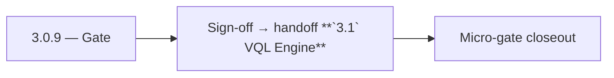

# 3.0.9 — Gate

- **Era:** `3.x` Contact/company data — hub [`versions.md`](../versions.md) · minors start at [`3.0 — Twin Ledger`](3.0%20%E2%80%94%20Twin%20Ledger.md)
- **Minor:** [3.0 — Twin Ledger](./3.0 — Twin Ledger.md)
- **Codename:** Gate
- **Status:** ✅ Completed
## Focus
Sign-off → handoff **`3.1` VQL Engine**

## Flowchart

## Micro-gate

| Track | Gate question | Answer / Evidence (fill at patch closeout) |
| --- | --- | --- |
| **Contract** | GraphQL, Connectra REST, or VQL contract changed? Diff vs `docs/backend/apis/` + endpoint matrices. | Document at patch closeout. |
| **Service** | List/count/batch-upsert, gateway clients, processors — smoke + idempotency story intact? | Document smoke paths. |
| **Surface** | Dashboard contacts/companies or admin paths changed? Filters, exports, error UX? | Document UX delta or N/A. |
| **Frontend** | Which routes/hooks/components for this patch? | `/contacts`, `/companies` shell; Connectra smoke — see minor. Document at closeout. |
| **Data** | PG+ES lineage, enrichment/dedup, job artifacts — migrations + docs? | Document lineage or N/A. |
| **Ops** | Queues, drift jobs, logs PII rules, runbooks — delta recorded? | Document ops delta or N/A. |

## Tasks
### Contract

- ✅ Completed: 📌 Planned: Freeze baseline REST surface per [`connectra-service.md`](connectra-service.md): `POST /contacts/`, `POST /contacts/count`, `POST /contacts/batch-upsert`, company equivalents, `GET /health`.
- ✅ Completed: 📌 Planned: GraphQL module boundaries for contacts/companies documented in [`docs/backend/apis/03_CONTACTS_MODULE.md`](../backend/apis/03_CONTACTS_MODULE.md) and [`04_COMPANIES_MODULE.md`](../backend/apis/04_COMPANIES_MODULE.md).

### Service

- ✅ Completed: 📌 Planned: Connectra: index bootstrap/mapping scripts validated; `BulkUpsertToDb` happy path for representative contact + company fixtures.
- ✅ Completed: 📌 Planned: Appointment360: `ConnectraClient` methods for list, count, batch-upsert, filters stub or minimal implementation with timeouts configured (`CONNECTRA_*` env).

### Surface

- ✅ Completed: 📌 Planned: Dashboard smoke: `/contacts` and `/companies` load with empty or seed dataset (see [`dashboard-search-ux.md`](dashboard-search-ux.md)).

### Data

- ✅ Completed: 📌 Planned: UUID5 rules understood and documented — [`enrichment-dedup.md`](enrichment-dedup.md).
- ✅ Completed: 📌 Planned: `filters` / `filters_data` tables present for facet bootstrap if filter sidebar is enabled.

### Ops

- ✅ Completed: 📌 Planned: Health checks and alarms for Connectra + API dependency chain.
- ✅ Completed: 📌 Planned: Document dev/prod URLs in [`docs/architecture.md`](../architecture.md) if not already.

## Service task slices
> Merged from era `3.x` contact/company task packs (P0→`.0`–`.2`, P1→`.3`–`.6`, Ops→`.7`–`.9`).

### Connectra
- **Contract:** Freeze VQL filter taxonomy and operator mapping for contacts and companies — keep aligned with [`vql-filter-taxonomy.md`](vql-filter-taxonomy.md) and gateway `vql_converter.py`.
- **Service:** Harden `ListByFilters`, `CountByFilters`, and `batch-upsert` for deterministic behavior — see [`connectra-service.md`](connectra-service.md).
- **Database:** Enforce **PG + ES** parity checks and deterministic **UUID5** rules for contacts, companies, and filter facets — [`enrichment-dedup.md`](enrichment-dedup.md).
- **Flow:** Validate **two-phase read** and **five-store parallel write** diagrams against runtime behavior.
- **Release gate evidence:** Relevance tests, **P95 latency** evidence, and **dedup consistency** report.
- One **golden search** (complex VQL) + **count** pair passes with trace id end-to-end.
- Reconciliation or sampling shows **ES/PG** within agreed drift threshold after bulk upsert test.
- Idempotency replay artifact attached for `batch-upsert` representative fixture.

### Appointment360 (gateway)
- Write contract test: contacts(query) input → Connectra REST /contacts/query
- Write contract test: companies(query) input → Connectra REST /companies/query
- Add /contacts + /companies Postman collection to docs/backend/postman/

### logs.api
- Synthetic **export job** emits `contact360.export.completed` queryable within SLA.
- Support runbook links **request_id** across app → api → Connectra → logs.api for one ticket.

## Evidence gate
Micro-gate table filled and handoff note to `3.1.0` recorded
