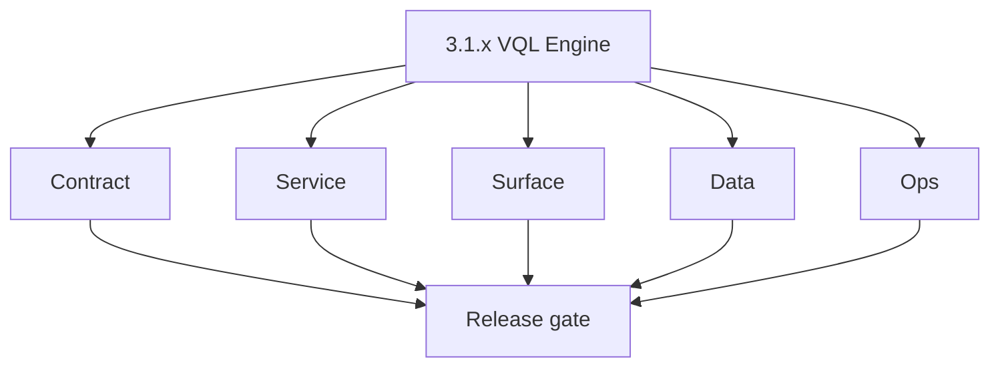
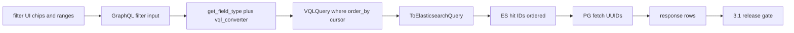

# Version 3.1 — VQL Engine

- **Status:** ✅ Completed
- **Codename:** VQL Engine
- **Era:** 3.x (Contact360 contact and company data system)
- **Roadmap:** Stage **3.1** — Advanced search filters (VQL)
- **Summary:** **Taxonomy + translation**: dashboard filter builders → **GraphQL** → **`vql_converter.py`** → **Connectra** `VQLQuery` (text_matches, keyword_match, range_query, order_by, cursor) → **Elasticsearch** query → hits → **PG hydrate**.
- **Patch closure:** Every codenamed patch file includes **Micro-gate** + **Service task slices**. Era hub: [`versions.md`](../versions.md).

## Scope

- **Target:** `3.1.x` patches — parser and operator correctness; performance regression tests for complex filters.
- **Out of scope:** Full drift reconciliation job (**`3.7`**); SN mapper (**`3.6`**).
- **Owners:** Connectra Engineering + Platform API.

## Flowchart

### Runtime focus (unique to this minor)

## Task tracks

### Contract

- ✅ Completed: 📌 Planned: **[connectra]** — refine duplicate task (was: 📌 planned: **[connectra]** — refine duplicate task (was: 📌 p…) | patch `3.1.0` band `0` | reason: specialize this file vs sibling patches; see docs/codebases/connectra-codebase-analysis.md
- ✅ Completed: 📌 Planned: **[connectra]** — refine duplicate task (was: 📌 planned: **[connectra]** — refine duplicate task (was: 📌 p…) | patch `3.1.0` band `0` | reason: specialize this file vs sibling patches; see docs/codebases/connectra-codebase-analysis.md

- ✅ Completed: 📌 Planned: **[connectra]** — refine duplicate task (was: 📌 planned: **[architecture]** — product **graphql** remains …) | patch `3.1.0` band `0` | reason: specialize this file vs sibling patches; see docs/codebases/connectra-codebase-analysis.md
### Service

- ✅ Completed: 📌 Planned: **[connectra]** — refine duplicate task (was: 📌 planned: **[connectra]** — refine duplicate task (was: 📌 p…) | patch `3.1.0` band `0` | reason: specialize this file vs sibling patches; see docs/codebases/connectra-codebase-analysis.md
- ✅ Completed: ✅ Completed: 📌 Planned: **Contract-parity tests** for VQL operators — **Service task slices** in `3.1.P` patch files (scope from former `connectra-contact-company-task-pack.md`).

- ✅ Completed: 📌 Planned: **[connectra]** — refine duplicate task (was: 📌 planned: **[architecture]** — **go/gin satellites** in sco…) | patch `3.1.0` band `0` | reason: specialize this file vs sibling patches; see docs/codebases/connectra-codebase-analysis.md
### Surface

- ✅ Completed: 📌 Planned: **[connectra]** — refine duplicate task (was: 📌 planned: **[connectra]** — refine duplicate task (was: 📌 p…) | patch `3.1.0` band `0` | reason: specialize this file vs sibling patches; see docs/codebases/connectra-codebase-analysis.md

- ✅ Completed: 📌 Planned: **[connectra]** — refine duplicate task (was: 📌 planned: **[architecture]** — **next.js** customer surface…) | patch `3.1.0` band `0` | reason: specialize this file vs sibling patches; see docs/codebases/connectra-codebase-analysis.md
### Data

- ✅ Completed: 📌 Planned: **[connectra]** — refine duplicate task (was: 📌 planned: **[connectra]** — refine duplicate task (was: 📌 p…) | patch `3.1.0` band `0` | reason: specialize this file vs sibling patches; see docs/codebases/connectra-codebase-analysis.md

- ✅ Completed: 📌 Planned: **[connectra]** — refine duplicate task (was: 📌 planned: **[architecture]** — **postgresql-first** per `do…) | patch `3.1.0` band `0` | reason: specialize this file vs sibling patches; see docs/codebases/connectra-codebase-analysis.md
### Ops

- ✅ Completed: 📌 Planned: **[connectra]** — refine duplicate task (was: 📌 planned: **[connectra]** — refine duplicate task (was: 📌 p…) | patch `3.1.0` band `0` | reason: specialize this file vs sibling patches; see docs/codebases/connectra-codebase-analysis.md

- ✅ Completed: 📌 Planned: **[connectra]** — refine duplicate task (was: 📌 planned: **[architecture]** — **observability**: correlate…) | patch `3.1.0` band `0` | reason: specialize this file vs sibling patches; see docs/codebases/connectra-codebase-analysis.md
## Task Breakdown

| Slice | Outcome |
| --- | --- |
| Gateway | Converter + tests |
| Connectra | ES query builder |
| App | Filter binding |

## Immediate next execution queue

- 📌 Planned: Golden file tests: 20 representative filters.
- 📌 Planned: Fuzz unknown fields → keyword path.

## Cross-service ownership

| Service | Focus |
| --- | --- |
| `contact360.io/api` | `vql_converter.py` |
| `contact360.io/sync` | List/Count |
| `contact360.io/app` | Filter UX |

## References

- [`docs/roadmap.md`](../roadmap.md) — stage 3.1
- [`docs/codebases/connectra-codebase-analysis.md`](../codebases/connectra-codebase-analysis.md)

## Backend API and Endpoint Scope

- GraphQL filter args; Connectra `POST /contacts/`, `POST /companies/`, `/count` variants; filter definition APIs per `connectra-service.md`.

## Database and Data Lineage Scope

- `filters`, `filters_data` consistency with VQL keys.

## Frontend UX Surface Scope

- Advanced filters; operator UX per roadmap.

## UI Elements Checklist

- 📌 Planned: Text search boxes
- 📌 Planned: Keyword multi-selects
- 📌 Planned: Range sliders / date ranges
- 📌 Planned: Clear filters

## Flow / Graph Delta for This Minor

- **Delta:** Deepens **`3.0`** spine into **translation + ES query** correctness.

## Audit and Compliance Notes

- Log **filter shape** hashes for support, not raw PII payloads in verbose logs.

## Patch ladder (`3.1.0` – `3.1.9`)

### Micro-gate reference (apply at every `3.N.P`)

| Track | Gate question (must answer Yes or document waiver) |
| --- | --- |
| **Contract** | GraphQL, Connectra REST, or VQL changed? `docs/backend/apis/` + endpoint matrices updated? |
| **Service** | List/count/batch-upsert and gateway paths still smoke; idempotency documented? |
| **Surface** | Dashboard contacts/companies or related admin UX changed? |
| **Frontend** | Which routes/hooks apply (see minor UX scope / `dashboard-search-ux.md`)? |
| **Data** | PG+ES lineage, enrichment/dedup, job artifacts — docs + migrations? |
| **Ops** | Queues, drift tooling, logs PII rules, runbooks — delta recorded? |
| **Architecture** | Go/Gin satellites only via Python GraphQL gateway (`contact360.io/api`); Next.js `NEXT_PUBLIC_GRAPHQL_URL`; Postgres-first / Redis exit per `docs/docs/data-stores-postgres.md`. |

**Patch intent bands (universal ladder):** `.0` Charter · `.1` Connectra · `.2` Gateway · `.3` Dashboard · `.4` Jobs/S3 · `.5` Satellite · `.6` Observability · `.7` Hardening · `.8` Evidence · `.9` Gate / handoff.

Theme: **Filter** — codenames in per-patch `3.1.P — *.md` files.

| Patch | Codename | Focus |
| --- | --- | --- |
| `3.1.0` | Parse | Parser charter |
| `3.1.1` | Field | Field registry |
| `3.1.2` | Token | Tokenization |
| `3.1.3` | Clause | Boolean compose |
| `3.1.4` | Operator | must/must_not |
| `3.1.5` | Type | text/keyword/range |
| `3.1.6` | Compose | company_config |
| `3.1.7` | Validate | schema validation |
| `3.1.8` | Optimize | query cost |
| `3.1.9` | Freeze | Handoff → `3.2` |

## Release Gate and Evidence

### Master Task Checklist

- 📌 Planned: Roadmap 3.1 DoD

### Backend API and Endpoints

- 📌 Planned: Regression suite green

### Database and Data Lineage

- 📌 Planned: Taxonomy doc updated if fields added

### Frontend UX

- 📌 Planned: Complex filter screen recording

### UI Elements

- 📌 Planned: Checklist above

### Flow and Graph

- 📌 Planned: Runtime Mermaid reviewed

### Validation

- 📌 Planned: P95 within budget for suite

### Release Gate

- 📌 Planned: Sign-off for **`3.2` Enrichment & Dedup**

## Patches

| Patch | Codename | Doc |
| --- | --- | --- |
| `3.1.0` | Parse | [`3.1.0` — Parse](3.1.0 — Parse.md) |
| `3.1.1` | Field | [`3.1.1` — Field](3.1.1 — Field.md) |
| `3.1.2` | Token | [`3.1.2` — Token](3.1.2 — Token.md) |
| `3.1.3` | Clause | [`3.1.3` — Clause](3.1.3 — Clause.md) |
| `3.1.4` | Operator | [`3.1.4` — Operator](3.1.4 — Operator.md) |
| `3.1.5` | Type | [`3.1.5` — Type](3.1.5 — Type.md) |
| `3.1.6` | Compose | [`3.1.6` — Compose](3.1.6 — Compose.md) |
| `3.1.7` | Validate | [`3.1.7` — Validate](3.1.7 — Validate.md) |
| `3.1.8` | Optimize | [`3.1.8` — Optimize](3.1.8 — Optimize.md) |
| `3.1.9` | Freeze | [`3.1.9` — Freeze](3.1.9 — Freeze.md) |
