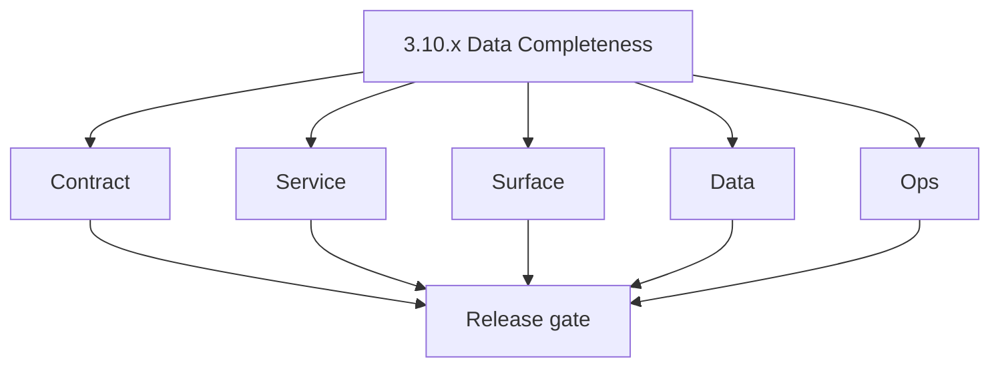
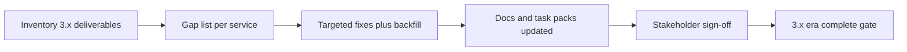

# Version 3.10 — Data Completeness

- **Status:** ✅ Completed
- **Codename:** Data Completeness
- **Era:** 3.x (Contact360 contact and company data system)
- **Roadmap:** **Closure sweep** for the contact/company data era — aggregate quality, documentation, and cross-cutting checks before primary **4.x** extension/SN narrative owns the roadmap.
- **Summary:** Reconcile **orphan** verifier/enrichment rows; **filter facet** gaps vs VQL; **completeness** score baselines on contacts/companies; align **docs/codebases/** execution queues; confirm **email campaign** / **logs** / **S3** references for 3.x are consistent; fix any lingering **3.0–3.9** debt tickets. Not a new feature minor — a **program exit gate** for 3.x *unless* product reopens scope.
- **Patch closure:** Every codenamed patch file includes **Micro-gate** + **Service task slices**. Era hub: [`versions.md`](../versions.md).

## Scope

- **Target:** `3.10.x` patches — audits, backfills, doc sync, low-risk code fixes.
- **Out of scope:** Net-new product surfaces best deferred to **4.x** / **10.x** (campaign wizard, public APIs).
- **Owners:** Data Platform + PM + Tech writing liaison.

## Flowchart

### Runtime focus (unique to this minor)

## Task tracks

### Contract

- 📌 Planned: **[connectra]** — refine duplicate task (was: 📌 planned: **[connectra]** — refine duplicate task (was: ✅ c…) | patch `3.10.0` band `0` | reason: specialize this file vs sibling patches; see docs/codebases/connectra-codebase-analysis.md
- 📌 Planned: **[connectra]** — refine duplicate task (was: 📌 planned: **[connectra]** — refine duplicate task (was: ✅ c…) | patch `3.10.0` band `0` | reason: specialize this file vs sibling patches; see docs/codebases/connectra-codebase-analysis.md

- 📌 Planned: **[connectra]** — refine duplicate task (was: 📌 planned: **[architecture]** — product **graphql** remains …) | patch `3.10.0` band `0` | reason: specialize this file vs sibling patches; see docs/codebases/connectra-codebase-analysis.md
### Service

- 📌 Planned: **[connectra]** — refine duplicate task (was: 📌 planned: **[connectra]** — refine duplicate task (was: ✅ c…) | patch `3.10.0` band `0` | reason: specialize this file vs sibling patches; see docs/codebases/connectra-codebase-analysis.md
- 📌 Planned: **[connectra]** — refine duplicate task (was: 📌 planned: **[connectra]** — refine duplicate task (was: ✅ c…) | patch `3.10.0` band `0` | reason: specialize this file vs sibling patches; see docs/codebases/connectra-codebase-analysis.md

- 📌 Planned: **[connectra]** — refine duplicate task (was: 📌 planned: **[architecture]** — **go/gin satellites** in sco…) | patch `3.10.0` band `0` | reason: specialize this file vs sibling patches; see docs/codebases/connectra-codebase-analysis.md
### Surface

- 📌 Planned: **[connectra]** — refine duplicate task (was: 📌 planned: **[connectra]** — refine duplicate task (was: ✅ c…) | patch `3.10.0` band `0` | reason: specialize this file vs sibling patches; see docs/codebases/connectra-codebase-analysis.md
- 📌 Planned: **[connectra]** — refine duplicate task (was: 📌 planned: **[connectra]** — refine duplicate task (was: ✅ c…) | patch `3.10.0` band `0` | reason: specialize this file vs sibling patches; see docs/codebases/connectra-codebase-analysis.md

- 📌 Planned: **[connectra]** — refine duplicate task (was: 📌 planned: **[architecture]** — **next.js** customer surface…) | patch `3.10.0` band `0` | reason: specialize this file vs sibling patches; see docs/codebases/connectra-codebase-analysis.md
### Data

- ✅ Completed: 📌 Planned: Mailvetter / email lineage: orphan **verifier ↔ contact** report (see **Service task slices** in `3.10.P` patch files (scope from former `mailvetter-contact-company-task-pack.md`)).
- 📌 Planned: **[connectra]** — refine duplicate task (was: 📌 planned: **[connectra]** — refine duplicate task (was: ✅ c…) | patch `3.10.0` band `0` | reason: specialize this file vs sibling patches; see docs/codebases/connectra-codebase-analysis.md

- 📌 Planned: **[connectra]** — refine duplicate task (was: 📌 planned: **[architecture]** — **postgresql-first** per `do…) | patch `3.10.0` band `0` | reason: specialize this file vs sibling patches; see docs/codebases/connectra-codebase-analysis.md
### Ops

- 📌 Planned: **[connectra]** — refine duplicate task (was: 📌 planned: **[connectra]** — refine duplicate task (was: ✅ c…) | patch `3.10.0` band `0` | reason: specialize this file vs sibling patches; see docs/codebases/connectra-codebase-analysis.md
- 📌 Planned: **[connectra]** — refine duplicate task (was: 📌 planned: **[connectra]** — refine duplicate task (was: ✅ c…) | patch `3.10.0` band `0` | reason: specialize this file vs sibling patches; see docs/codebases/connectra-codebase-analysis.md

- 📌 Planned: **[connectra]** — refine duplicate task (was: 📌 planned: **[architecture]** — **observability**: correlate…) | patch `3.10.0` band `0` | reason: specialize this file vs sibling patches; see docs/codebases/connectra-codebase-analysis.md
## Task breakdown

| Slice | Outcome |
| --- | --- |
| Inventory | Closed 3.x backlog |
| Quality | Metrics baselines stored |
| Narrative | Docs truthful |

## Immediate next execution queue

- 📌 Planned: Spreadsheet: service × open 3.x risk × owner × target era.
- 📌 Planned: One **executive summary** markdown in repo (optional: `docs/3. Contact360 contact and company data system/3.x-completion-summary.md` — only if PM requests).

## Cross-service ownership

| Role | Focus |
| --- | --- |
| Data | Parity + completeness |
| Platform | Doc + code hygiene |
| Product | Scope acceptance |

## References

- All [`version_3.*.md`](.) minors **`3.0`–`3.9`**
- [`docs/codebase.md`](../codebase.md)
- [`docs/governance.md`](../governance.md)

## Backend API and endpoint scope

Cross-reference only — no new endpoint charter.

## Database and data lineage scope

Backfill scripts recorded in [`docs/backend/database/`](../backend/database/) where executed.

## Frontend UX surface scope

Copy, feature-flag, and route consistency audit.

## Patch ladder (`3.10.0` – `3.10.9`)

### Micro-gate reference (apply at every `3.N.P`)

| Track | Gate question (must answer Yes or document waiver) |
| --- | --- |
| **Contract** | GraphQL, Connectra REST, or VQL changed? `docs/backend/apis/` + endpoint matrices updated? |
| **Service** | List/count/batch-upsert and gateway paths still smoke; idempotency documented? |
| **Surface** | Dashboard contacts/companies or related admin UX changed? |
| **Frontend** | Which routes/hooks apply (see minor UX scope / `dashboard-search-ux.md`)? |
| **Data** | PG+ES lineage, enrichment/dedup, job artifacts — docs + migrations? |
| **Ops** | Queues, drift tooling, logs PII rules, runbooks — delta recorded? |
| **Architecture** | Go/Gin satellites only via Python GraphQL gateway (`contact360.io/api`); Next.js `NEXT_PUBLIC_GRAPHQL_URL`; Postgres-first / Redis exit per `docs/docs/data-stores-postgres.md`. |

**Patch intent bands (universal ladder):** `.0` Charter · `.1` Connectra · `.2` Gateway · `.3` Dashboard · `.4` Jobs/S3 · `.5` Satellite · `.6` Observability · `.7` Hardening · `.8` Evidence · `.9` Gate / handoff.

Theme: **Exit** — codenames in per-patch `3.10.P — *.md` files.

| Patch | Codename | Focus |
| --- | --- | --- |
| `3.10.0` | Charter | Scope + acceptance list |
| `3.10.1` | Connectra | Sampling / parity link |
| `3.10.2` | Gateway | GraphQL doc nits |
| `3.10.3` | Dashboard | Route/hook audit |
| `3.10.4` | Jobs / S3 | Import/export doc closure |
| `3.10.5` | Satellite | Email/campaign/mailvetter triage |
| `3.10.6` | Observability | logs.api preset queries verified |
| `3.10.7` | Hardening | Security nits from analyses |
| `3.10.8` | Evidence | Sign-off packet |
| `3.10.9` | Gate | **3.x era complete** → handoff **4.x** |

## Release gate and evidence

### Master task checklist

- 📌 Planned: PM accepts 3.x completeness

### Backend API and endpoints

- 📌 Planned: No orphaned Postman collections for dead paths *(or marked deprecated)*

### Database and data lineage

- 📌 Planned: Known orphan rate below threshold or ticketed

### Frontend UX

- 📌 Planned: `dashboard-search-ux.md` verified

### Validation

- 📌 Planned: Cross-link spot-check: README ↔ versions ↔ roadmap

### Release gate

- 📌 Planned: Formal **4.x** kickoff approved

## Patches

| Patch | Codename | Doc |
| --- | --- | --- |
| `3.10.0` | Charter | [`3.10.0` — Charter](3.10.0 — Charter.md) |
| `3.10.1` | Connectra | [`3.10.1` — Connectra](3.10.1 — Connectra.md) |
| `3.10.2` | Gateway | [`3.10.2` — Gateway](3.10.2 — Gateway.md) |
| `3.10.3` | Dashboard | [`3.10.3` — Dashboard](3.10.3 — Dashboard.md) |
| `3.10.4` | Jobs - S3 | [`3.10.4` — Jobs - S3](3.10.4 — Jobs - S3.md) |
| `3.10.5` | Satellite | [`3.10.5` — Satellite](3.10.5 — Satellite.md) |
| `3.10.6` | Observability | [`3.10.6` — Observability](3.10.6 — Observability.md) |
| `3.10.7` | Hardening | [`3.10.7` — Hardening](3.10.7 — Hardening.md) |
| `3.10.8` | Evidence | [`3.10.8` — Evidence](3.10.8 — Evidence.md) |
| `3.10.9` | Gate | [`3.10.9` — Gate](3.10.9 — Gate.md) |

## Release Gate and Evidence

### Master Task Checklist
- 📌 Planned: Track-level closure evidence linked

### Backend API and Endpoints
- 📌 Planned: Endpoint/contract parity verified

### Database and Data Lineage
- 📌 Planned: Migration and lineage references linked

### Frontend UX
- 📌 Planned: UX/route behavior evidence linked

### UI Elements
- 📌 Planned: Components/checklist closeout captured

### Flow and Graph
- 📌 Planned: Runtime graph reflects implementation

### Validation
- 📌 Planned: Smoke/CI/lint checks recorded

### Release Gate
- 📌 Planned: Minor ready for handoff to next minor
