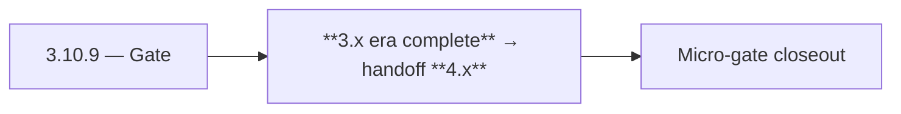

# 3.10.9 — Gate

- **Era:** `3.x` Contact/company data — hub [`versions.md`](../versions.md) · minors start at [`3.0 — Twin Ledger`](3.0%20%E2%80%94%20Twin%20Ledger.md)
- **Minor:** [3.10 — Data Completeness](./3.10 — Data Completeness.md)
- **Codename:** Gate
- **Status:** ✅ Completed
## Focus
**3.x era complete** → handoff **4.x**

## Flowchart

## Micro-gate

| Track | Gate question | Answer / Evidence (fill at patch closeout) |
| --- | --- | --- |
| **Contract** | GraphQL, Connectra REST, or VQL contract changed? Diff vs `docs/backend/apis/` + endpoint matrices. | Document at patch closeout. |
| **Service** | List/count/batch-upsert, gateway clients, processors — smoke + idempotency story intact? | Document smoke paths. |
| **Surface** | Dashboard contacts/companies or admin paths changed? Filters, exports, error UX? | Document UX delta or N/A. |
| **Frontend** | Which routes/hooks/components for this patch? | Exit sweep; minimal new UX unless ops-only. Document at closeout. |
| **Data** | PG+ES lineage, enrichment/dedup, job artifacts — migrations + docs? | Document lineage or N/A. |
| **Ops** | Queues, drift jobs, logs PII rules, runbooks — delta recorded? | Document ops delta or N/A. |

## Tasks
### Contract

- ✅ Completed: 📌 Planned: **`docs/versions.md`** and [`docs/roadmap.md`](../roadmap.md) reflect 3.x completion criteria.
- ✅ Completed: 📌 Planned: All **3.x** task packs: unchecked items triaged → done, deferred (with era), or wontfix.

### Service

- ✅ Completed: 📌 Planned: Connectra: sample **ES vs PG** spot-check or link to **`3.7`** reconciliation report.
- ✅ Completed: 📌 Planned: Appointment360: remove or ticket **debug file writes** called out in codebase analysis.

### Surface

- ✅ Completed: 📌 Planned: Dashboard: [`dashboard-search-ux.md`](dashboard-search-ux.md) matches **live** routes and hooks.
- ✅ Completed: 📌 Planned: Admin/root: contact/company **story** pages reviewed ([`admin-codebase-analysis.md`](../codebases/admin-codebase-analysis.md), [`root-codebase-analysis.md`](../codebases/root-codebase-analysis.md)).

### Data

- ✅ Completed: 📌 Planned: Mailvetter / email lineage: orphan **verifier ↔ contact** report (see **Service task slices** below (includes former `mailvetter-contact-company-task-pack.md` scope)).
- ✅ Completed: 📌 Planned: Campaign service: schema drift items from analysis closed or documented (**`emailcampaign`**).

### Ops

- ✅ Completed: 📌 Planned: Support runbook: **single** doc path for “wrong export count” / “missing contact after import”.
- ✅ Completed: 📌 Planned: **`docs/docsai-sync.md`** updated if narrative pages changed.

## Service task slices
> Merged from era `3.x` contact/company task packs (P0→`.0`–`.2`, P1→`.3`–`.6`, Ops→`.7`–`.9`).

### Appointment360 (gateway)
- Write contract test: contacts(query) input → Connectra REST /contacts/query
- Write contract test: companies(query) input → Connectra REST /companies/query
- Add /contacts + /companies Postman collection to docs/backend/postman/

### Connectra
- **Contract:** Freeze VQL filter taxonomy and operator mapping for contacts and companies — keep aligned with [`vql-filter-taxonomy.md`](vql-filter-taxonomy.md) and gateway `vql_converter.py`.
- **Service:** Harden `ListByFilters`, `CountByFilters`, and `batch-upsert` for deterministic behavior — see [`connectra-service.md`](connectra-service.md).
- **Database:** Enforce **PG + ES** parity checks and deterministic **UUID5** rules for contacts, companies, and filter facets — [`enrichment-dedup.md`](enrichment-dedup.md).
- **Flow:** Validate **two-phase read** and **five-store parallel write** diagrams against runtime behavior.
- **Release gate evidence:** Relevance tests, **P95 latency** evidence, and **dedup consistency** report.
- One **golden search** (complex VQL) + **count** pair passes with trace id end-to-end.
- Reconciliation or sampling shows **ES/PG** within agreed drift threshold after bulk upsert test.
- Idempotency replay artifact attached for `batch-upsert` representative fixture.

### contact.ai
- Integration test: `parseContactFilters` → VQL query → contact search end-to-end.
- Load test `generateCompanySummary` with p95 < 3s; tune Lambda timeout accordingly.
- Add all three utility endpoints to contact.ai Postman collection.

### emailapis / emailapigo
- Golden profile: finder/verifier → contact row shows same email + status as Connectra **after** refresh.
- Endpoint matrix updated for **3.x**.
- No undocumented breaking field rename on enrichment responses.

### Emailcampaign
- Campaign created with `audience_source: "segment"` resolves recipients from Connectra.
- No duplicate recipients in campaign for same email address.
- CSV fallback still works but logs deprecation warning.
- Audience count preview visible in wizard before campaign is saved.

### Jobs
- E2E: **validate/vql** → export job → artifact download matches count from Connectra `CountByFilters` for same VQL.
- Import replay after simulated worker failure yields **idempotent** row counts (no duplicate keys).
- Runbook reviewed for **blocked DAG** scenario.

### logs.api
- Synthetic **export job** emits `contact360.export.completed` queryable within SLA.
- Support runbook links **request_id** across app → api → Connectra → logs.api for one ticket.

### Mailvetter
- Sample bulk verify with **`contact_uuid`** → contact row shows badge + timestamp after gateway merge.
- Orphan reconciliation report runs in staging with zero **unexpected** data loss.
- Drift report query documented for support (`logs.api` or DB script).
- Runbook linked from this pack or from [`docs/audit-compliance.md`](../audit-compliance.md) if verifier evidence is audit-relevant.

### S3Storage
- Sample jobs: **`s3_key`** traceable in **`job_response`** / logs event (`contact360.import.*` event types per **Service task slices** below; ex-`logsapi-contact-company-data-task-pack.md`).
- At least one **large-file** preview completes within agreed latency budget.
- [`docs/backend/endpoints/`](../backend/endpoints/) or service README updated if presign paths change.

### Salesnavigator
- Reconciliation equation holds on 1k profile golden batch.
- PLACEHOLDER / URL policy documented and signed off by Data owner.
- Idempotency retry test: duplicate chunk → no duplicate Connectra rows.

## Evidence gate
Micro-gate table filled and handoff note to `4.0.0` recorded
