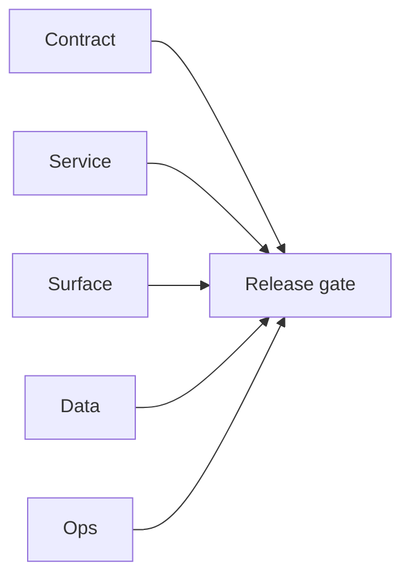

# 3.11.100 — EC2 email server contact-company patch linkage

## Scope

Patch linkage for contact/company enrichment pipelines that depend on email finder/verifier.

## Included patch intents

- `003-parallel-bulk-verification.patch`: improves throughput for downstream enrichment workloads.
- `004-endpoint-contract-fixes.patch`: tighter request validation and contract predictability.

## Contact/company outcome

- Better reliability for email-dependent enrichment flows and less schema drift risk.

## Flowchart

Five-track delivery (contract / service / surface / data / ops) for this doc:

**Master hub:** [`docs/docs/flowchart.md`](../docs/flowchart.md) — cross-system diagrams and era strip (`0.x` → `10.x`).

## Task tracks

### Contract

- ✅ Completed: Patch intents (`003-parallel-bulk-verification`, `004-endpoint-contract-fixes`) mapped; parity with [`graphql.modules`](../backend/graphql.modules/README.md) for `3.x` contact/company flows.

### Service

- ✅ Completed: EC2 `email.server` throughput + validation improvements for enrichment pipelines.

### Surface

- ✅ Completed: No direct dashboard change in this linkage file.

### Data

- ✅ Completed: Connectra-facing enrichment benefits indirectly; no Connectra DDL change listed here.

### Ops

- ✅ Completed: Correlate verifier throughput and error envelopes in staging before promotion.
