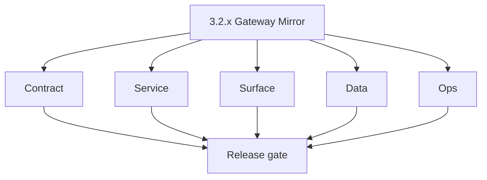
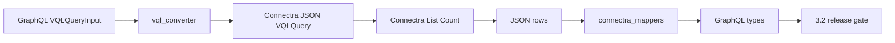

# Version 3.2 — Gateway Mirror

- **Status:** planned  
- **Codename:** Gateway Mirror  
- **Era:** 3.x (Contact360 contact and company data system)  
- **Roadmap:** **Appointment360 ↔ Connectra** contract parity — GraphQL inputs map to **identical** REST payloads and response shapes as dashboard-issued VQL (complements **`3.1`** taxonomy depth).  
- **Summary:** **`vql_converter.py`** edge cases (`get_field_type`, unknown fields → keyword), **boolean composition**, **pagination/sort**, **company_config**; **`connectra_mappers.py`** field-for-field fidelity; automated **contract-parity tests** so gateway cannot drift from Connectra silently.  
- **Patch closure:** Every codenamed patch file includes **Micro-gate** + **Service task slices**. Era hub: [`versions.md`](../versions.md).

## Scope

- **Target:** `3.2.x` patches — tests + mapper fixes, not ES relevance tuning (**`3.3`**) or bulk CSV pipeline (**`3.5`**).  
- **Out of scope:** Extension capture hardening (**`3.8`** / **`4.x`**).  
- **Owners:** Platform API (+ Connectra for response-shape questions).

## Flowchart

### Runtime focus (unique to this minor)

## Task tracks

### Contract

- 📌 Planned: Golden **input/output** pairs checked in CI: GraphQL filter object → Connectra `VQLQuery` JSON (per [`vql-filter-taxonomy.md`](vql-filter-taxonomy.md)).  
- 📌 Planned: Document **error mapping**: Connectra 4xx/5xx → GraphQL errors users see.

### Service

- 📌 Planned: Parity tests for **contacts** and **companies** list + count for the same VQL fixture.  
- 📌 Planned: **Batch-upsert** response: mapped UUID lists match Connectra body ordering contract.

### Surface

- 📌 Planned: Regression: filter chips + search bar produce same results as **raw** Connectra call for copy-pasted VQL (QA script).

### Data

- 📌 Planned: Confirm nullable / omitted fields in Connectra JSON do not crash mappers.

### Ops

- 📌 Planned: Alert if **converter exception rate** spikes post-deploy.

## Task breakdown

| Slice | Outcome |
| --- | --- |
| Converter | Edge-case completeness |
| Mappers | Response fidelity |
| CI | Parity suite green |

## Immediate next execution queue

- 📌 Planned: Test matrix: text vs keyword vs range fields × contacts × companies.  
- 📌 Planned: Fuzz: random `where` trees within schema (bounded depth).

## Cross-service ownership

| Service | Focus |
| --- | --- |
| `contact360.io/api` | `vql_converter`, `connectra_mappers`, tests |
| `contact360.io/sync` | Reference truth for VQL JSON |

## References

- **Service task slices** in `3.2.P` patch files (scope from former `appointment360-contact-company-task-pack.md`)  
- **Service task slices** in `3.2.P` patch files (scope from former `connectra-contact-company-task-pack.md`)  
- [`docs/codebases/appointment360-codebase-analysis.md`](../codebases/appointment360-codebase-analysis.md)

## Backend API and endpoint scope

GraphQL operations on contacts/companies; Connectra `POST /contacts/`, `POST /companies/`, `/count`, `batch-upsert`.

## Database and data lineage scope

No schema migration focus; optional activity logging for export/batch triggers if touched.

## Frontend UX surface scope

Indirect — verifies filters match backend; no new UX flagship ( **`3.4`** ).

## Patch ladder (`3.2.0` – `3.2.9`)

### Micro-gate reference (apply at every `3.N.P`)

| Track | Gate question (must answer Yes or document waiver) |
| --- | --- |
| **Contract** | GraphQL, Connectra REST, or VQL changed? `docs/backend/apis/` + endpoint matrices updated? |
| **Service** | List/count/batch-upsert and gateway paths still smoke; idempotency documented? |
| **Surface** | Dashboard contacts/companies or related admin UX changed? |
| **Frontend** | Which routes/hooks apply (see minor UX scope / `dashboard-search-ux.md`)? |
| **Data** | PG+ES lineage, enrichment/dedup, job artifacts — docs + migrations? |
| **Ops** | Queues, drift tooling, logs PII rules, runbooks — delta recorded? |

**Patch intent bands (universal ladder):** `.0` Charter · `.1` Connectra · `.2` Gateway · `.3` Dashboard · `.4` Jobs/S3 · `.5` Satellite · `.6` Observability · `.7` Hardening · `.8` Evidence · `.9` Gate / handoff.

Theme: **Parity** — codenames in per-patch `3.2.P — *.md` files.

| Patch | Codename | Focus |
| --- | --- | --- |
| `3.2.0` | Charter | Test plan + golden fixtures list |
| `3.2.1` | Connectra | Reference payloads from sync team |
| `3.2.2` | Gateway | `vql_converter` fixes |
| `3.2.3` | Dashboard | QA regression script |
| `3.2.4` | Jobs / S3 | `validate/vql` alignment if export path touched |
| `3.2.5` | Satellite | `n/a` |
| `3.2.6` | Observability | Log converter version unknown-field counts |
| `3.2.7` | Hardening | Timeout + payload size limits |
| `3.2.8` | Evidence | CI artifact: parity report |
| `3.2.9` | Gate | Sign-off → **`3.3` Search Quality** |

## Release gate and evidence

### Master task checklist

- 📌 Planned: Parity suite passes in CI

### Backend API and endpoints

- 📌 Planned: Documented error codes for Connectra bridge

### Database and data lineage

- 📌 Planned: `n/a` unless batch-upsert mapping changes

### Frontend UX

- 📌 Planned: QA sign-off on filter parity spot-check

### Validation

- 📌 Planned: No unmapped critical fields in taxonomy

### Release gate

- 📌 Planned: Approve **`3.3`** work

## Patches

| Patch | Codename | Doc |
| --- | --- | --- |
| `3.2.0` | Charter | [`3.2.0` — Charter](3.2.0 — Charter.md) |
| `3.2.1` | Connectra | [`3.2.1` — Connectra](3.2.1 — Connectra.md) |
| `3.2.2` | Gateway | [`3.2.2` — Gateway](3.2.2 — Gateway.md) |
| `3.2.3` | Dashboard | [`3.2.3` — Dashboard](3.2.3 — Dashboard.md) |
| `3.2.4` | Jobs - S3 | [`3.2.4` — Jobs - S3](3.2.4 — Jobs - S3.md) |
| `3.2.5` | Satellite | [`3.2.5` — Satellite](3.2.5 — Satellite.md) |
| `3.2.6` | Observability | [`3.2.6` — Observability](3.2.6 — Observability.md) |
| `3.2.7` | Hardening | [`3.2.7` — Hardening](3.2.7 — Hardening.md) |
| `3.2.8` | Evidence | [`3.2.8` — Evidence](3.2.8 — Evidence.md) |
| `3.2.9` | Gate | [`3.2.9` — Gate](3.2.9 — Gate.md) |

## Release Gate and Evidence

### Master Task Checklist
- 📌 Planned: Track-level closure evidence linked

### Backend API and Endpoints
- 📌 Planned: Endpoint/contract parity verified

### Database and Data Lineage
- 📌 Planned: Migration and lineage references linked

### Frontend UX
- 📌 Planned: UX/route behavior evidence linked

### UI Elements
- 📌 Planned: Components/checklist closeout captured

### Flow and Graph
- 📌 Planned: Runtime graph reflects implementation

### Validation
- 📌 Planned: Smoke/CI/lint checks recorded

### Release Gate
- 📌 Planned: Minor ready for handoff to next minor
