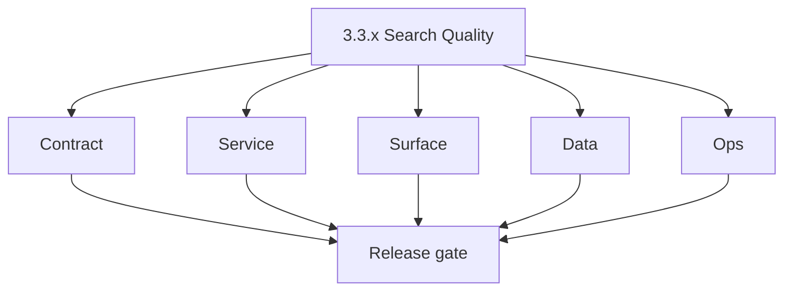
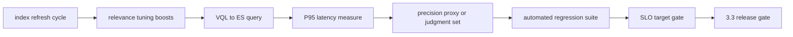

# Version 3.3 — Search Quality

- **Status:** planned  
- **Codename:** Search Quality  
- **Era:** 3.x (Contact360 contact and company data system)  
- **Roadmap:** Stage **3.3** — Search quality and performance  
- **Summary:** **Relevance + latency**: index refresh cadence, scoring/tuning, **P95** targets for `ListByFilters` / `CountByFilters`, **regression** suite so filter complexity does not regress ranking or speed.  
- **Patch closure:** Every codenamed patch file includes **Micro-gate** + **Service task slices**. Era hub: [`versions.md`](../versions.md).

## Scope

- **Target:** `3.3.x` patches — ES + app perceived performance; no major UX redesign (**`3.4`**).  
- **Owners:** Connectra Engineering.

## Flowchart

### Runtime focus (unique to this minor)

## Task tracks

### Contract

- 📌 Planned: Document **SLO** numbers (P95 list, P95 count) per environment.  
- 📌 Planned: Lock **forCount** behavior vs list path.

### Service

- 📌 Planned: Index maintenance: refresh, force-merge policy (if any), shard sizing review.  
- 📌 Planned: Query **profiling** for worst customer filters.

### Surface

- 📌 Planned: Loading skeletons; debounced search where applicable.

### Data

- 📌 Planned: **ES/PG** consistency assumptions for ranking (hydration must preserve ES order).

### Ops

- 📌 Planned: Dashboards: search latency, ES health, query rate.

## Task Breakdown

| Slice | Outcome |
| --- | --- |
| Connectra | ES tuning |
| Observability | SLO charts |
| QA | Regression tests |

## Immediate next execution queue

- 📌 Planned: Judgment list or click-through proxy for relevance.  
- 📌 Planned: Before/after A/B on tuning change.

## Cross-service ownership

| Service | Focus |
| --- | --- |
| `contact360.io/sync` | ES + queries |
| `contact360.io/app` | Perceived perf |

## References

- [`docs/roadmap.md`](../roadmap.md) — stage 3.3  
- [`docs/codebases/connectra-codebase-analysis.md`](../codebases/connectra-codebase-analysis.md)

## Backend API and Endpoint Scope

- List/count endpoints; optional admin reindex triggers if exist.

## Database and Data Lineage Scope

- Index mappings; alias swap strategy for zero-downtime reindex.

## Frontend UX Surface Scope

- Non-functional UX improvements (loading, virtualization).

## UI Elements Checklist

- 📌 Planned: Skeleton rows  
- 📌 Planned: Cancel in-flight query on filter change  
- 📌 Planned: Error retry

## Flow / Graph Delta for This Minor

- **Delta:** Adds **measurable quality bar** on top of correct VQL (`3.1`) and writes (`3.2`).

## Audit and Compliance Notes

- Avoid logging full ES query payloads with PII in production info-level logs.

## Patch ladder (`3.3.0` – `3.3.9`)

### Micro-gate reference (apply at every `3.N.P`)

| Track | Gate question (must answer Yes or document waiver) |
| --- | --- |
| **Contract** | GraphQL, Connectra REST, or VQL changed? `docs/backend/apis/` + endpoint matrices updated? |
| **Service** | List/count/batch-upsert and gateway paths still smoke; idempotency documented? |
| **Surface** | Dashboard contacts/companies or related admin UX changed? |
| **Frontend** | Which routes/hooks apply (see minor UX scope / `dashboard-search-ux.md`)? |
| **Data** | PG+ES lineage, enrichment/dedup, job artifacts — docs + migrations? |
| **Ops** | Queues, drift tooling, logs PII rules, runbooks — delta recorded? |

**Patch intent bands (universal ladder):** `.0` Charter · `.1` Connectra · `.2` Gateway · `.3` Dashboard · `.4` Jobs/S3 · `.5` Satellite · `.6` Observability · `.7` Hardening · `.8` Evidence · `.9` Gate / handoff.

Theme: **Index** — codenames in per-patch `3.3.P — *.md` files.

| Patch | Codename | Focus |
| --- | --- | --- |
| `3.3.0` | Refresh | Index refresh |
| `3.3.1` | Analyze | Analyzer review |
| `3.3.2` | Shard | Shard plan |
| `3.3.3` | Rank | Baseline rank |
| `3.3.4` | Boost | Field boosts |
| `3.3.5` | Tune | Parameter tune |
| `3.3.6` | Benchmark | Load benchmark |
| `3.3.7` | Validate | SLO verify |
| `3.3.8` | Promote | Rollout |
| `3.3.9` | Lock | Handoff → `3.4` |

## Release Gate and Evidence

### Master Task Checklist

- 📌 Planned: Roadmap 3.3 KPI

### Backend API and Endpoints

- 📌 Planned: P95 evidence attached

### Database and Data Lineage

- 📌 Planned: Mapping change log

### Frontend UX

- 📌 Planned: Perf trace screenshot

### UI Elements

- 📌 Planned: Checklist above

### Flow and Graph

- 📌 Planned: Runtime Mermaid reviewed

### Validation

- 📌 Planned: Regression suite green

### Release Gate

- 📌 Planned: Sign-off for **`3.4` Dashboard UX**

## Patches

| Patch | Codename | Doc |
| --- | --- | --- |
| `3.3.0` | Refresh | [`3.3.0` — Refresh](3.3.0 — Refresh.md) |
| `3.3.1` | Analyze | [`3.3.1` — Analyze](3.3.1 — Analyze.md) |
| `3.3.2` | Shard | [`3.3.2` — Shard](3.3.2 — Shard.md) |
| `3.3.3` | Rank | [`3.3.3` — Rank](3.3.3 — Rank.md) |
| `3.3.4` | Boost | [`3.3.4` — Boost](3.3.4 — Boost.md) |
| `3.3.5` | Tune | [`3.3.5` — Tune](3.3.5 — Tune.md) |
| `3.3.6` | Benchmark | [`3.3.6` — Benchmark](3.3.6 — Benchmark.md) |
| `3.3.7` | Validate | [`3.3.7` — Validate](3.3.7 — Validate.md) |
| `3.3.8` | Promote | [`3.3.8` — Promote](3.3.8 — Promote.md) |
| `3.3.9` | Lock | [`3.3.9` — Lock](3.3.9 — Lock.md) |
