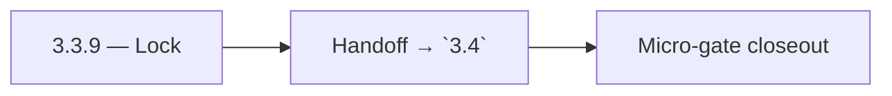

# 3.3.9 — Lock

- **Era:** `3.x` Contact/company data — hub [`versions.md`](../versions.md) · minors start at [`3.0 — Twin Ledger`](3.0%20%E2%80%94%20Twin%20Ledger.md)
- **Minor:** [3.3 — Search Quality](./3.3 — Search Quality.md)
- **Codename:** Lock
- **Status:** ✅ Completed
## Focus
Handoff → `3.4`

## Flowchart

## Micro-gate

| Track | Gate question | Answer / Evidence (fill at patch closeout) |
| --- | --- | --- |
| **Contract** | GraphQL, Connectra REST, or VQL contract changed? Diff vs `docs/backend/apis/` + endpoint matrices. | Document at patch closeout. |
| **Service** | List/count/batch-upsert, gateway clients, processors — smoke + idempotency story intact? | Document smoke paths. |
| **Surface** | Dashboard contacts/companies or admin paths changed? Filters, exports, error UX? | Document UX delta or N/A. |
| **Frontend** | Which routes/hooks/components for this patch? | Search UX, relevance, regression hooks. Document at closeout. |
| **Data** | PG+ES lineage, enrichment/dedup, job artifacts — migrations + docs? | Document lineage or N/A. |
| **Ops** | Queues, drift jobs, logs PII rules, runbooks — delta recorded? | Document ops delta or N/A. |

## Tasks
### Contract

- 📌 Planned: **[connectra]** — refine duplicate task (was: ✅ completed: 📌 planned: document **slo** numbers (p95 list, …) | patch `3.3.9` band `9` | reason: specialize this file vs sibling patches; see docs/codebases/connectra-codebase-analysis.md
- 📌 Planned: **[connectra]** — refine duplicate task (was: ✅ completed: 📌 planned: lock **forcount** behavior vs list p…) | patch `3.3.9` band `9` | reason: specialize this file vs sibling patches; see docs/codebases/connectra-codebase-analysis.md

### Service

- 📌 Planned: **[connectra]** — refine duplicate task (was: ✅ completed: 📌 planned: index maintenance: refresh, force-me…) | patch `3.3.9` band `9` | reason: specialize this file vs sibling patches; see docs/codebases/connectra-codebase-analysis.md
- 📌 Planned: **[connectra]** — refine duplicate task (was: ✅ completed: 📌 planned: query **profiling** for worst custom…) | patch `3.3.9` band `9` | reason: specialize this file vs sibling patches; see docs/codebases/connectra-codebase-analysis.md

### Surface

- 📌 Planned: **[connectra]** — refine duplicate task (was: ✅ completed: 📌 planned: loading skeletons; debounced search …) | patch `3.3.9` band `9` | reason: specialize this file vs sibling patches; see docs/codebases/connectra-codebase-analysis.md

### Data

- 📌 Planned: **[connectra]** — refine duplicate task (was: ✅ completed: 📌 planned: **es/pg** consistency assumptions fo…) | patch `3.3.9` band `9` | reason: specialize this file vs sibling patches; see docs/codebases/connectra-codebase-analysis.md

### Ops

- 📌 Planned: **[connectra]** — refine duplicate task (was: ✅ completed: 📌 planned: dashboards: search latency, es healt…) | patch `3.3.9` band `9` | reason: specialize this file vs sibling patches; see docs/codebases/connectra-codebase-analysis.md

## Service task slices
> Merged from era `3.x` contact/company task packs (P0→`.0`–`.2`, P1→`.3`–`.6`, Ops→`.7`–`.9`).

### Connectra
- **Contract:** Freeze VQL filter taxonomy and operator mapping for contacts and companies — keep aligned with [`vql-filter-taxonomy.md`](vql-filter-taxonomy.md) and gateway `vql_converter.py`.
- **Service:** Harden `ListByFilters`, `CountByFilters`, and `batch-upsert` for deterministic behavior — see [`connectra-service.md`](connectra-service.md).
- **Database:** Enforce **PG + ES** parity checks and deterministic **UUID5** rules for contacts, companies, and filter facets — [`enrichment-dedup.md`](enrichment-dedup.md).
- **Flow:** Validate **two-phase read** and **five-store parallel write** diagrams against runtime behavior.
- **Release gate evidence:** Relevance tests, **P95 latency** evidence, and **dedup consistency** report.
- One **golden search** (complex VQL) + **count** pair passes with trace id end-to-end.
- Reconciliation or sampling shows **ES/PG** within agreed drift threshold after bulk upsert test.
- Idempotency replay artifact attached for `batch-upsert` representative fixture.

### Appointment360 (gateway)
- Write contract test: contacts(query) input → Connectra REST /contacts/query
- Write contract test: companies(query) input → Connectra REST /companies/query
- Add /contacts + /companies Postman collection to docs/backend/postman/

## Evidence gate
Micro-gate table filled and handoff note to `3.4.0` recorded
