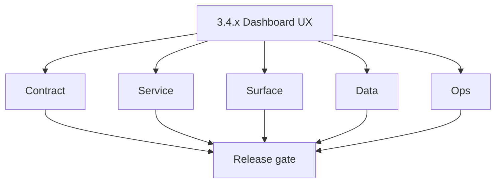

# Version 3.4 — Dashboard UX

- **Status:** ✅ Completed
- **Codename:** Dashboard UX
- **Era:** 3.x (Contact360 contact and company data system)
- **Roadmap:** Stage **3.4** — Dashboard search UX expansion
- **Summary:** **Discoverability**: advanced filter sidebar, **saved searches** (modal + GraphQL service), **company drill-down** by id, **search-to-export** via `useNewExport` / jobs page — without sacrificing VQL correctness from **`3.1`**.
- **Patch closure:** Every codenamed patch file includes **Micro-gate** + **Service task slices**. Era hub: [`versions.md`](../versions.md).

## Scope

- **Target:** `3.4.x` patches — UX completeness and conversion metrics.
- **Out of scope:** Backend drift jobs (**`3.7`**).
- **Owners:** Dashboard + Search.

## Flowchart

### Runtime focus (unique to this minor)

```mermaid
flowchart LR
    side["advanced filter sidebar"] --> state["filter state in app"]
    state --> save["SaveSearchModal plus SavedSearchesModal"]
    save --> gql["savedSearchesService GraphQL"]
    gql --> results["contacts companies table"]
    results --> drill["company detail route by id"]
    drill --> export["useNewExport hook from current VQL"]
    export --> jobs["jobs page status plus download"]
    jobs --> gate["3.4 release gate"]
```

## Task tracks

### Contract

- 📌 Planned: **[connectra]** — refine duplicate task (was: 📌 planned: **[connectra]** — refine duplicate task (was: ✅ c…) | patch `3.4.0` band `0` | reason: specialize this file vs sibling patches; see docs/codebases/connectra-codebase-analysis.md
- 📌 Planned: **[connectra]** — refine duplicate task (was: 📌 planned: **[connectra]** — refine duplicate task (was: ✅ c…) | patch `3.4.0` band `0` | reason: specialize this file vs sibling patches; see docs/codebases/connectra-codebase-analysis.md

- 📌 Planned: **[connectra]** — refine duplicate task (was: 📌 planned: **[architecture]** — product **graphql** remains …) | patch `3.4.0` band `0` | reason: specialize this file vs sibling patches; see docs/codebases/connectra-codebase-analysis.md
### Service

- 📌 Planned: **[connectra]** — refine duplicate task (was: 📌 planned: **[connectra]** — refine duplicate task (was: ✅ c…) | patch `3.4.0` band `0` | reason: specialize this file vs sibling patches; see docs/codebases/connectra-codebase-analysis.md

- 📌 Planned: **[connectra]** — refine duplicate task (was: 📌 planned: **[architecture]** — **go/gin satellites** in sco…) | patch `3.4.0` band `0` | reason: specialize this file vs sibling patches; see docs/codebases/connectra-codebase-analysis.md
### Surface

- 📌 Planned: **[connectra]** — refine duplicate task (was: 📌 planned: **[connectra]** — refine duplicate task (was: ✅ c…) | patch `3.4.0` band `0` | reason: specialize this file vs sibling patches; see docs/codebases/connectra-codebase-analysis.md
- 📌 Planned: **[connectra]** — refine duplicate task (was: 📌 planned: **[connectra]** — refine duplicate task (was: ✅ c…) | patch `3.4.0` band `0` | reason: specialize this file vs sibling patches; see docs/codebases/connectra-codebase-analysis.md

- 📌 Planned: **[connectra]** — refine duplicate task (was: 📌 planned: **[architecture]** — **next.js** customer surface…) | patch `3.4.0` band `0` | reason: specialize this file vs sibling patches; see docs/codebases/connectra-codebase-analysis.md
### Data

- 📌 Planned: **[connectra]** — refine duplicate task (was: 📌 planned: **[connectra]** — refine duplicate task (was: ✅ c…) | patch `3.4.0` band `0` | reason: specialize this file vs sibling patches; see docs/codebases/connectra-codebase-analysis.md

- 📌 Planned: **[connectra]** — refine duplicate task (was: 📌 planned: **[architecture]** — **postgresql-first** per `do…) | patch `3.4.0` band `0` | reason: specialize this file vs sibling patches; see docs/codebases/connectra-codebase-analysis.md
### Ops

- 📌 Planned: **[connectra]** — refine duplicate task (was: 📌 planned: **[connectra]** — refine duplicate task (was: ✅ c…) | patch `3.4.0` band `0` | reason: specialize this file vs sibling patches; see docs/codebases/connectra-codebase-analysis.md

- 📌 Planned: **[connectra]** — refine duplicate task (was: 📌 planned: **[architecture]** — **observability**: correlate…) | patch `3.4.0` band `0` | reason: specialize this file vs sibling patches; see docs/codebases/connectra-codebase-analysis.md
## Task Breakdown

| Slice | Outcome |
| --- | --- |
| App | Filter + saved search UX |
| Gateway | Mutations + validation |
| Jobs | Export handoff |

## Immediate next execution queue

- 📌 Planned: UX review: discoverability of advanced filters.
- 📌 Planned: Instrument export attribution (which saved search).

## Cross-service ownership

| Service | Focus |
| --- | --- |
| `contact360.io/app` | Primary |
| `contact360.io/api` | Saved search API |
| `contact360.io/jobs` | Export |

## References

- [`dashboard-search-ux.md`](dashboard-search-ux.md)
- [`docs/codebases/app-codebase-analysis.md`](../codebases/app-codebase-analysis.md)

## Backend API and Endpoint Scope

- GraphQL saved searches; export/job mutations tied to VQL.

## Database and Data Lineage Scope

- Saved search storage; export job references.

## Frontend UX Surface Scope

- Contacts, companies list, company `[id]`, jobs, export entry points.

## UI Elements Checklist

- 📌 Planned: SaveSearchModal, SavedSearchesModal
- 📌 Planned: Company detail link from row
- 📌 Planned: Export CTA with scope explanation
- 📌 Planned: Jobs list status badges

## Flow / Graph Delta for This Minor

- **Delta:** Productizes **discovery + repeatability** (saved search + export) on the technical spine from `3.0`–`3.3`.

## Audit and Compliance Notes

- Saved searches may encode sensitive criteria — treat as **user confidential** data.

## Patch ladder (`3.4.0` – `3.4.9`)

### Micro-gate reference (apply at every `3.N.P`)

| Track | Gate question (must answer Yes or document waiver) |
| --- | --- |
| **Contract** | GraphQL, Connectra REST, or VQL changed? `docs/backend/apis/` + endpoint matrices updated? |
| **Service** | List/count/batch-upsert and gateway paths still smoke; idempotency documented? |
| **Surface** | Dashboard contacts/companies or related admin UX changed? |
| **Frontend** | Which routes/hooks apply (see minor UX scope / `dashboard-search-ux.md`)? |
| **Data** | PG+ES lineage, enrichment/dedup, job artifacts — docs + migrations? |
| **Ops** | Queues, drift tooling, logs PII rules, runbooks — delta recorded? |
| **Architecture** | Go/Gin satellites only via Python GraphQL gateway (`contact360.io/api`); Next.js `NEXT_PUBLIC_GRAPHQL_URL`; Postgres-first / Redis exit per `docs/docs/data-stores-postgres.md`. |

**Patch intent bands (universal ladder):** `.0` Charter · `.1` Connectra · `.2` Gateway · `.3` Dashboard · `.4` Jobs/S3 · `.5` Satellite · `.6` Observability · `.7` Hardening · `.8` Evidence · `.9` Gate / handoff.

Theme: **Canvas** — codenames in per-patch `3.4.P — *.md` files.

| Patch | Codename | Focus |
| --- | --- | --- |
| `3.4.0` | Sidebar | Advanced filters |
| `3.4.1` | Chip | Chip UX |
| `3.4.2` | Range | Range controls |
| `3.4.3` | Saved | Persist search |
| `3.4.4` | Detail | Row actions |
| `3.4.5` | Drill | Company page |
| `3.4.6` | Export | Export handoff |
| `3.4.7` | Gate | Entitlement gates |
| `3.4.8` | Feature | Plan flags |
| `3.4.9` | Ship | Handoff → `3.5` |

## Release Gate and Evidence

### Master Task Checklist

- 📌 Planned: Roadmap 3.4 KPI baseline

### Backend API and Endpoints

- 📌 Planned: Saved search CRUD smoke

### Database and Data Lineage

- 📌 Planned: Storage schema link

### Frontend UX

- 📌 Planned: End-to-end screen recording

### UI Elements

- 📌 Planned: Checklist above

### Flow and Graph

- 📌 Planned: Runtime Mermaid reviewed

### Validation

- 📌 Planned: Export from saved search works

### Release Gate

- 📌 Planned: Sign-off for **`3.5` Import/Export Pipeline**

## Patches

| Patch | Codename | Doc |
| --- | --- | --- |
| `3.4.0` | Sidebar | [`3.4.0` — Sidebar](3.4.0 — Sidebar.md) |
| `3.4.1` | Chip | [`3.4.1` — Chip](3.4.1 — Chip.md) |
| `3.4.2` | Range | [`3.4.2` — Range](3.4.2 — Range.md) |
| `3.4.3` | Saved | [`3.4.3` — Saved](3.4.3 — Saved.md) |
| `3.4.4` | Detail | [`3.4.4` — Detail](3.4.4 — Detail.md) |
| `3.4.5` | Drill | [`3.4.5` — Drill](3.4.5 — Drill.md) |
| `3.4.6` | Export | [`3.4.6` — Export](3.4.6 — Export.md) |
| `3.4.7` | Gate | [`3.4.7` — Gate](3.4.7 — Gate.md) |
| `3.4.8` | Feature | [`3.4.8` — Feature](3.4.8 — Feature.md) |
| `3.4.9` | Ship | [`3.4.9` — Ship](3.4.9 — Ship.md) |
