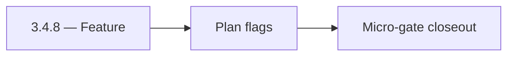

# 3.4.8 — Feature

- **Era:** `3.x` Contact/company data — hub [`versions.md`](../versions.md) · minors start at [`3.0 — Twin Ledger`](3.0%20%E2%80%94%20Twin%20Ledger.md)
- **Minor:** [3.4 — Dashboard UX](./3.4 — Dashboard UX.md)
- **Codename:** Feature
- **Status:** ✅ Completed
## Focus
Plan flags

## Flowchart

## Micro-gate

| Track | Gate question | Answer / Evidence (fill at patch closeout) |
| --- | --- | --- |
| **Contract** | GraphQL, Connectra REST, or VQL contract changed? Diff vs `docs/backend/apis/` + endpoint matrices. | Document at patch closeout. |
| **Service** | List/count/batch-upsert, gateway clients, processors — smoke + idempotency story intact? | Document smoke paths. |
| **Surface** | Dashboard contacts/companies or admin paths changed? Filters, exports, error UX? | Document UX delta or N/A. |
| **Frontend** | Which routes/hooks/components for this patch? | Saved search, export, drill-down modals. Document at closeout. |
| **Data** | PG+ES lineage, enrichment/dedup, job artifacts — migrations + docs? | Document lineage or N/A. |
| **Ops** | Queues, drift jobs, logs PII rules, runbooks — delta recorded? | Document ops delta or N/A. |

## Tasks
### Contract

- ✅ Completed: 📌 Planned: Saved search payload ↔ **stored VQL** or equivalent JSON.
- ✅ Completed: 📌 Planned: Export job create carries **query fingerprint** for lineage.

### Service

- ✅ Completed: 📌 Planned: Server validates saved search size and filter depth (abuse guard).

### Surface

- ✅ Completed: 📌 Planned: Routes: [`dashboard-search-ux.md`](dashboard-search-ux.md).
- ✅ Completed: 📌 Planned: Feature access: `ADVANCED_FILTERS`, `SAVE_SEARCHES`.

### Data

- ✅ Completed: 📌 Planned: **User-owned** saved search rows; GDPR delete path.

### Ops

- ✅ Completed: 📌 Planned: Funnel metric: **search-to-export conversion** (roadmap KPI).

## Service task slices
> Merged from era `3.x` contact/company task packs (P0→`.0`–`.2`, P1→`.3`–`.6`, Ops→`.7`–`.9`).

### Appointment360 (gateway)
- Write contract test: contacts(query) input → Connectra REST /contacts/query
- Write contract test: companies(query) input → Connectra REST /companies/query
- Add /contacts + /companies Postman collection to docs/backend/postman/

## Evidence gate
Patch closeout includes contract diff, smoke output, data lineage delta, and ops note
