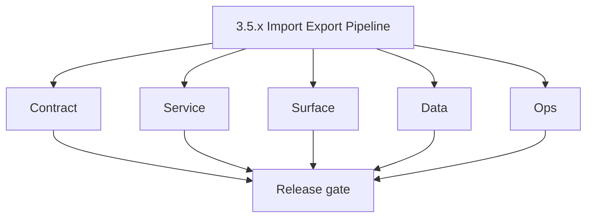

# Version 3.5 — Import/Export Pipeline

- **Status:** planned  
- **Codename:** Import/Export Pipeline  
- **Era:** 3.x (Contact360 contact and company data system)  
- **Roadmap:** Cross-cutting — Jobs **`3.x`**: `contact360_import_prepare`, `contact360_export_stream`, **`POST /api/v1/jobs/validate/vql`**  
- **Summary:** **Bulk data motion**: CSV/object intake → **`contact360_import_prepare`** → DAG nodes → stream processors writing **PG + OpenSearch**; **export** stream emits files from **VQL**; validation endpoint keeps export payloads aligned with dashboard queries.  
- **Patch closure:** Every codenamed patch file includes **Micro-gate** + **Service task slices**. Era hub: [`versions.md`](../versions.md).

## Scope

- **Target:** `3.5.x` patches — contracts, lineage, partial failure UX.  
- **Out of scope:** Email stream processors (**`2.x`**).  
- **Owners:** Data Pipeline + Platform.

## Flowchart

### Runtime focus (unique to this minor)

```mermaid
flowchart LR
    up["upload or ingest trigger"] --> prep["contact360_import_prepare"]
    prep --> dag["job DAG nodes"]
    dag --> stream["stream processor PG plus OS"]
    stream --> validate["validate vql for export"]
    validate --> exp["contact360_export_stream"]
    exp --> out["artifact download"]
    out --> trace["job_response plus VQL lineage"]
    trace --> gate["3.5 release gate"]
```

## Task tracks

### Contract

- 📌 Planned: Freeze **import/export** job create payloads — **Service task slices** in `3.5.P` patch files (scope from former `jobs-contact-company-task-pack.md`).  
- 📌 Planned: **`validate/vql`** request/response tied to [`vql-filter-taxonomy.md`](vql-filter-taxonomy.md).

### Service

- 📌 Planned: **DAG degree** updates safe; document recovery if degree stuck (jobs analysis).  
- 📌 Planned: Idempotent stages on retry.

### Surface

- 📌 Planned: Import/export pages and execution graph panels per jobs pack.

### Data

- 📌 Planned: **job_node.data** includes VQL fingerprint, target tables, index names.

### Ops

- 📌 Planned: Runbook: replay import after Connectra partial failure.

## Task Breakdown

| Slice | Outcome |
| --- | --- |
| Jobs | Processors + API |
| Connectra | Upsert targets |
| s3storage | Large file path |

## Immediate next execution queue

- 📌 Planned: E2E: validate VQL → export job → download.  
- 📌 Planned: Chaos: worker kill mid-import → resume policy.

## Cross-service ownership

| Service | Focus |
| --- | --- |
| `contact360.io/jobs` | DAG + processors |
| `contact360.io/sync` | Connectra writes |
| `contact360.io/api` | Job orchestration |

## References

- [`docs/codebases/jobs-codebase-analysis.md`](../codebases/jobs-codebase-analysis.md)  
- [`docs/roadmap.md`](../roadmap.md) — jobs 3.x bullet

## Backend API and Endpoint Scope

- `POST /api/v1/jobs/contact360-import`, `POST /api/v1/jobs/contact360-export`, `POST /api/v1/jobs/validate/vql`.

## Database and Data Lineage Scope

- Job tables; PG tables; OpenSearch indexes; S3 keys for CSV.

## Frontend UX Surface Scope

- Data jobs UI; error and partial progress states.

## UI Elements Checklist

- 📌 Planned: Import wizard  
- 📌 Planned: Export dialog with VQL preview  
- 📌 Planned: Job graph / timeline  
- 📌 Planned: Download / retry

## Flow / Graph Delta for This Minor

- **Delta:** Adds **asynchronous bulk** path alongside interactive search (`3.0`–`3.4`).

## Audit and Compliance Notes

- CSV bulk is **high PII** — encryption, retention, access logging.

## Patch ladder (`3.5.0` – `3.5.9`)

### Micro-gate reference (apply at every `3.N.P`)

| Track | Gate question (must answer Yes or document waiver) |
| --- | --- |
| **Contract** | GraphQL, Connectra REST, or VQL changed? `docs/backend/apis/` + endpoint matrices updated? |
| **Service** | List/count/batch-upsert and gateway paths still smoke; idempotency documented? |
| **Surface** | Dashboard contacts/companies or related admin UX changed? |
| **Frontend** | Which routes/hooks apply (see minor UX scope / `dashboard-search-ux.md`)? |
| **Data** | PG+ES lineage, enrichment/dedup, job artifacts — docs + migrations? |
| **Ops** | Queues, drift tooling, logs PII rules, runbooks — delta recorded? |

**Patch intent bands (universal ladder):** `.0` Charter · `.1` Connectra · `.2` Gateway · `.3` Dashboard · `.4` Jobs/S3 · `.5` Satellite · `.6` Observability · `.7` Hardening · `.8` Evidence · `.9` Gate / handoff.

Theme: **Pipeline** — codenames in per-patch `3.5.P — *.md` files.

| Patch | Codename | Focus |
| --- | --- | --- |
| `3.5.0` | Intake | Upload contract |
| `3.5.1` | Parse | CSV schema |
| `3.5.2` | Stage | Staging tables |
| `3.5.3` | Validate | Row validation |
| `3.5.4` | Execute | Processor core |
| `3.5.5` | Persist | Upsert flush |
| `3.5.6` | Verify | Row counts |
| `3.5.7` | Export | Export stream |
| `3.5.8` | Trace | Lineage IDs |
| `3.5.9` | Close | Handoff → `3.6` |

## Release Gate and Evidence

### Master Task Checklist

- 📌 Planned: Import + export evidence bundle

### Backend API and Endpoints

- 📌 Planned: validate/vql CI test

### Database and Data Lineage

- 📌 Planned: Lineage diagram updated

### Frontend UX

- 📌 Planned: Job UX recording

### UI Elements

- 📌 Planned: Checklist above

### Flow and Graph

- 📌 Planned: Runtime Mermaid reviewed

### Validation

- 📌 Planned: Row count reconciliation report

### Release Gate

- 📌 Planned: Sign-off for **`3.6` Sales Navigator Ingestion**

## Patches

| Patch | Codename | Doc |
| --- | --- | --- |
| `3.5.0` | Intake | [`3.5.0` — Intake](3.5.0 — Intake.md) |
| `3.5.1` | Parse | [`3.5.1` — Parse](3.5.1 — Parse.md) |
| `3.5.2` | Stage | [`3.5.2` — Stage](3.5.2 — Stage.md) |
| `3.5.3` | Validate | [`3.5.3` — Validate](3.5.3 — Validate.md) |
| `3.5.4` | Execute | [`3.5.4` — Execute](3.5.4 — Execute.md) |
| `3.5.5` | Persist | [`3.5.5` — Persist](3.5.5 — Persist.md) |
| `3.5.6` | Verify | [`3.5.6` — Verify](3.5.6 — Verify.md) |
| `3.5.7` | Export | [`3.5.7` — Export](3.5.7 — Export.md) |
| `3.5.8` | Trace | [`3.5.8` — Trace](3.5.8 — Trace.md) |
| `3.5.9` | Close | [`3.5.9` — Close](3.5.9 — Close.md) |
