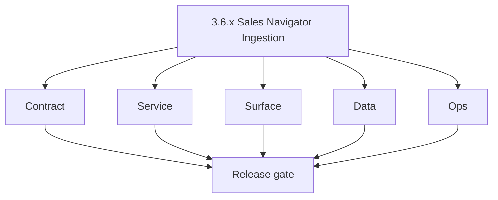
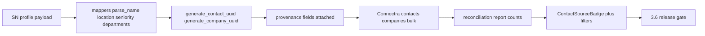

# Version 3.6 — Sales Navigator Ingestion

- **Status:** planned  
- **Codename:** Sales Navigator Ingestion  
- **Era:** 3.x (Contact360 contact and company data system)  
- **Roadmap:** **Sales Navigator** codebase **`3.x`** row — mapper coverage, provenance, Connectra parity (**Service task slices** in `3.6.P` patch files (scope from former `salesnavigator-contact-company-task-pack.md`))  
- **Summary:** **`m.py` mappers** → normalized contact/company → **UUID** determinism → **provenance** (`source`, `lead_id`, `search_id`, `connection_degree`, `data_quality_score`) → **Connectra** bulk upsert → **reconciliation** counts (input = created + updated + errors).  
- **Patch closure:** Every codenamed patch file includes **Micro-gate** + **Service task slices**. Era hub: [`versions.md`](../versions.md).

## Scope

- **Target:** `3.6.x` patches — field coverage, idempotency, UI badges/filters tied to SN fields.  
- **Out of scope:** Extension token/session hardening (**`4.x`**).  
- **Owners:** Ingest + Connectra.

## Flowchart

### Runtime focus (unique to this minor)

## Task tracks

### Contract

- 📌 Planned: Lock **`mappers.py`** output vs Connectra VQL taxonomy — pack checklist.  
- 📌 Planned: Document **`PLACEHOLDER_VALUE`** / LinkedIn URL gap and dedup impact.

### Service

- 📌 Planned: **Chunk-level idempotency token** on Lambda retry (SN analysis gap).  
- 📌 Planned: 100-profile integration test → Connectra.

### Surface

- 📌 Planned: Chips/badges: seniority, department, connection degree, source filter.

### Data

- 📌 Planned: Same **profile URL** → same UUID on repeat; different email policy documented.

### Ops

- 📌 Planned: Parity: all input UUIDs discoverable in Connectra.

## Task Breakdown

| Slice | Outcome |
| --- | --- |
| salesnavigator | Mappers + API |
| Connectra | Upsert contract |
| App | SN-aware UX |

## Immediate next execution queue

- 📌 Planned: Table of **null** SN fields (`employees_count`, etc.) vs enrichment follow-up.  
- 📌 Planned: Retry test: duplicate chunk does not double-insert.

## Cross-service ownership

| Service | Focus |
| --- | --- |
| `backend(dev)/salesnavigator` | Ingest |
| `contact360.io/sync` | Storage |
| `contact360.io/app` | Filters/badges |

## References

- [`docs/codebases/salesnavigator-codebase-analysis.md`](../codebases/salesnavigator-codebase-analysis.md)  
- **Service task slices** in `3.6.P` patch files (scope from former `salesnavigator-contact-company-task-pack.md`)

## Backend API and Endpoint Scope

- SN Lambda routes; Connectra `/contacts/batch-upsert`, `/companies/batch-upsert` (per `connectra-service.md` naming).

## Database and Data Lineage Scope

- Provenance columns; extended attrs for premium/hired/mutual counts.

## Frontend UX Surface Scope

- Contact/company surfaces per pack Surface track.

## UI Elements Checklist

- 📌 Planned: ContactSourceBadge  
- 📌 Planned: SeniorityChip, DepartmentChips, ConnectionDegreeBadge  
- 📌 Planned: ContactSourceFilter

## Flow / Graph Delta for This Minor

- **Delta:** Tightens **ingest → Connectra** for SN-specific quality; complements generic dedup (`3.2`).

## Audit and Compliance Notes

- Provenance fields support **audit** of lead origin; avoid logging raw SN tokens.

## Patch ladder (`3.6.0` – `3.6.9`)

### Micro-gate reference (apply at every `3.N.P`)

| Track | Gate question (must answer Yes or document waiver) |
| --- | --- |
| **Contract** | GraphQL, Connectra REST, or VQL changed? `docs/backend/apis/` + endpoint matrices updated? |
| **Service** | List/count/batch-upsert and gateway paths still smoke; idempotency documented? |
| **Surface** | Dashboard contacts/companies or related admin UX changed? |
| **Frontend** | Which routes/hooks apply (see minor UX scope / `dashboard-search-ux.md`)? |
| **Data** | PG+ES lineage, enrichment/dedup, job artifacts — docs + migrations? |
| **Ops** | Queues, drift tooling, logs PII rules, runbooks — delta recorded? |

**Patch intent bands (universal ladder):** `.0` Charter · `.1` Connectra · `.2` Gateway · `.3` Dashboard · `.4` Jobs/S3 · `.5` Satellite · `.6` Observability · `.7` Hardening · `.8` Evidence · `.9` Gate / handoff.

Theme: **Navigator** — codenames in per-patch `3.6.P — *.md` files.

| Patch | Codename | Focus |
| --- | --- | --- |
| `3.6.0` | Map | Mapper charter |
| `3.6.1` | Parse | Name/location |
| `3.6.2` | Infer | Seniority |
| `3.6.3` | Score | Quality score |
| `3.6.4` | Tag | Provenance |
| `3.6.5` | Dedup | UUID edges |
| `3.6.6` | Submit | Bulk submit |
| `3.6.7` | Verify | Field verify |
| `3.6.8` | Reconcile | Count report |
| `3.6.9` | Freeze | Handoff → `3.7` |

## Release Gate and Evidence

### Master Task Checklist

- 📌 Planned: SN pack contract checklist progress

### Backend API and Endpoints

- 📌 Planned: Batch ingest smoke

### Database and Data Lineage

- 📌 Planned: Provenance column migration if any

### Frontend UX

- 📌 Planned: Badge screenshot

### UI Elements

- 📌 Planned: Checklist above

### Flow and Graph

- 📌 Planned: Runtime Mermaid reviewed

### Validation

- 📌 Planned: Reconciliation equation holds on sample batch

### Release Gate

- 📌 Planned: Sign-off for **`3.7` Dual-Store Integrity**

## Patches

| Patch | Codename | Doc |
| --- | --- | --- |
| `3.6.0` | Map | [`3.6.0` — Map](3.6.0 — Map.md) |
| `3.6.1` | Parse | [`3.6.1` — Parse](3.6.1 — Parse.md) |
| `3.6.2` | Infer | [`3.6.2` — Infer](3.6.2 — Infer.md) |
| `3.6.3` | Score | [`3.6.3` — Score](3.6.3 — Score.md) |
| `3.6.4` | Tag | [`3.6.4` — Tag](3.6.4 — Tag.md) |
| `3.6.5` | Dedup | [`3.6.5` — Dedup](3.6.5 — Dedup.md) |
| `3.6.6` | Submit | [`3.6.6` — Submit](3.6.6 — Submit.md) |
| `3.6.7` | Verify | [`3.6.7` — Verify](3.6.7 — Verify.md) |
| `3.6.8` | Reconcile | [`3.6.8` — Reconcile](3.6.8 — Reconcile.md) |
| `3.6.9` | Freeze | [`3.6.9` — Freeze](3.6.9 — Freeze.md) |
