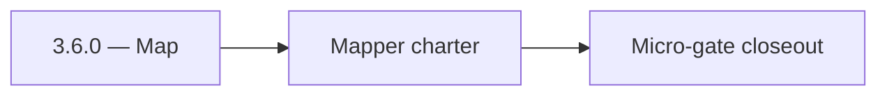

# 3.6.0 — Map

- **Era:** `3.x` Contact/company data — hub [`versions.md`](../versions.md) · minors start at [`3.0 — Twin Ledger`](3.0%20%E2%80%94%20Twin%20Ledger.md)
- **Minor:** [3.6 — Sales Navigator Ingestion](./3.6 — Sales Navigator Ingestion.md)
- **Codename:** Map
- **Status:** planned

## Focus
Mapper charter

## Flowchart

## Micro-gate

| Track | Gate question | Answer / Evidence (fill at patch closeout) |
| --- | --- | --- |
| **Contract** | GraphQL, Connectra REST, or VQL contract changed? Diff vs `docs/backend/apis/` + endpoint matrices. | Document at patch closeout. |
| **Service** | List/count/batch-upsert, gateway clients, processors — smoke + idempotency story intact? | Document smoke paths. |
| **Surface** | Dashboard contacts/companies or admin paths changed? Filters, exports, error UX? | Document UX delta or N/A. |
| **Frontend** | Which routes/hooks/components for this patch? | SN ingestion surfaces / provenance display if any. Document at closeout. |
| **Data** | PG+ES lineage, enrichment/dedup, job artifacts — migrations + docs? | Document lineage or N/A. |
| **Ops** | Queues, drift jobs, logs PII rules, runbooks — delta recorded? | Document ops delta or N/A. |

## Tasks
### Contract

- 📌 Planned: Lock **`mappers.py`** output vs Connectra VQL taxonomy — pack checklist.  
- 📌 Planned: Document **`PLACEHOLDER_VALUE`** / LinkedIn URL gap and dedup impact.

### Service

- 📌 Planned: **Chunk-level idempotency token** on Lambda retry (SN analysis gap).  
- 📌 Planned: 100-profile integration test → Connectra.

### Surface

- 📌 Planned: Chips/badges: seniority, department, connection degree, source filter.

### Data

- 📌 Planned: Same **profile URL** → same UUID on repeat; different email policy documented.

### Ops

- 📌 Planned: Parity: all input UUIDs discoverable in Connectra.

## Service task slices
> Merged from era `3.x` contact/company task packs (P0→`.0`–`.2`, P1→`.3`–`.6`, Ops→`.7`–`.9`).

### Salesnavigator
- Reconciliation equation holds on 1k profile golden batch.
- PLACEHOLDER / URL policy documented and signed off by Data owner.
- Idempotency retry test: duplicate chunk → no duplicate Connectra rows.

### Connectra
- **Contract:** Freeze VQL filter taxonomy and operator mapping for contacts and companies — keep aligned with [`vql-filter-taxonomy.md`](vql-filter-taxonomy.md) and gateway `vql_converter.py`.
- **Service:** Harden `ListByFilters`, `CountByFilters`, and `batch-upsert` for deterministic behavior — see [`connectra-service.md`](connectra-service.md).
- **Database:** Enforce **PG + ES** parity checks and deterministic **UUID5** rules for contacts, companies, and filter facets — [`enrichment-dedup.md`](enrichment-dedup.md).
- **Flow:** Validate **two-phase read** and **five-store parallel write** diagrams against runtime behavior.

### emailapis / emailapigo
- Golden profile: finder/verifier → contact row shows same email + status as Connectra **after** refresh.
- Endpoint matrix updated for **3.x**.
- No undocumented breaking field rename on enrichment responses.

## Evidence gate
Primary charter artifact created and linked in the parent minor doc
