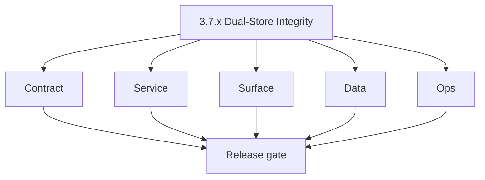

# Version 3.7 — Dual-Store Integrity

- **Status:** planned  
- **Codename:** Dual-Store Integrity  
- **Era:** 3.x (Contact360 contact and company data system)  
- **Roadmap:** Connectra **`3.x`** execution queue — **ES↔PG reconciliation**, durable jobs, **batch-upsert idempotency** evidence  
- **Summary:** After **dual writes**, detect **drift** between Elasticsearch and PostgreSQL, run **reconciliation** jobs, alert on threshold, support **replay/backfill** with evidence; harden **in-memory queue** risk via durable backing.  
- **Patch closure:** Every codenamed patch file includes **Micro-gate** + **Service task slices**. Era hub: [`versions.md`](../versions.md).

## Scope

- **Target:** `3.7.x` patches — automation + runbooks, minimal UX.  
- **Owners:** Platform + Search SRE.

## Flowchart

### Runtime focus (unique to this minor)

```mermaid
flowchart LR
    wr["batch upsert completes"] --> scan["reconciliation scan job"]
    scan --> diff["ES vs PG diff sets"]
    diff --> flag["drift report plus severity"]
    flag --> alert["pager or ticket threshold"]
    alert --> patch["repair or reindex slice"]
    patch --> replay["replay evidence archived"]
    replay --> gate["3.7 release gate"]
```

## Task tracks

### Contract

- 📌 Planned: Define **drift** semantics (missing in ES, stale doc, extra in ES).  
- 📌 Planned: **Release gate** artifact: idempotency replay proof — **Service task slices** in `3.7.P` patch files (scope from former `connectra-contact-company-task-pack.md`).

### Service

- 📌 Planned: **Persistent queue** for Connectra jobs — codebase analysis queue.  
- 📌 Planned: Reconciliation job **schedule** and locking.

### Surface

- 📌 Planned: Admin/internal UI for drift report (optional).

### Data

- 📌 Planned: Backfill playbook: reindex + verify counts.

### Ops

- 📌 Planned: Runbook: “ES green, PG correct, UI wrong” triage.

## Task Breakdown

| Slice | Outcome |
| --- | --- |
| Connectra + infra | Queue + reconciliation |
| Data | Repair jobs |
| SRE | Alerts |

## Immediate next execution queue

- 📌 Planned: Sample drift report from staging chaos test.  
- 📌 Planned: Document allowed lag window before alert.

## Cross-service ownership

| Service | Focus |
| --- | --- |
| `contact360.io/sync` | Primary |
| `logs.api` | Drift events |

## References

- [`docs/codebases/connectra-codebase-analysis.md`](../codebases/connectra-codebase-analysis.md)  
- [`enrichment-dedup.md`](enrichment-dedup.md) — reconciliation note

## Backend API and Endpoint Scope

- Internal repair endpoints if any; job listing `POST /common/jobs` per `connectra-service.md`.

## Database and Data Lineage Scope

- ES indexes; PG tables; reconciliation audit table (if introduced).

## Frontend UX Surface Scope

- Minimal — optional ops console.

## UI Elements Checklist

- 📌 Planned: Drift summary table (if built)

## Flow / Graph Delta for This Minor

- **Delta:** Adds **closed-loop integrity** on top of parallel write model (`3.2`).

## Audit and Compliance Notes

- Repair actions must be **actor-attributed** in admin contexts.

## Patch ladder (`3.7.0` – `3.7.9`)

### Micro-gate reference (apply at every `3.N.P`)

| Track | Gate question (must answer Yes or document waiver) |
| --- | --- |
| **Contract** | GraphQL, Connectra REST, or VQL changed? `docs/backend/apis/` + endpoint matrices updated? |
| **Service** | List/count/batch-upsert and gateway paths still smoke; idempotency documented? |
| **Surface** | Dashboard contacts/companies or related admin UX changed? |
| **Frontend** | Which routes/hooks apply (see minor UX scope / `dashboard-search-ux.md`)? |
| **Data** | PG+ES lineage, enrichment/dedup, job artifacts — docs + migrations? |
| **Ops** | Queues, drift tooling, logs PII rules, runbooks — delta recorded? |

**Patch intent bands (universal ladder):** `.0` Charter · `.1` Connectra · `.2` Gateway · `.3` Dashboard · `.4` Jobs/S3 · `.5` Satellite · `.6` Observability · `.7` Hardening · `.8` Evidence · `.9` Gate / handoff.

Theme: **Parity** — codenames in per-patch `3.7.P — *.md` files.

| Patch | Codename | Focus |
| --- | --- | --- |
| `3.7.0` | Write | Write audit |
| `3.7.1` | Scan | Scanner job |
| `3.7.2` | Diff | Diff engine |
| `3.7.3` | Flag | Classification |
| `3.7.4` | Alert | Thresholds |
| `3.7.5` | Patch | Repair slice |
| `3.7.6` | Replay | Replay job |
| `3.7.7` | Confirm | Sign-off |
| `3.7.8` | Archive | Evidence store |
| `3.7.9` | Gate | Handoff → `3.8` |

## Release Gate and Evidence

### Master Task Checklist

- 📌 Planned: Connectra execution queue items 1–5 status

### Backend API and Endpoints

- 📌 Planned: Reconciliation job dry-run OK

### Database and Data Lineage

- 📌 Planned: Before/after counts

### Frontend UX

- 📌 Planned: N/A

### UI Elements

- 📌 Planned: Checklist above

### Flow and Graph

- 📌 Planned: Runtime Mermaid reviewed

### Validation

- 📌 Planned: Injected drift detected within SLA

### Release Gate

- 📌 Planned: Sign-off for **`3.8` Contact AI Alignment**

## Patches

| Patch | Codename | Doc |
| --- | --- | --- |
| `3.7.0` | Write | [`3.7.0` — Write](3.7.0 — Write.md) |
| `3.7.1` | Scan | [`3.7.1` — Scan](3.7.1 — Scan.md) |
| `3.7.2` | Diff | [`3.7.2` — Diff](3.7.2 — Diff.md) |
| `3.7.3` | Flag | [`3.7.3` — Flag](3.7.3 — Flag.md) |
| `3.7.4` | Alert | [`3.7.4` — Alert](3.7.4 — Alert.md) |
| `3.7.5` | Patch | [`3.7.5` — Patch](3.7.5 — Patch.md) |
| `3.7.6` | Replay | [`3.7.6` — Replay](3.7.6 — Replay.md) |
| `3.7.7` | Confirm | [`3.7.7` — Confirm](3.7.7 — Confirm.md) |
| `3.7.8` | Archive | [`3.7.8` — Archive](3.7.8 — Archive.md) |
| `3.7.9` | Gate | [`3.7.9` — Gate](3.7.9 — Gate.md) |
