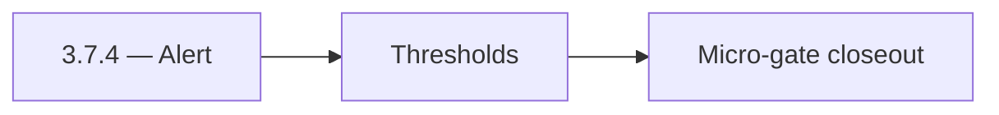

# 3.7.4 — Alert

- **Era:** `3.x` Contact/company data — hub [`versions.md`](../versions.md) · minors start at [`3.0 — Twin Ledger`](3.0%20%E2%80%94%20Twin%20Ledger.md)
- **Minor:** [3.7 — Dual-Store Integrity](./3.7 — Dual-Store Integrity.md)
- **Codename:** Alert
- **Status:** ✅ Completed
## Focus
Thresholds

## Flowchart

## Micro-gate

| Track | Gate question | Answer / Evidence (fill at patch closeout) |
| --- | --- | --- |
| **Contract** | GraphQL, Connectra REST, or VQL contract changed? Diff vs `docs/backend/apis/` + endpoint matrices. | Document at patch closeout. |
| **Service** | List/count/batch-upsert, gateway clients, processors — smoke + idempotency story intact? | Document smoke paths. |
| **Surface** | Dashboard contacts/companies or admin paths changed? Filters, exports, error UX? | Document UX delta or N/A. |
| **Frontend** | Which routes/hooks/components for this patch? | Drift/diff admin views if exposed. Document at closeout. |
| **Data** | PG+ES lineage, enrichment/dedup, job artifacts — migrations + docs? | Document lineage or N/A. |
| **Ops** | Queues, drift jobs, logs PII rules, runbooks — delta recorded? | Document ops delta or N/A. |

## Tasks
### Contract

- 📌 Planned: **[connectra]** — refine duplicate task (was: ✅ completed: 📌 planned: define **drift** semantics (missing …) | patch `3.7.4` band `4` | reason: specialize this file vs sibling patches; see docs/codebases/connectra-codebase-analysis.md
- 📌 Planned: **[connectra]** — refine duplicate task (was: ✅ completed: 📌 planned: **release gate** artifact: idempoten…) | patch `3.7.4` band `4` | reason: specialize this file vs sibling patches; see docs/codebases/connectra-codebase-analysis.md

### Service

- 📌 Planned: **[connectra]** — refine duplicate task (was: ✅ completed: 📌 planned: **persistent queue** for connectra j…) | patch `3.7.4` band `4` | reason: specialize this file vs sibling patches; see docs/codebases/connectra-codebase-analysis.md
- 📌 Planned: **[connectra]** — refine duplicate task (was: ✅ completed: 📌 planned: reconciliation job **schedule** and …) | patch `3.7.4` band `4` | reason: specialize this file vs sibling patches; see docs/codebases/connectra-codebase-analysis.md

### Surface

- 📌 Planned: **[connectra]** — refine duplicate task (was: ✅ completed: 📌 planned: admin/internal ui for drift report (…) | patch `3.7.4` band `4` | reason: specialize this file vs sibling patches; see docs/codebases/connectra-codebase-analysis.md

### Data

- 📌 Planned: **[connectra]** — refine duplicate task (was: ✅ completed: 📌 planned: backfill playbook: reindex + verify …) | patch `3.7.4` band `4` | reason: specialize this file vs sibling patches; see docs/codebases/connectra-codebase-analysis.md

### Ops

- 📌 Planned: **[connectra]** — refine duplicate task (was: ✅ completed: 📌 planned: runbook: “es green, pg correct, ui w…) | patch `3.7.4` band `4` | reason: specialize this file vs sibling patches; see docs/codebases/connectra-codebase-analysis.md

## Service task slices
> Merged from era `3.x` contact/company task packs (P0→`.0`–`.2`, P1→`.3`–`.6`, Ops→`.7`–`.9`).

### Connectra
- **Database:** Enforce **PG + ES** parity checks and deterministic **UUID5** rules for contacts, companies, and filter facets — [`enrichment-dedup.md`](enrichment-dedup.md).
- **Flow:** Validate **two-phase read** and **five-store parallel write** diagrams against runtime behavior.
- **Release gate evidence:** Relevance tests, **P95 latency** evidence, and **dedup consistency** report.
- One **golden search** (complex VQL) + **count** pair passes with trace id end-to-end.
- Reconciliation or sampling shows **ES/PG** within agreed drift threshold after bulk upsert test.
- Idempotency replay artifact attached for `batch-upsert` representative fixture.

### logs.api
- Synthetic **export job** emits `contact360.export.completed` queryable within SLA.
- Support runbook links **request_id** across app → api → Connectra → logs.api for one ticket.

### Jobs
- E2E: **validate/vql** → export job → artifact download matches count from Connectra `CountByFilters` for same VQL.
- Import replay after simulated worker failure yields **idempotent** row counts (no duplicate keys).
- Runbook reviewed for **blocked DAG** scenario.

## Evidence gate
Patch closeout includes contract diff, smoke output, data lineage delta, and ops note
