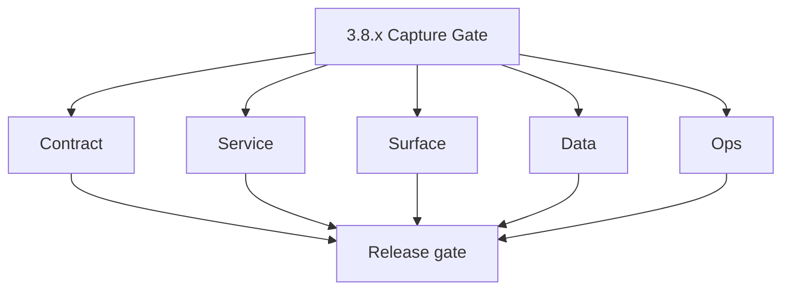
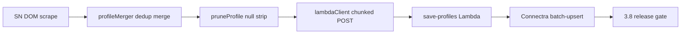

# Version 3.8 — Capture Gate

- **Status:** ✅ Completed
- **Codename:** Capture Gate
- **Era:** 3.x (Contact360 contact and company data system)
- **Roadmap:** **Extension → Connectra** ingestion quality for contact/company records *before* full **4.x** extension/SN maturity (session, popup UX, partner APIs).
- **Summary:** Harden **`profileMerger.js`** (`deduplicateProfiles`, `mergeProfiles`, `scoreProfile`) and **`lambdaClient.js`** (chunking, retry, `saveProfiles` to internal save/bulk path); optional **completeness threshold** to reject low-quality profiles; **provenance** tags consistent with Connectra/SN docs; dedup ratio telemetry. Primary SN *mapper* work remains **`3.6`**; this minor is **client-side capture + transport** quality.
- **Patch closure:** Every codenamed patch file includes **Micro-gate** + **Service task slices**. Era hub: [`versions.md`](../versions.md).

## Scope

- **Target:** `3.8.x` patches — extension codebase + Lambda relay contracts to Connectra.
- **Out of scope:** Chrome Web Store packaging narrative alone without data-quality outcomes; full OAuth/session saga (**`4.x`**).
- **Owners:** Extension + Integrations + Connectra (API path verification).

## Flowchart

### Runtime focus (unique to this minor)

## Task tracks

### Contract

- ✅ Completed: 📌 Planned: **[connectra]** — refine duplicate task (was: 📌 planned: **[connectra]** — refine duplicate task (was: 📌 p…) | patch `3.8.0` band `0` | reason: specialize this file vs sibling patches; see docs/codebases/connectra-codebase-analysis.md
- ✅ Completed: 📌 Planned: **[connectra]** — refine duplicate task (was: 📌 planned: **[connectra]** — refine duplicate task (was: 📌 p…) | patch `3.8.0` band `0` | reason: specialize this file vs sibling patches; see docs/codebases/connectra-codebase-analysis.md

- ✅ Completed: 📌 Planned: **[connectra]** — refine duplicate task (was: 📌 planned: **[architecture]** — product **graphql** remains …) | patch `3.8.0` band `0` | reason: specialize this file vs sibling patches; see docs/codebases/connectra-codebase-analysis.md
### Service

- ✅ Completed: 📌 Planned: **[connectra]** — refine duplicate task (was: 📌 planned: **[connectra]** — refine duplicate task (was: 📌 p…) | patch `3.8.0` band `0` | reason: specialize this file vs sibling patches; see docs/codebases/connectra-codebase-analysis.md
- ✅ Completed: ✅ Completed: 📌 Planned: Relay normalizes SN **LinkedIn URL** placeholders per **Service task slices** in `3.8.P` patch files (scope from former `salesnavigator-contact-company-task-pack.md`) risk notes (coordinate with Data).

- ✅ Completed: 📌 Planned: **[connectra]** — refine duplicate task (was: 📌 planned: **[architecture]** — **go/gin satellites** in sco…) | patch `3.8.0` band `0` | reason: specialize this file vs sibling patches; see docs/codebases/connectra-codebase-analysis.md
### Surface

- ✅ Completed: 📌 Planned: **[connectra]** — refine duplicate task (was: 📌 planned: **[connectra]** — refine duplicate task (was: 📌 p…) | patch `3.8.0` band `0` | reason: specialize this file vs sibling patches; see docs/codebases/connectra-codebase-analysis.md

- ✅ Completed: 📌 Planned: **[connectra]** — refine duplicate task (was: 📌 planned: **[architecture]** — **next.js** customer surface…) | patch `3.8.0` band `0` | reason: specialize this file vs sibling patches; see docs/codebases/connectra-codebase-analysis.md
### Data

- ✅ Completed: 📌 Planned: **[connectra]** — refine duplicate task (was: 📌 planned: **[connectra]** — refine duplicate task (was: 📌 p…) | patch `3.8.0` band `0` | reason: specialize this file vs sibling patches; see docs/codebases/connectra-codebase-analysis.md
- ✅ Completed: 📌 Planned: **[connectra]** — refine duplicate task (was: 📌 planned: **[connectra]** — refine duplicate task (was: 📌 p…) | patch `3.8.0` band `0` | reason: specialize this file vs sibling patches; see docs/codebases/connectra-codebase-analysis.md

- ✅ Completed: 📌 Planned: **[connectra]** — refine duplicate task (was: 📌 planned: **[architecture]** — **postgresql-first** per `do…) | patch `3.8.0` band `0` | reason: specialize this file vs sibling patches; see docs/codebases/connectra-codebase-analysis.md
### Ops

- ✅ Completed: ✅ Completed: 📌 Planned: Session: log `duplicate_count`, `chunk_size`, latency to **Service task slices** in `3.8.P` patch files (scope from former `logsapi-contact-company-data-task-pack.md`) event types where available.

- ✅ Completed: 📌 Planned: **[connectra]** — refine duplicate task (was: 📌 planned: **[architecture]** — **observability**: correlate…) | patch `3.8.0` band `0` | reason: specialize this file vs sibling patches; see docs/codebases/connectra-codebase-analysis.md
## Task breakdown

| Slice | Outcome |
| --- | --- |
| Merger | Dedup + score stable |
| Client | Reliable transport |
| Connectra | Verified ingest path |

## Immediate next execution queue

- 📌 Planned: Golden extension fixture → expected Connectra body (redacted).
- 📌 Planned: Load test: max profiles per chunk without 429/timeouts.

## Cross-service ownership

| Area | Focus |
| --- | --- |
| `extension/contact360` | Merger + client |
| Lambda relay | Auth + forward |
| `contact360.io/sync` | Upsert acceptance |

## References

- [`docs/codebases/extension-codebase-analysis.md`](../codebases/extension-codebase-analysis.md)
- **Service task slices** in `3.8.P` patch files (scope from former `connectra-contact-company-task-pack.md`) — Extension section
- **Service task slices** in `3.8.P` patch files (scope from former `salesnavigator-contact-company-task-pack.md`)

## Backend API and endpoint scope

Internal save-profiles + Connectra `batch-upsert` / common batch paths per deployment.

## Database and data lineage scope

Contacts/companies rows from extension; provenance columns or extended attrs.

## Frontend UX surface scope

Extension popup/toast behavior; dashboard badges largely **`3.6`**.

## Patch ladder (`3.8.0` – `3.8.9`)

### Micro-gate reference (apply at every `3.N.P`)

| Track | Gate question (must answer Yes or document waiver) |
| --- | --- |
| **Contract** | GraphQL, Connectra REST, or VQL changed? `docs/backend/apis/` + endpoint matrices updated? |
| **Service** | List/count/batch-upsert and gateway paths still smoke; idempotency documented? |
| **Surface** | Dashboard contacts/companies or related admin UX changed? |
| **Frontend** | Which routes/hooks apply (see minor UX scope / `dashboard-search-ux.md`)? |
| **Data** | PG+ES lineage, enrichment/dedup, job artifacts — docs + migrations? |
| **Ops** | Queues, drift tooling, logs PII rules, runbooks — delta recorded? |
| **Architecture** | Go/Gin satellites only via Python GraphQL gateway (`contact360.io/api`); Next.js `NEXT_PUBLIC_GRAPHQL_URL`; Postgres-first / Redis exit per `docs/docs/data-stores-postgres.md`. |

**Patch intent bands (universal ladder):** `.0` Charter · `.1` Connectra · `.2` Gateway · `.3` Dashboard · `.4` Jobs/S3 · `.5` Satellite · `.6` Observability · `.7` Hardening · `.8` Evidence · `.9` Gate / handoff.

Theme: **Capture** — codenames in per-patch `3.8.P — *.md` files.

| Patch | Codename | Focus |
| --- | --- | --- |
| `3.8.0` | Charter | Completeness + provenance policy doc |
| `3.8.1` | Connectra | Path verification batch-upsert |
| `3.8.2` | Gateway | `n/a` or GraphQL sync helper if any |
| `3.8.3` | Dashboard | `n/a` |
| `3.8.4` | Jobs / S3 | `n/a` unless upload-staging used |
| `3.8.5` | Satellite | Merger scoring tweak |
| `3.8.6` | Observability | Dedup ratio metrics |
| `3.8.7` | Hardening | Retry storms prevented |
| `3.8.8` | Evidence | RC replay artifact |
| `3.8.9` | Gate | Sign-off → **`3.9`** or **`4.0`** per roadmap |

## Release gate and evidence

### Master task checklist

- 📌 Planned: Capture Gate DoD: completeness + provenance + stability

### Backend API and endpoints

- 📌 Planned: Relay + Connectra path documented

### Database and data lineage

- 📌 Planned: Sample rows show correct `source`

### Frontend UX

- 📌 Planned: Extension operator willing to ship current error copy

### Validation

- 📌 Planned: Retry duplicate submit → no duplicate UUID rows

### Release gate

- 📌 Planned: Cross-team sign-off (Extension + Data)

## Patches

| Patch | Codename | Doc |
| --- | --- | --- |
| `3.8.0` | Charter | [`3.8.0` — Charter](3.8.0 — Charter.md) |
| `3.8.1` | Connectra | [`3.8.1` — Connectra](3.8.1 — Connectra.md) |
| `3.8.2` | Gateway | [`3.8.2` — Gateway](3.8.2 — Gateway.md) |
| `3.8.3` | Dashboard | [`3.8.3` — Dashboard](3.8.3 — Dashboard.md) |
| `3.8.4` | Jobs - S3 | [`3.8.4` — Jobs - S3](3.8.4 — Jobs - S3.md) |
| `3.8.5` | Satellite | [`3.8.5` — Satellite](3.8.5 — Satellite.md) |
| `3.8.6` | Observability | [`3.8.6` — Observability](3.8.6 — Observability.md) |
| `3.8.7` | Hardening | [`3.8.7` — Hardening](3.8.7 — Hardening.md) |
| `3.8.8` | Evidence | [`3.8.8` — Evidence](3.8.8 — Evidence.md) |
| `3.8.9` | Gate | [`3.8.9` — Gate](3.8.9 — Gate.md) |

## Release Gate and Evidence

### Master Task Checklist
- 📌 Planned: Track-level closure evidence linked

### Backend API and Endpoints
- 📌 Planned: Endpoint/contract parity verified

### Database and Data Lineage
- 📌 Planned: Migration and lineage references linked

### Frontend UX
- 📌 Planned: UX/route behavior evidence linked

### UI Elements
- 📌 Planned: Components/checklist closeout captured

### Flow and Graph
- 📌 Planned: Runtime graph reflects implementation

### Validation
- 📌 Planned: Smoke/CI/lint checks recorded

### Release Gate
- 📌 Planned: Minor ready for handoff to next minor
