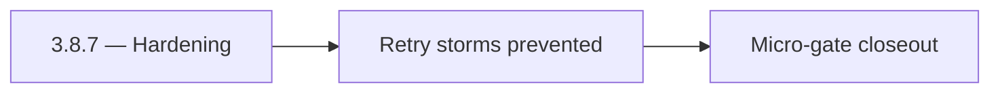

# 3.8.7 — Hardening

- **Era:** `3.x` Contact/company data — hub [`versions.md`](../versions.md) · minors start at [`3.0 — Twin Ledger`](3.0%20%E2%80%94%20Twin%20Ledger.md)
- **Minor:** [3.8 — Capture Gate](./3.8 — Capture Gate.md)
- **Codename:** Hardening
- **Status:** ✅ Completed
## Focus
Retry storms prevented

## Flowchart

## Micro-gate

| Track | Gate question | Answer / Evidence (fill at patch closeout) |
| --- | --- | --- |
| **Contract** | GraphQL, Connectra REST, or VQL contract changed? Diff vs `docs/backend/apis/` + endpoint matrices. | Document at patch closeout. |
| **Service** | List/count/batch-upsert, gateway clients, processors — smoke + idempotency story intact? | Document smoke paths. |
| **Surface** | Dashboard contacts/companies or admin paths changed? Filters, exports, error UX? | Document UX delta or N/A. |
| **Frontend** | Which routes/hooks/components for this patch? | Extension capture / merge UX touchpoints. Document at closeout. |
| **Data** | PG+ES lineage, enrichment/dedup, job artifacts — migrations + docs? | Document lineage or N/A. |
| **Ops** | Queues, drift jobs, logs PII rules, runbooks — delta recorded? | Document ops delta or N/A. |

## Tasks
### Contract

- ✅ Completed: 📌 Planned: Document extension → relay → Connectra field list; align with [`connectra-service.md`](connectra-service.md) (verify **batch-upsert** path vs any legacy `/bulk` naming in code).
- ✅ Completed: 📌 Planned: Lock **completeness** policy: min score or required fields before submit (configurable).

### Service

- ✅ Completed: 📌 Planned: `lambdaClient`: adaptive timeout, batch size, idempotent retry behavior documented.
- ✅ Completed: 📌 Planned: Relay normalizes SN **LinkedIn URL** placeholders per **Service task slices** below (includes former `salesnavigator-contact-company-task-pack.md` scope) risk notes (coordinate with Data).

### Surface

- ✅ Completed: 📌 Planned: Extension user feedback: duplicate dropped count, submit errors, partial success (ties to **`4.x`** UX depth).

### Data

- ✅ Completed: 📌 Planned: Attach **`source`** / provenance fields on extension-originated upserts.
- ✅ Completed: 📌 Planned: Validate UUID stability for same `profile_url` across retries.

### Ops

- ✅ Completed: 📌 Planned: Session: log `duplicate_count`, `chunk_size`, latency to **Service task slices** below (includes former `logsapi-contact-company-data-task-pack.md` scope) event types where available.

## Service task slices
> Merged from era `3.x` contact/company task packs (P0→`.0`–`.2`, P1→`.3`–`.6`, Ops→`.7`–`.9`).

### Connectra
- **Contract:** Freeze VQL filter taxonomy and operator mapping for contacts and companies — keep aligned with [`vql-filter-taxonomy.md`](vql-filter-taxonomy.md) and gateway `vql_converter.py`.
- **Service:** Harden `ListByFilters`, `CountByFilters`, and `batch-upsert` for deterministic behavior — see [`connectra-service.md`](connectra-service.md).
- **Database:** Enforce **PG + ES** parity checks and deterministic **UUID5** rules for contacts, companies, and filter facets — [`enrichment-dedup.md`](enrichment-dedup.md).
- **Flow:** Validate **two-phase read** and **five-store parallel write** diagrams against runtime behavior.
- **Release gate evidence:** Relevance tests, **P95 latency** evidence, and **dedup consistency** report.
- One **golden search** (complex VQL) + **count** pair passes with trace id end-to-end.
- Reconciliation or sampling shows **ES/PG** within agreed drift threshold after bulk upsert test.
- Idempotency replay artifact attached for `batch-upsert` representative fixture.

### Appointment360 (gateway)
- Write contract test: contacts(query) input → Connectra REST /contacts/query
- Write contract test: companies(query) input → Connectra REST /companies/query
- Add /contacts + /companies Postman collection to docs/backend/postman/

### Salesnavigator
- Reconciliation equation holds on 1k profile golden batch.
- PLACEHOLDER / URL policy documented and signed off by Data owner.
- Idempotency retry test: duplicate chunk → no duplicate Connectra rows.

### S3Storage
- Sample jobs: **`s3_key`** traceable in **`job_response`** / logs event (`contact360.import.*` event types per **Service task slices** below; ex-`logsapi-contact-company-data-task-pack.md`).
- At least one **large-file** preview completes within agreed latency budget.
- [`docs/backend/endpoints/`](../backend/endpoints/) or service README updated if presign paths change.

## Evidence gate
Patch closeout includes contract diff, smoke output, data lineage delta, and ops note
