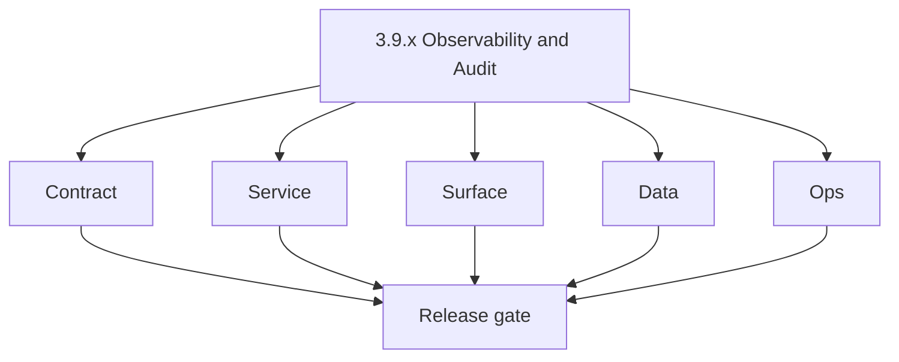
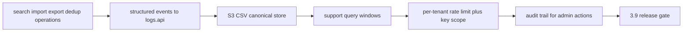

# Version 3.9 — Observability & Audit

- **Status:** planned  
- **Codename:** Observability & Audit  
- **Era:** 3.x (Contact360 contact and company data system)  
- **Roadmap:** **logs.api `3.x`** — data-enrichment/search diagnostics; Connectra **per-tenant rate limits** and **API key scope** (analysis gaps)  
- **Summary:** Emit **structured events** for search, import, export, dedup; **query** support tooling; tighten **API keys** and **rate limits** per tenant; ensure **audit** trail for admin operations on data jobs and bulk exports.  
- **Patch closure:** Every codenamed patch file includes **Micro-gate** + **Service task slices**. Era hub: [`versions.md`](../versions.md).

## Scope

- **Target:** `3.9.x` patches — telemetry + governance hooks.  
- **Owners:** Platform + Compliance.

## Flowchart

### Runtime focus (unique to this minor)

## Task tracks

### Contract

- 📌 Planned: Event schema — **Service task slices** in `3.9.P` patch files (scope from former `logsapi-contact-company-data-task-pack.md`).  
- 📌 Planned: API key **scopes** for Connectra read vs write vs job.

### Service

- 📌 Planned: **Request-ID** propagation app → api → Connectra → jobs (extend email-era pattern).  
- 📌 Planned: Rate limiter: token bucket **per tenant** not only global.

### Surface

- 📌 Planned: Internal dashboards / admin views consuming logs (if any).

### Data

- 📌 Planned: Retention tiers for **high-PII** events.

### Ops

- 📌 Planned: Runbook: diagnose “slow search tenant” using event trail.

## Task Breakdown

| Slice | Outcome |
| --- | --- |
| logs.api | Ingest + query |
| Connectra | Key scope + limits |
| Governance | Audit policy |

## Immediate next execution queue

- 📌 Planned: Cardinality budget for labels.  
- 📌 Planned: Sample support query: export by `job_id`.

## Cross-service ownership

| Service | Focus |
| --- | --- |
| `lambda/logs.api` | Events |
| `contact360.io/sync` | Limits |
| `contact360.io/api` | Correlation |

## References

- [`docs/codebases/logsapi-codebase-analysis.md`](../codebases/logsapi-codebase-analysis.md)  
- [`docs/audit-compliance.md`](../audit-compliance.md)

## Backend API and Endpoint Scope

- logs.api write paths from Connectra, jobs, gateway; optional read APIs for admin.

## Database and Data Lineage Scope

- S3 CSV partitions; index of recent events if used.

## Frontend UX Surface Scope

- Support tooling only unless productized.

## UI Elements Checklist

- 📌 Planned: Event timeline view (internal)

## Flow / Graph Delta for This Minor

- **Delta:** Makes **`3.x`** operations **observable and attributable** at scale.

## Audit and Compliance Notes

- Align **who** exported **what** VQL snapshot with policy; redact row payloads in logs.

## Patch ladder (`3.9.0` – `3.9.9`)

### Micro-gate reference (apply at every `3.N.P`)

| Track | Gate question (must answer Yes or document waiver) |
| --- | --- |
| **Contract** | GraphQL, Connectra REST, or VQL changed? `docs/backend/apis/` + endpoint matrices updated? |
| **Service** | List/count/batch-upsert and gateway paths still smoke; idempotency documented? |
| **Surface** | Dashboard contacts/companies or related admin UX changed? |
| **Frontend** | Which routes/hooks apply (see minor UX scope / `dashboard-search-ux.md`)? |
| **Data** | PG+ES lineage, enrichment/dedup, job artifacts — docs + migrations? |
| **Ops** | Queues, drift tooling, logs PII rules, runbooks — delta recorded? |

**Patch intent bands (universal ladder):** `.0` Charter · `.1` Connectra · `.2` Gateway · `.3` Dashboard · `.4` Jobs/S3 · `.5` Satellite · `.6` Observability · `.7` Hardening · `.8` Evidence · `.9` Gate / handoff.

Theme: **Signal** — codenames in per-patch `3.9.P — *.md` files.

| Patch | Codename | Focus |
| --- | --- | --- |
| `3.9.0` | Emit | Event charter |
| `3.9.1` | Ingest | Pipeline |
| `3.9.2` | Route | Routing rules |
| `3.9.3` | Query | Support queries |
| `3.9.4` | Rate | Rate limits |
| `3.9.5` | Key | Key scopes |
| `3.9.6` | Scope | Tenant model |
| `3.9.7` | Audit | Audit fields |
| `3.9.8` | Report | Weekly report |
| `3.9.9` | Calibrate | Handoff → `3.10` |

## Release Gate and Evidence

### Master Task Checklist

- 📌 Planned: Schema + retention doc published

### Backend API and Endpoints

- 📌 Planned: Synthetic event drill

### Database and Data Lineage

- 📌 Planned: Partition policy

### Frontend UX

- 📌 Planned: N/A

### UI Elements

- 📌 Planned: Checklist above

### Flow and Graph

- 📌 Planned: Runtime Mermaid reviewed

### Validation

- 📌 Planned: Per-tenant limit blocks test abuse without blocking others

### Release Gate

- 📌 Planned: Sign-off for **`3.10` Data System Exit Gate**

## Patches

| Patch | Codename | Doc |
| --- | --- | --- |
| `3.9.0` | Emit | [`3.9.0` — Emit](3.9.0 — Emit.md) |
| `3.9.1` | Ingest | [`3.9.1` — Ingest](3.9.1 — Ingest.md) |
| `3.9.2` | Route | [`3.9.2` — Route](3.9.2 — Route.md) |
| `3.9.3` | Query | [`3.9.3` — Query](3.9.3 — Query.md) |
| `3.9.4` | Rate | [`3.9.4` — Rate](3.9.4 — Rate.md) |
| `3.9.5` | Key | [`3.9.5` — Key](3.9.5 — Key.md) |
| `3.9.6` | Scope | [`3.9.6` — Scope](3.9.6 — Scope.md) |
| `3.9.7` | Audit | [`3.9.7` — Audit](3.9.7 — Audit.md) |
| `3.9.8` | Report | [`3.9.8` — Report](3.9.8 — Report.md) |
| `3.9.9` | Calibrate | [`3.9.9` — Calibrate](3.9.9 — Calibrate.md) |
