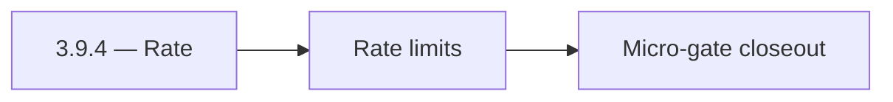

# 3.9.4 — Rate

- **Era:** `3.x` Contact/company data — hub [`versions.md`](../versions.md) · minors start at [`3.0 — Twin Ledger`](3.0%20%E2%80%94%20Twin%20Ledger.md)
- **Minor:** [3.9 — Observability & Audit](./3.9 — Observability & Audit.md)
- **Codename:** Rate
- **Status:** ✅ Completed
## Focus
Rate limits

## Flowchart

## Micro-gate

| Track | Gate question | Answer / Evidence (fill at patch closeout) |
| --- | --- | --- |
| **Contract** | GraphQL, Connectra REST, or VQL contract changed? Diff vs `docs/backend/apis/` + endpoint matrices. | Document at patch closeout. |
| **Service** | List/count/batch-upsert, gateway clients, processors — smoke + idempotency story intact? | Document smoke paths. |
| **Surface** | Dashboard contacts/companies or admin paths changed? Filters, exports, error UX? | Document UX delta or N/A. |
| **Frontend** | Which routes/hooks/components for this patch? | Audit/telemetry dashboards if user-visible. Document at closeout. |
| **Data** | PG+ES lineage, enrichment/dedup, job artifacts — migrations + docs? | Document lineage or N/A. |
| **Ops** | Queues, drift jobs, logs PII rules, runbooks — delta recorded? | Document ops delta or N/A. |

## Tasks
### Contract

- ✅ Completed: 📌 Planned: Event schema — **Service task slices** below (includes former `logsapi-contact-company-data-task-pack.md` scope).
- ✅ Completed: 📌 Planned: API key **scopes** for Connectra read vs write vs job.

### Service

- ✅ Completed: 📌 Planned: **Request-ID** propagation app → api → Connectra → jobs (extend email-era pattern).
- ✅ Completed: 📌 Planned: Rate limiter: token bucket **per tenant** not only global.

### Surface

- ✅ Completed: 📌 Planned: Internal dashboards / admin views consuming logs (if any).

### Data

- ✅ Completed: 📌 Planned: Retention tiers for **high-PII** events.

### Ops

- ✅ Completed: 📌 Planned: Runbook: diagnose “slow search tenant” using event trail.

## Service task slices
> Merged from era `3.x` contact/company task packs (P0→`.0`–`.2`, P1→`.3`–`.6`, Ops→`.7`–`.9`).

### logs.api
- Synthetic **export job** emits `contact360.export.completed` queryable within SLA.
- Support runbook links **request_id** across app → api → Connectra → logs.api for one ticket.

### Appointment360 (gateway)
- Document contacts module in docs/backend/apis/03_CONTACTS_MODULE.md
- Document companies module in docs/backend/apis/04_COMPANIES_MODULE.md
- Add DataLoader for contact batch loading by uuid
- Add DataLoader for company batch loading by uuid
- Saved searches persist in appointment360 DB: saved_searches table with type=contact\
- DataLoader batch keys logged for debugging N+1 issues
- Write contract test: contacts(query) input → Connectra REST /contacts/query
- Write contract test: companies(query) input → Connectra REST /companies/query
- Add /contacts + /companies Postman collection to docs/backend/postman/

### Connectra
- **Database:** Enforce **PG + ES** parity checks and deterministic **UUID5** rules for contacts, companies, and filter facets — [`enrichment-dedup.md`](enrichment-dedup.md).
- **Flow:** Validate **two-phase read** and **five-store parallel write** diagrams against runtime behavior.
- **Release gate evidence:** Relevance tests, **P95 latency** evidence, and **dedup consistency** report.
- One **golden search** (complex VQL) + **count** pair passes with trace id end-to-end.
- Reconciliation or sampling shows **ES/PG** within agreed drift threshold after bulk upsert test.
- Idempotency replay artifact attached for `batch-upsert` representative fixture.

## Evidence gate
Patch closeout includes contract diff, smoke output, data lineage delta, and ops note
