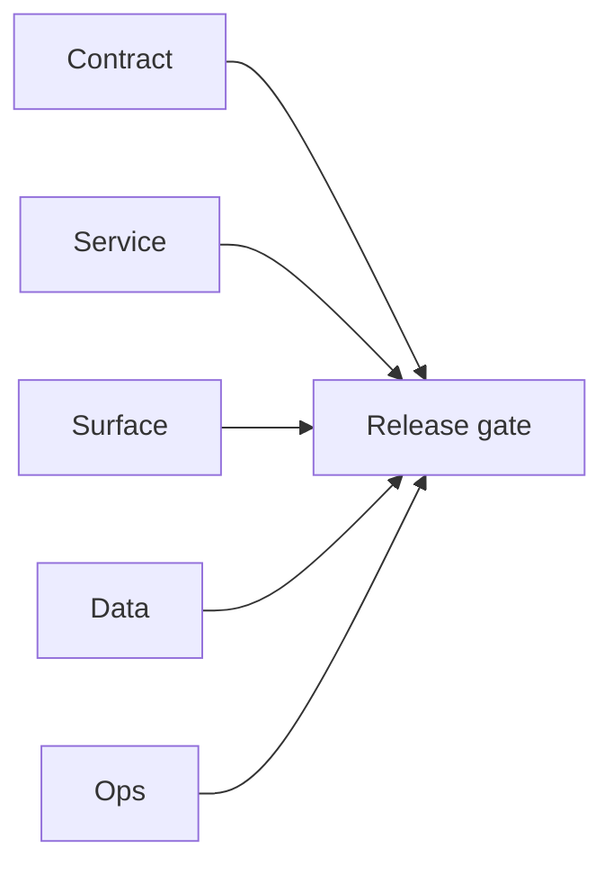

# 3.x Era Docs

Execution guide for Contact360 `3.x.x` era delivery.

## Era objective

- Define and deliver a stable era contract across Contract/Service/Surface/Data/Ops tracks.
- Ensure every patch packet carries closeout evidence before release handoff.

## As-is snapshot (dashboard vs backend)

- **Contacts/companies** dashboard surfaces in `contact360.io/app` are **available** (filters, saved searches, export wiring per **3.4** docs).
- **Connectra / VQL** depth and some **gateway** paths remain **partially** integrated — see [`contact360.io/root/docs/imported/analysis/3.x-master-checklist.md`](../../contact360.io/root/docs/imported/analysis/3.x-master-checklist.md) and [`contact360.io/root/docs/imported/analysis/connectra-contact-company-task-pack.md`](../../contact360.io/root/docs/imported/analysis/connectra-contact-company-task-pack.md) for the shared wording so analysis and era docs stay aligned.

## Minor index

| Minor | Title | Status | Doc |
| --- | --- | --- | --- |
| `3.0` | Twin Ledger | planned | [`3.0 - Twin Ledger`](3.0%20—%20Twin%20Ledger.md) |
| `3.1` | VQL Engine | planned | [`3.1 - VQL Engine`](3.1%20—%20VQL%20Engine.md) |
| `3.2` | Gateway Mirror | planned | [`3.2 - Gateway Mirror`](3.2%20—%20Gateway%20Mirror.md) |
| `3.3` | Search Quality | planned | [`3.3 - Search Quality`](3.3%20—%20Search%20Quality.md) |
| `3.4` | Dashboard UX | planned | [`3.4 - Dashboard UX`](3.4%20—%20Dashboard%20UX.md) |
| `3.5` | Import-Export Pipeline | planned | [`3.5 - Import-Export Pipeline`](3.5%20—%20Import-Export%20Pipeline.md) |
| `3.6` | Sales Navigator Ingestion | planned | [`3.6 - Sales Navigator Ingestion`](3.6%20—%20Sales%20Navigator%20Ingestion.md) |
| `3.7` | Dual-Store Integrity | planned | [`3.7 - Dual-Store Integrity`](3.7%20—%20Dual-Store%20Integrity.md) |
| `3.8` | Capture Gate | planned | [`3.8 - Capture Gate`](3.8%20—%20Capture%20Gate.md) |
| `3.9` | Observability & Audit | planned | [`3.9 - Observability & Audit`](3.9%20—%20Observability%20&%20Audit.md) |
| `3.10` | Data Completeness | planned | [`3.10 - Data Completeness`](3.10%20—%20Data%20Completeness.md) |

## Patch ladder overview

- `3.0.x`: Charter, Connectra, Gateway, Dashboard, Jobs - S3, Satellite, Observability, Hardening, Evidence, Gate
- `3.1.x`: Parse, Field, Token, Clause, Operator, Type, Compose, Validate, Optimize, Freeze
- `3.2.x`: Charter, Connectra, Gateway, Dashboard, Jobs - S3, Satellite, Observability, Hardening, Evidence, Gate
- `3.3.x`: Refresh, Analyze, Shard, Rank, Boost, Tune, Benchmark, Validate, Promote, Lock
- `3.4.x`: Sidebar, Chip, Range, Saved, Detail, Drill, Export, Gate, Feature, Ship
- `3.5.x`: Intake, Parse, Stage, Validate, Execute, Persist, Verify, Export, Trace, Close
- `3.6.x`: Map, Parse, Infer, Score, Tag, Dedup, Submit, Verify, Reconcile, Freeze
- `3.7.x`: Write, Scan, Diff, Flag, Alert, Patch, Replay, Confirm, Archive, Gate
- `3.8.x`: Charter, Connectra, Gateway, Dashboard, Jobs - S3, Satellite, Observability, Hardening, Evidence, Gate
- `3.9.x`: Emit, Ingest, Route, Query, Rate, Key, Scope, Audit, Report, Calibrate
- `3.10.x`: Charter, Connectra, Gateway, Dashboard, Jobs - S3, Satellite, Observability, Hardening, Evidence, Gate

## Universal task breakdown

- `Task 1 - Contract`: freeze API contracts, auth boundaries, and error envelopes.
- `Task 2 - Service`: validate runtime health and integration behavior.
- `Task 3 - Surface`: verify UI/UX/admin/extension surface behavior.
- `Task 4 - Data`: verify migrations, index mappings, and lineage references.
- `Task 5 - Ops`: verify CI, rollback path, secrets, and runbooks.
- `Task 6 - Evidence`: close patch gates with links in era docs and versions index.

## Stack references

Framework and stack reference material (rename-safe paths under `docs/tech/`):

- [Go/Gin — why & practices](../tech/tech-go-gin-why-practices.md)
- [Go/Gin — 100-point checklist](../tech/tech-go-gin-checklist-100.md)
- [Next.js — why & practices](../tech/tech-nextjs-why-practices.md)
- [Next.js — 100-point checklist](../tech/tech-nextjs-checklist-100.md)

## Cross-links

- [`docs/README.md`](../README.md)
- [`docs/versions.md`](../versions.md)
- [`docs/architecture.md`](../architecture.md)
- [`contact360.io/root/docs/imported/analysis/README.md`](../../contact360.io/root/docs/imported/analysis/README.md)
## Tasks

### Contract

- ✅ Completed: ✅ Completed: 📌 Planned: **[connectra]** — Diff and document schema for operations like ConnectraClient, LAMBDA_AI_API_URL, LAMBDA_CONNECTRA_API_URL; align with roadmap | area: `backend-api` | files: `docs/backend/apis/*.md`, `contact360.io/api/app/graphql/schema.py` | reason: Keep GraphQL/REST contracts aligned for era 3.0 patch 0.0.0

### Service

- ✅ Completed: ✅ Completed: 📌 Planned: **[connectra]** — Service slice: Era 3 scope per docs/codebases/connectra-codebase-analysis.md | area: `backend-api` | files: `contact360.io/api/app/graphql/modules/`, `contact360.io/api/app/clients/` | reason: Implement or verify runtime behavior for Era 3 scope per docs/codebases/connectra-codebase-analysis.md
- ✅ Completed: ✅ Completed: 📌 Planned: **[jobs]** — Harden primary worker/gateway integration and failure envelopes | area: `backend-api` | files: `docs/codebases/jobs-codebase-analysis.md` | reason: P0 band: critical path and idempotency

### Surface

- ✅ Completed: ✅ Completed: 📌 Planned: **[appointment360]** — Verify UX for route `/email` and bindings (patch 0.0.0 band 0) | area: `frontend-page` | files: `contact360.io/app/...` | reason: Dashboard/extension surface for era 3 must match gateway contracts

### Data

- ✅ Completed: ✅ Completed: 📌 Planned: **[connectra]** — Update PostgreSQL/ES/S3 lineage notes if this patch touches persistence or exports | area: `data-lineage` | files: `docs/backend/database/`, `migrations/` | reason: Migrations, indexes, and lineage evidence for this patch

### Ops

- ✅ Completed: ✅ Completed: 📌 Planned: **[platform]** — Record smoke evidence, rollback, and alerts (patch band 0: charter/P0) | area: `ops` | files: `docs/commands/`, `.github/workflows/` | reason: Smoke, rollback, and observability for patch 0.0.0

## Flowchart

Five-track delivery (contract / service / surface / data / ops) for this doc:

**Master hub:** [`docs/docs/flowchart.md`](../docs/flowchart.md) — cross-system diagrams and era strip (`0.x` → `10.x`).
