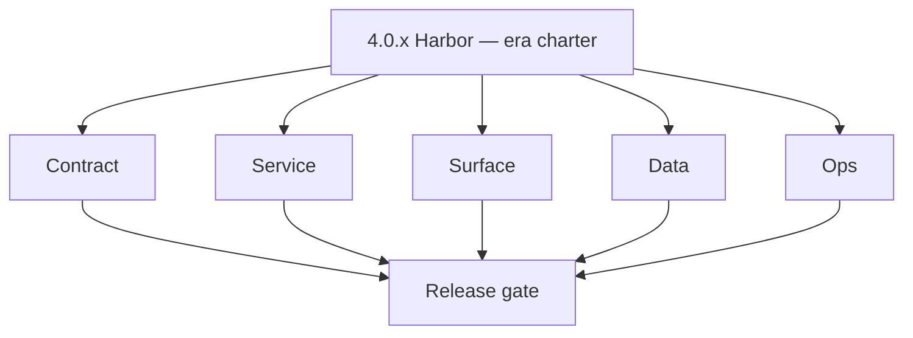
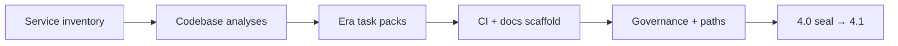

# Version 4.0 — Harbor (era charter)

- **Status:** ✅ Completed
- **Codename:** Harbor
- **Era:** 4.x (Extension and Sales Navigator maturity) — **planning / charter** minor before roadmap stages **4.1–4.4** execution peaks
- **Roadmap:** Pre-stage **charter** — align service inventory, codebase analyses, CI/docs scaffold, and governance with this era folder.
- **Summary:** Establish **parity** between the **Extension + SN spine** services and their **docs/codebases/*-codebase-analysis.md** sources; align **Micro-gate** + per-patch **Service task slices**; ensure **logs.api** (S3 CSV), **s3storage**, **Connectra**, **Appointment360**, **jobs**, and **salesnavigator** are registered consistently for **4.x** execution.
- **Owner:** Platform Engineering
- **Patch closure:** Every codenamed patch file includes **Micro-gate** + **Service task slices**. Era hub: [`versions.md`](../versions.md).

## Scope

- **Target:** `4.0.x` patches.
- **In scope:** Service register, folder paths (`extension/contact360` canonical), broken-link sweeps across this era folder + minors, codebase analysis freshness, Postman / endpoint matrix pointers, governance alignment ([`docs/governance.md`](../governance.md)).
- **Out of scope:** Feature delivery that belongs to **4.1+** (auth), **4.2** (Harvest ingestion), **4.3** (sync integrity). Harbor **defines** work; later minors **execute**.

## Flowchart

### Runtime focus (unique to this minor)

## Task tracks (per-service inventory)

### Contract

- 📌 Planned: Confirm **4.x** scope statements in each `4.N — *.md` minor, patch files, and [`versions.md`](../versions.md) rows — no **wrong-era** AI placeholder text.
- 📌 Planned: Link **endpoint matrices** under `docs/backend/endpoints/` for extension-touching services.
- 📌 Planned: Register **canonical paths**: `extension/contact360`, `backend(dev)/salesnavigator`, `lambda/logs.api`, `lambda/s3storage`.

- 📌 Planned: **[architecture]** — Product **GraphQL** remains on `contact360.io/api` (Python); satellite HTTP contracts live under `docs/backend/apis/` and must stay versioned with gateway clients.
### Service — inventory slices

- 📌 Planned: **`extension/contact360`** — manifest placeholder, auth module, `lambdaClient`, `profileMerger` — [`docs/codebases/extension-codebase-analysis.md`](../codebases/extension-codebase-analysis.md).
- ⬜ Incomplete: **`extension/contact360` — `content.js` stub** — currently a 9-line no-op (`window.__CONTACT360_CONTENT_SCRIPT__ = true` only); must implement: MutationObserver watching for `data-x-search-result="LEAD"` nodes, auto-capture trigger, and `chrome.runtime.sendMessage` call to hand profiles to background.
- ⬜ Incomplete: **`extension/contact360` — `background.js` orchestration** — no `chrome.runtime.onMessage` listener; service worker cannot receive or forward profile arrays from `content.js` to `LambdaClient.saveProfiles()`; implement message handler and error recovery.
- ⬜ Incomplete: **`extension/contact360` — `manifest.json` host_permissions** — includes `"https://*/*"` and `"http://*/*"` (overly broad); Chrome Web Store will reject; scope down to `https://www.linkedin.com/*` and `https://*.linkedin.com/*`.
- ⬜ Incomplete: **`extension/contact360` — `graphqlSession.js` ES module** — uses `export function` / `export {}` syntax but `manifest.json` does not declare `"type": "module"` in `content_scripts` or `web_accessible_resources`; will silently fail in non-module context.
- 📌 Planned: **`extension/contact360` — `utils/constants.js`** — missing file; `lambdaClient.js` reads `window.Contact360Constants?.LAMBDA_API_CONFIG` but no `constants.js` exists; create and register in `manifest.json`.
- 📌 Planned: **`backend(dev)/salesnavigator`** — routes, SaveService, extraction — [`docs/codebases/salesnavigator-codebase-analysis.md`](../codebases/salesnavigator-codebase-analysis.md).
- 📌 Planned: **`contact360.io/api` (Appointment360)** — **Service task slices** in `4.0.P` patch files (scope from former `appointment360-extension-sn-task-pack.md`).
- 📌 Planned: **`contact360.io/sync` (Connectra)** — **Service task slices** in `4.0.P` patch files (scope from former `connectra-extension-sn-task-pack.md`).
- 📌 Planned: **`contact360.io/jobs`** — extension provenance / sync jobs per architecture spine.
- 📌 Planned: **`lambda/logs.api`** — S3 CSV; **Service task slices** in `4.0.P` patch files (scope from former `logsapi-extension-salesnav-task-pack.md`) if present.
- 📌 Planned: **`lambda/s3storage`** — **Service task slices** in `4.0.P` patch files (scope from former `s3storage-extension-sn-task-pack.md`).

### Surface

- 📌 Planned: **`contact360.io/app`** — `SNIngestionPanel`, ingestion timeline widgets, sync status cards, LinkedIn profile overlay per [`salesnavigator-ui-bindings.md`](../frontend/docs/salesnavigator-ui-bindings.md).
- 📌 Planned: Extension UX placeholders indexed (popup, save CTA).

> [!WARNING]
> **P0 Security (Chrome Extension):** `extension/contact360/manifest.json` `host_permissions` must be minimized to only required LinkedIn domains. Current wildcard or over-broad permissions risk Chrome Web Store rejection.

- 📌 Planned: **[architecture]** — **Next.js** customer surfaces (`contact360.io/app`, `root`, `email`, `joblevel-next`): standardise `NEXT_PUBLIC_GRAPHQL_URL` and GraphQL client; avoid calling Go services directly except documented REST exceptions.
- 📌 Planned: **[architecture]** — **Chrome extension**: GraphQL bearer + narrow `host_permissions`; align with `docs/tech/tech-extension-why-practices.md` for MV3 constraints.
### Data

- 📌 Planned: Lineage docs enumerated: **`logsapi_data_lineage.md`**, Connectra dedup doc, SN provenance fields.
- 📌 Planned: Remove mistaken **MongoDB** references for logs (see [`extension-telemetry.md`](extension-telemetry.md)).

- 📌 Planned: **[architecture]** — **PostgreSQL-first** per `docs/docs/data-stores-postgres.md`; gateway idempotency and sessions use Postgres.
### Ops

- 📌 Planned: **Drift-scan:** grep for legacy `extention/` paths in new docs.
- 📌 Planned: **CI:** ensure era docs included in doc-lint or review checklist if available.
- 📌 Planned: **Postman:** collections exist or stubs filed for SN + extension flows.
- 📌 Planned: **Idempotency:** Require `X-Idempotency-Key` header for `POST /v1/save-profiles` to prevent duplicate SN profile ingestion.
- ⬜ Incomplete: **salesnavigator Lambda** — no `samconfig.toml`; create with SSM-based `parameter_overrides` for `ApiKey`, `ConnectraApiKey`, `ConnectraApiUrl`.
- ⬜ Incomplete: **salesnavigator Lambda** — `template.yaml` Outputs block references `ServerlessHttpApi` (implicit resource name may differ); verify output `GetAtt` references resolve or replace with explicit `HttpApi` resource.
- 📌 Planned: **salesnavigator Lambda** — add CORS configuration to `template.yaml` `HttpApi` resource; extension browser calls will be blocked without `Access-Control-Allow-Origin` header.

- 📌 Planned: **[architecture]** — **Observability**: correlate `X-Request-ID` gateway → satellites; rollback path documented per release.
## Task breakdown

| Slice | Outcome |
| --- | --- |
| Platform | Charter + checklist usable |
| Owners | Each service has analysis + pack link |
| Docs | No broken master checklist link |

## Immediate next execution queue

- 📌 Planned: Keep **versions** / roadmap rows aligned with `4.N.P` patch closure (no standalone task-pack index).
- 📌 Planned: Audit `docs/codebases/*` “Last reviewed” or era rows for Extension/SN services.
- 📌 Planned: File tickets for P0 SN doc drift (hand off to **4.2**).

## Cross-service ownership

| Service | Focus |
| --- | --- |
| Platform | Harbor coordinator |
| Each service team | Confirm inventory row |

## References

- [docs/frontend/salesnavigator-ui-bindings.md](../frontend/salesnavigator-ui-bindings.md)
- [`docs/versions.md`](../versions.md) · era `4.x` patch ladder (`4.N.P — *.md`)
- [`docs/architecture.md`](../architecture.md)
- [`docs/codebases/extension-codebase-analysis.md`](../codebases/extension-codebase-analysis.md)
- [`docs/codebases/salesnavigator-codebase-analysis.md`](../codebases/salesnavigator-codebase-analysis.md)

## Backend API and endpoint scope

- **Inventory only** — enumerate GraphQL + `POST /v1/scrape|save-profiles` + Connectra `batch-upsert`; no contract change required for Harbor alone.

## Database and data lineage scope

- Catalog which stores hold SN provenance; no migrations in Harbor unless blocking.

## Frontend UX surface scope

- Index components: **SNIngestionPanel**, extension hooks (per SN analysis UI map).

## UI Elements Checklist

- 📌 Planned: SN-related primary entry point present
- 📌 Planned: Loading/progress state present
- 📌 Planned: Error and retry states present

## Audit and Compliance Notes

- Validate provenance (source, ingestion_batch_id, trace_id) is retained through this minor flow.
- Ensure PII handling aligns with [docs/audit-compliance.md](../audit-compliance.md).

## Flow / graph delta for this minor

- **Delta:** **Meta** — documentation and ownership graph for **4.x**, not runtime feature flow.

## Patch ladder (`4.0.0` – `4.0.9`)

### Micro-gate reference (apply at every `4.N.P`)

| Track | Gate question (must answer Yes or document waiver) |
| --- | --- |
| **Contract** | Extension/SN REST, GraphQL modules, CSP — `docs/backend/apis/` + endpoint matrices updated? |
| **Service** | SN scrape/save, Connectra upsert, jobs DAG, session refresh — smoke + idempotency documented? |
| **Surface** | Extension popup, dashboard SN/campaign panels, operator flows changed? |
| **Frontend** | Extension MV3 + dashboard routes/hooks (see minor scope / `extension-auth.md`, `extension-telemetry.md`)? |
| **Data** | Provenance, audience tables, `messages.contacts[]` — migrations + lineage docs? |
| **Ops** | `logs.api` events, S3 evidence, runbooks, rate/retry — delta recorded? |
| **Architecture** | Go/Gin satellites only via Python GraphQL gateway (`contact360.io/api`); Next.js `NEXT_PUBLIC_GRAPHQL_URL`; Postgres-first / Redis exit per `docs/docs/data-stores-postgres.md`. |

**Patch intent bands:** Codenames per minor — see **Patch ladder** table in this file (`.0` charter … `.9` seal/handoff).

Theme: **Harbor** — codenames in per-patch `4.0.P — *.md` files.

| Patch | Codename | Focus |
| --- | --- | --- |
| `4.0.0` | Charter | Era scope locked |
| `4.0.1` | Inventory | Service register |
| `4.0.2` | Drift-scan | Doc vs code |
| `4.0.3` | Codebase-link | Analyses ↔ paths |
| `4.0.4` | Governance | policy + retention |
| `4.0.5` | CI | Pipeline/docs checks |
| `4.0.6` | Docs | Scaffold complete |
| `4.0.7` | Postman | Collections indexed |
| `4.0.8` | Release-evidence | Template |
| `4.0.9` | Seal | → **`4.1`** |

## Release gate and evidence

- 📌 Planned: Harbor checklist 100% ticked or ticketed
- 📌 Planned: Master checklist + README links valid
- 📌 Planned: Cross-analysis review slot scheduled for **4.10**
- 📌 Planned: Owner sign-off: Platform

## Patches

| Patch | Codename | Doc |
| --- | --- | --- |
| `4.0.0` | Charter | [`4.0.0` — Charter](4.0.0 — Charter.md) |
| `4.0.1` | Inventory | [`4.0.1` — Inventory](4.0.1 — Inventory.md) |
| `4.0.2` | Drift-scan | [`4.0.2` — Drift-scan](4.0.2 — Drift-scan.md) |
| `4.0.3` | Codebase-link | [`4.0.3` — Codebase-link](4.0.3 — Codebase-link.md) |
| `4.0.4` | Governance | [`4.0.4` — Governance](4.0.4 — Governance.md) |
| `4.0.5` | CI | [`4.0.5` — CI](4.0.5 — CI.md) |
| `4.0.6` | Docs | [`4.0.6` — Docs](4.0.6 — Docs.md) |
| `4.0.7` | Postman | [`4.0.7` — Postman](4.0.7 — Postman.md) |
| `4.0.8` | Release-evidence | [`4.0.8` — Release-evidence](4.0.8 — Release-evidence.md) |
| `4.0.9` | Seal | [`4.0.9` — Seal](4.0.9 — Seal.md) |

## Release Gate and Evidence

### Master Task Checklist
- 📌 Planned: Track-level closure evidence linked

### Backend API and Endpoints
- 📌 Planned: Endpoint/contract parity verified

### Database and Data Lineage
- 📌 Planned: Migration and lineage references linked

### Frontend UX
- 📌 Planned: UX/route behavior evidence linked

### UI Elements
- 📌 Planned: Components/checklist closeout captured

### Flow and Graph
- 📌 Planned: Runtime graph reflects implementation

### Validation
- 📌 Planned: Smoke/CI/lint checks recorded

### Release Gate
- 📌 Planned: Minor ready for handoff to next minor
## Tasks

### Contract

- 📌 Planned: **[salesnavigator]** — refine duplicate task (was: 📌 planned: **[salesnavigator]** — refine duplicate task (was…) | patch `4.0.0` band `0` | reason: specialize this file vs sibling patches; see docs/codebases/salesnavigator-codebase-analysis.md

### Service

- 📌 Planned: **[salesnavigator]** — refine duplicate task (was: 📌 planned: **[salesnavigator]** — refine duplicate task (was…) | patch `4.0.0` band `0` | reason: specialize this file vs sibling patches; see docs/codebases/salesnavigator-codebase-analysis.md
- 📌 Planned: **[salesnavigator]** — refine duplicate task (was: 📌 planned: **[salesnavigator]** — refine duplicate task (was…) | patch `4.0.0` band `0` | reason: specialize this file vs sibling patches; see docs/codebases/salesnavigator-codebase-analysis.md

- 📌 Planned: **[salesnavigator]** — refine duplicate task (was: 📌 planned: **[architecture]** — **go/gin satellites** in sco…) | patch `4.0.0` band `0` | reason: specialize this file vs sibling patches; see docs/codebases/salesnavigator-codebase-analysis.md
### Surface

- 📌 Planned: **[salesnavigator]** — refine duplicate task (was: 📌 planned: **[salesnavigator]** — refine duplicate task (was…) | patch `4.0.0` band `0` | reason: specialize this file vs sibling patches; see docs/codebases/salesnavigator-codebase-analysis.md

### Data

- 📌 Planned: **[salesnavigator]** — refine duplicate task (was: 📌 planned: **[salesnavigator]** — refine duplicate task (was…) | patch `4.0.0` band `0` | reason: specialize this file vs sibling patches; see docs/codebases/salesnavigator-codebase-analysis.md

### Ops

- 📌 Planned: **[salesnavigator]** — refine duplicate task (was: 📌 planned: **[salesnavigator]** — refine duplicate task (was…) | patch `4.0.0` band `0` | reason: specialize this file vs sibling patches; see docs/codebases/salesnavigator-codebase-analysis.md

