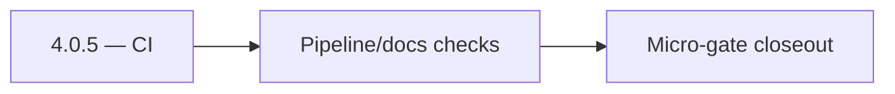

# 4.0.5 — CI

- **Era:** `4.x` Extension/SN maturity — hub [`versions.md`](../versions.md) · minors start at [`4.0 — Harbor`](4.0%20%E2%80%94%20Harbor.md)
- **Minor:** [4.0 — Harbor](./4.0 — Harbor.md)
- **Codename:** CI
- **Status:** ✅ Completed
## Focus
Pipeline/docs checks

## Flowchart

## Micro-gate

| Track | Gate question | Answer / Evidence (fill at patch closeout) |
| --- | --- | --- |
| **Contract** | Extension/SN REST, GraphQL modules, CSP — `docs/backend/apis/` + endpoint matrices updated? | Document at patch closeout. |
| **Service** | SN scrape/save, Connectra upsert, jobs DAG, session refresh — smoke + idempotency? | Document smoke paths. |
| **Surface** | Extension popup, dashboard SN/campaign panels, operator flows changed? | Document UX delta or N/A. |
| **Frontend** | Which extension MV3 + dashboard routes/hooks for this patch? | Harbor charter — service inventory, CI/docs; minimal product UX. Document at closeout. |
| **Data** | Provenance fields, audience tables, `messages.contacts[]` — migrations + lineage? | Document lineage or N/A. |
| **Ops** | `logs.api` events, S3 evidence, runbooks, rate/retry — delta recorded? | Document ops delta or N/A. |

## Tasks

### Contract

- ✅ Completed: 📌 Planned: **[salesnavigator]** — Diff and document schema for operations like ConnectraClient, LAMBDA_AI_API_URL, LAMBDA_CONNECTRA_API_URL; align with roadmap | area: `backend-api` | files: `docs/backend/apis/*.md`, `contact360.io/api/app/graphql/schema.py` | reason: Keep GraphQL/REST contracts aligned for era 4.5 patch 4.0.5

### Service

- ✅ Completed: 📌 Planned: **[salesnavigator]** — Service slice: Era 4 scope per docs/codebases/salesnavigator-codebase-analysis.md | area: `backend-api` | files: `contact360.io/api/app/graphql/modules/`, `contact360.io/api/app/clients/` | reason: Implement or verify runtime behavior for Era 4 scope per docs/codebases/salesnavigator-codebase-analysis.md

### Surface

- ✅ Completed: 📌 Planned: **[extension]** — Verify UX for route `/email` and bindings (patch 4.0.5 band 5) | area: `frontend-page` | files: `contact360.io/app/...` | reason: Dashboard/extension surface for era 4 must match gateway contracts

### Data

- ✅ Completed: 📌 Planned: **[salesnavigator]** — Update PostgreSQL/ES/S3 lineage notes if this patch touches persistence or exports | area: `data-lineage` | files: `docs/backend/database/`, `migrations/` | reason: Migrations, indexes, and lineage evidence for this patch

### Ops

- ✅ Completed: 📌 Planned: **[platform]** — Record smoke evidence, rollback, and alerts (patch band 5: surface/data) | area: `ops` | files: `docs/commands/`, `.github/workflows/` | reason: Smoke, rollback, and observability for patch 4.0.5

## Service task slices
> Merged from era `4.x` extension/SN task packs (P0→`.0`–`.2`, P1→`.3`–`.6`, Ops→`.7`–`.9`).

### Connectra
- Document **conflict / validation** error codes on POST /contacts/batch-upsert for SN-sourced batches (operator-readable)
- Record **CORS** posture: today AllowAllOrigins; add era note for gateway-only extension traffic vs hardened env
- Add **circuit-breaker friendly** error surfaces for SN Lambda (timeout vs 4xx vs Connectra 5xx)
- Expose **health / dependency** signals Connectra uses when SN bulk save degrades (Connectra unavailable)
- Dashboard: surface **ES vs PG drift** hints when SN-sourced contacts fail list/count parity
- Document **VQL** expectations for SN-sourced contacts (source / provenance filters)
- **Drift detection hooks:** align with Connectra queue item “ES–PG reconciliation job” (analysis gaps) — define minimal SN acceptance query set
- Preserve **filter_data** facet consistency when SN bulk jobs update company/employer fields
- Alerting: bulk-upsert error rate by **source=sales_navigator** / extension session correlation

### Salesnavigator
- `SNSaveButton` — "Save to Contact360" button with loading state
- `SNSyncCTA` — "Sync Page" button (scrape + save)
- `SNProfileCountBadge` — "25 profiles found"
- `SNSaveProgress` — progress bar: idle → extracting (20%) → dedup (40%) → saving (60–90%) → done (100%)
- `SNSaveSummaryCard` — shows saved count, created/updated split
- `SNErrorToast` — quick error notification
- `SNErrorDrawer` — detailed failed profiles list with reason
- `SNRetryButton` — retry after partial failure
- `DataQualityBadge` — per-profile quality indicator (green/yellow/red)
- `AlreadySavedBadge` — show if profile UUID already in Contact360
- `ProfileCheckbox` + `ProfileSelectAll` — selective save
- `ConnectionDegreeBadge` — 1st/2nd/3rd degree indicator
- `SNIngestionPanel` — `/contacts/import` tab with SN section
- `SNSyncHistoryTable` — past SN sync sessions with stats
- `SNIngestionStatsCard` — saved count, quality average, error rate
- `SNSourceFilterChip` — filter contacts by `source=sales_navigator`
- Confirm provenance fields written per profile: `lead_id`, `search_id`, `data_quality_score`, `connection_degree`, `recently_hired`, `is_premium`
- Add `source="sales_navigator"` tag on all contacts from this service
- Validate `data_quality_score` computation accuracy (70% required + 30% optional weighted)
- Dedup evidence: log `duplicate_count` per save session
- Harden HTML extraction across multiple SN DOM variants:
- Standard search results page
- Account map view
- People tab on company page
- Optimize extraction for 25-profile search result pages (primary extension use case)
- Validate deduplication correctness: same `profile_url` → single record, best-completeness kept
- Fix `convert_sales_nav_url_to_linkedin()` coverage — document when PLACEHOLDER is returned
- Implement extraction fallback for missing fields (graceful null, not error)
- Add `X-Request-ID` correlation header to all responses
- Test chunk boundary behavior: exactly 500, 501, 1000 profiles

### Appointment360 (gateway)
- Document LinkedIn module in docs/backend/apis/21_LINKEDIN_MODULE.md
- Document Sales Navigator module in docs/backend/apis/23_SALES_NAVIGATOR_MODULE.md
- Implement syncSalesNavigator mutation: trigger tkdjob sync task
- Implement exportLinkedinResults mutation: create contact360 export job via tkdjob
- Add extension session token validation for browser extension requests
- SN export button in contacts table → mutation exportLinkedinResults
- Extension badge count (unsaved profiles) synced via mutation syncSalesNavigator
- Extension auth state: JWT-based auth token validated per extension request
- Store extension session tokens in sessions table (appointment360 DB)
- Add SN + extension mutation tests in Postman collection
- Write E2E test: extension captures LinkedIn profile → appears in /contacts table
- Add X-Extension-Token header validation middleware or GraphQL guard

### logs.api
- Document dashboard ingestion status surfaces and source filters.
- Ensure empty/error states map to logs-derived aggregates.
- Define S3 CSV partition/prefix strategy for extension/SN event volume.
- Document retention and query-window expectations for operations.
- Confirm lineage in [`docs/backend/database/logsapi_data_lineage.md`](../backend/database/logsapi_data_lineage.md).
- Validate burst ingestion behavior after large SN harvests.
- Verify auth and error envelope for event writers.
- Correlate `trace_id` + `ingestion_batch_id` + lambda request id across pipeline.

### S3Storage
- Cross-reference **governance** retention classes for SN scrape artifacts vs extension uploads
- Extension-friendly **error + retry** semantics (403 vs 404 vs expired URL) — surface copy in extension pack
- Ensure dashboard **SN ingestion** and **jobs** UIs show linked artifact id when an object exists in s3storage
- Extension: progressive disclosure — user-visible “upload failed / link expired” states tied to telemetry
- Lineage: link **S3 object key → SN save batch id / request id** in metadata sidecar or jobs record
- Reliability: success rate for **complete / abort** flows originating from extension channel; alarms on stuck multipart
- Runbook: leaked object or wrong prefix — revoke URL class, audit tag gaps, backfill metadata

### Jobs
- Document sync status cards, retry controls, and execution history for extension-origin jobs.
- Map backend states (`queued`, `processing`, `failed`, `completed`, `stuck`) to user labels/actions.
- Persist idempotency evidence fields (`idempotency_token`, content hash, ingestion batch id).
- Link API traces to job records and logs.api events.
- Document retention for audit and replay investigations.
- Enforce source tagging and dedupe-safe scheduling for replayed batches.
- Harden retries with exponential backoff + jitter and capped attempts.
- Expose sync lag metrics from `save-profiles` success to job completion.

## Evidence gate
Patch closeout includes contract diff, smoke output, data lineage delta, and ops note
