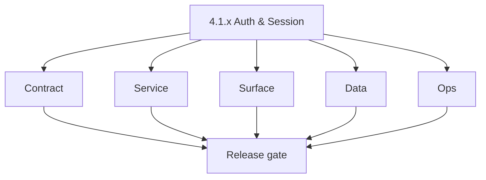
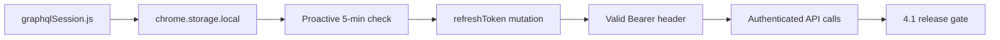

# Version 4.1 — Auth & Session

- **Status:** in_progress  
- **Codename:** Auth & Session  
- **Era:** 4.x (Extension and Sales Navigator maturity)  
- **Roadmap:** Stage **4.1** — extension auth/session hardening ([`docs/versions.md`](../versions.md) **`4.1.0`**)  
- **Summary:** Stable **authenticated extension lifecycle**: `graphqlSession.js` → **`chrome.storage.local`** → proactive refresh (~5 min) → Appointment360 **`refreshToken`** mutation → valid **Bearer** for API calls.  
- **Scope note:** core auth/session utility is implemented; full extension shell delivery remains pending (manifest/background/content/popup).
- **Patch closure:** Every codenamed patch file includes **Micro-gate** + **Service task slices**. Era hub: [`versions.md`](../versions.md).

## Scope

- **Target:** `4.1.x` patches.  
- **In scope:** Token storage, refresh scheduling, failure UX, correlation with dashboard session policy.  
- **Out of scope:** Full SN mapper changes (**`4.2`**); merge semantics (**`4.3`**).  
- **Owners:** Extension Engineering + Platform API.

## Flowchart

### Runtime focus (unique to this minor)

## Task tracks

### Contract

- 📌 Planned: Document refresh request/response vs Appointment360 schema — [`extension-auth.md`](extension-auth.md).  
- 📌 Planned: Error codes: expiry, invalid_grant, network — user-recoverable vs fatal.

### Service

- ✅ Completed: `graphqlSession.js` — `isAccessTokenExpired`, `refreshWithGraphQL`, `ensureAccessToken`, `createChromeStorageAdapter` implemented with 60-second early-refresh buffer.
- ⬜ Incomplete: `graphqlSession.js` uses ES module `export` keyword — `manifest.json` does not declare `type: "module"` in `content_scripts` or service worker; script will fail silently when loaded in non-module context; must wrap in IIFE or add `"type": "module"` to manifest `background` entry.
- 📌 Planned: Refresh **before** hard expiry where possible; backoff on repeated failures.  
- 📌 Planned: Single-flight refresh (no stampede) — add mutex/lock flag to prevent token refresh stampede when multiple concurrent API calls detect expiry simultaneously.

### Surface

- 📌 Planned: Extension: “session expired — re-login” path matches dashboard copy.  
- 📌 Planned: Telemetry: `extension.session.token_refreshed` — **Service task slices** in `4.1.P` patch files (scope from former `logsapi-extension-salesnav-task-pack.md`).

### Data

- 📌 Planned: No long-lived secrets in `localStorage` if migration from legacy.  
- 📌 Planned: Rotation audit fields if required by compliance.

### Ops

- 📌 Planned: KPI: **extension auth failure rate** per roadmap **4.1**.  
- 📌 Planned: Dashboard for refresh failures by version.

## Task Breakdown

| Slice | Outcome |
| --- | --- |
| Extension | Refresh correctness |
| API | Mutation stability |
| logs.api | Refresh events shipped |

## Immediate next execution queue

- 📌 Planned: Chaos test: clock skew, offline refresh, 401 storm.  
- 📌 Planned: Document cookie vs token model for MV3 constraints.

## Cross-service ownership

| Service | Focus |
| --- | --- |
| `extension/contact360` | `graphqlSession` |
| `contact360.io/api` | GraphQL auth |
| `lambda/logs.api` | Events |

## References

- [`docs/roadmap.md`](../roadmap.md) — Stage **4.1**  
- **Service task slices** in `4.1.P` patch files (scope from former `appointment360-extension-sn-task-pack.md`)

## Backend API and Endpoint Scope

- **`refreshToken`** and related GraphQL auth fields.  
- Optional REST parity for legacy paths (document if any).

## Database and Data Lineage Scope

- Session/token persistence is client-side; server-side session tables only if API stores refresh rotation metadata.

## Frontend UX Surface Scope

- Extension auth UX; re-auth modal or redirect.

## UI Elements Checklist

- 📌 Planned: Session warning  
- 📌 Planned: Retry / re-login button

## Flow / Graph Delta for This Minor

- **Delta:** Adds **explicit refresh loop** graph vs generic extension intake.

## Audit and Compliance Notes

- Device-bound tokens; document retention for auth telemetry.

## Patch ladder (`4.1.0` – `4.1.9`)

### Micro-gate reference (apply at every `4.N.P`)

| Track | Gate question (must answer Yes or document waiver) |
| --- | --- |
| **Contract** | Extension/SN REST, GraphQL modules, CSP — `docs/backend/apis/` + endpoint matrices updated? |
| **Service** | SN scrape/save, Connectra upsert, jobs DAG, session refresh — smoke + idempotency documented? |
| **Surface** | Extension popup, dashboard SN/campaign panels, operator flows changed? |
| **Frontend** | Extension MV3 + dashboard routes/hooks (see minor scope / `extension-auth.md`, `extension-telemetry.md`)? |
| **Data** | Provenance, audience tables, `messages.contacts[]` — migrations + lineage docs? |
| **Ops** | `logs.api` events, S3 evidence, runbooks, rate/retry — delta recorded? |

**Patch intent bands:** Codenames per minor — see **Patch ladder** table in this file (`.0` charter … `.9` seal/handoff).

Theme: **Session** — codenames in per-patch `4.1.P — *.md` files.

| Patch | Codename | Focus |
| --- | --- | --- |
| `4.1.0` | Init | Session charter |
| `4.1.1` | Hydrate | Cold start read |
| `4.1.2` | Check | Expiry parse |
| `4.1.3` | Refresh | Mutation path |
| `4.1.4` | Persist | Storage writes |
| `4.1.5` | Expire | Hard stop |
| `4.1.6` | Recover | Re-auth |
| `4.1.7` | Revoke | Server revoke |
| `4.1.8` | Probe | Health ping |
| `4.1.9` | Seal | Freeze → **`4.2`** |

## Release Gate and Evidence

- 📌 Planned: Auth failure KPI baseline captured  
- 📌 Planned: `extension.session.*` events in staging  
- 📌 Planned: Runtime Mermaid reviewed  
- 📌 Planned: Roadmap **4.1** definition of done checked

## Patches

| Patch | Codename | Doc |
| --- | --- | --- |
| `4.1.0` | Init | [`4.1.0` — Init](4.1.0 — Init.md) |
| `4.1.1` | Hydrate | [`4.1.1` — Hydrate](4.1.1 — Hydrate.md) |
| `4.1.2` | Check | [`4.1.2` — Check](4.1.2 — Check.md) |
| `4.1.3` | Refresh | [`4.1.3` — Refresh](4.1.3 — Refresh.md) |
| `4.1.4` | Persist | [`4.1.4` — Persist](4.1.4 — Persist.md) |
| `4.1.5` | Expire | [`4.1.5` — Expire](4.1.5 — Expire.md) |
| `4.1.6` | Recover | [`4.1.6` — Recover](4.1.6 — Recover.md) |
| `4.1.7` | Revoke | [`4.1.7` — Revoke](4.1.7 — Revoke.md) |
| `4.1.8` | Probe | [`4.1.8` — Probe](4.1.8 — Probe.md) |
| `4.1.9` | Seal | [`4.1.9` — Seal](4.1.9 — Seal.md) |
