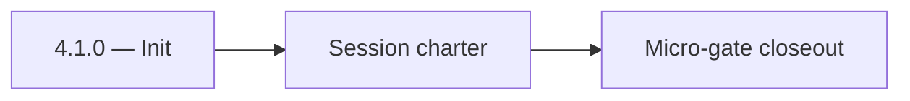

# 4.1.0 — Init

- **Era:** `4.x` Extension/SN maturity — hub [`versions.md`](../versions.md) · minors start at [`4.0 — Harbor`](4.0%20%E2%80%94%20Harbor.md)
- **Minor:** [4.1 — Auth & Session](./4.1 — Auth & Session.md)
- **Codename:** Init
- **Status:** ✅ Completed
## Focus
Session charter

## Flowchart

## Micro-gate

| Track | Gate question | Answer / Evidence (fill at patch closeout) |
| --- | --- | --- |
| **Contract** | Extension/SN REST, GraphQL modules, CSP — `docs/backend/apis/` + endpoint matrices updated? | Document at patch closeout. |
| **Service** | SN scrape/save, Connectra upsert, jobs DAG, session refresh — smoke + idempotency? | Document smoke paths. |
| **Surface** | Extension popup, dashboard SN/campaign panels, operator flows changed? | Document UX delta or N/A. |
| **Frontend** | Which extension MV3 + dashboard routes/hooks for this patch? | Extension auth/session — `extension-auth.md`, storage + refresh flows. Document at closeout. |
| **Data** | Provenance fields, audience tables, `messages.contacts[]` — migrations + lineage? | Document lineage or N/A. |
| **Ops** | `logs.api` events, S3 evidence, runbooks, rate/retry — delta recorded? | Document ops delta or N/A. |

## Tasks
### Contract

- ✅ Completed: 📌 Planned: Document refresh request/response vs Appointment360 schema — [`extension-auth.md`](extension-auth.md).
- ✅ Completed: 📌 Planned: Error codes: expiry, invalid_grant, network — user-recoverable vs fatal.

### Service

- ✅ Completed: 📌 Planned: Refresh **before** hard expiry where possible; backoff on repeated failures.
- ✅ Completed: 📌 Planned: Single-flight refresh (no stampede).

### Surface

- ✅ Completed: 📌 Planned: Extension: “session expired — re-login” path matches dashboard copy.
- ✅ Completed: 📌 Planned: Telemetry: `extension.session.token_refreshed` — **Service task slices** below (includes former `logsapi-extension-salesnav-task-pack.md` scope).

### Data

- ✅ Completed: 📌 Planned: No long-lived secrets in `localStorage` if migration from legacy.
- ✅ Completed: 📌 Planned: Rotation audit fields if required by compliance.

### Ops

- ✅ Completed: 📌 Planned: KPI: **extension auth failure rate** per roadmap **4.1**.
- ✅ Completed: 📌 Planned: Dashboard for refresh failures by version.

## Service task slices
> Merged from era `4.x` extension/SN task packs (P0→`.0`–`.2`, P1→`.3`–`.6`, Ops→`.7`–`.9`).

### Appointment360 (gateway)
- Define LinkedInMutation { upsertByLinkedinUrl, searchLinkedin, exportLinkedinResults }
- Define SalesNavigatorQuery { salesNavigatorSearch(query) }
- Define SalesNavigatorMutation { saveSalesNavigatorProfiles, syncSalesNavigator }
- Define LinkedInProfileType, SalesNavigatorResultType GraphQL output types
- Define LinkedInUpsertInput, SalesNavigatorSearchInput GraphQL input types
- Implement upsertByLinkedinUrl mutation: call ConnectraClient.search_by_linkedin_url(url) then upsert
- Implement searchLinkedin mutation: call Sales Navigator external service, return profile list
- Implement saveSalesNavigatorProfiles mutation: bulk upsert to Connectra via batch_upsert_contacts
- Add sales_navigator_client.py in app/clients/ wrapping SN external API
- Add credit deduction for Sales Navigator search queries
- Extension popup → mutation upsertByLinkedinUrl(url) to save LinkedIn contact
- Extension search results panel → mutation saveSalesNavigatorProfiles([...]) bulk save
- /contacts page, LinkedIn import tab → mutation searchLinkedin
- useSalesNavigatorSearch hook: manage search state, batch save
- useLinkedInSync hook: extension-to-dashboard sync trigger
- Contact/company records from LinkedIn upserts stored in Connectra (not appointment360 DB)
- Track SN searches in activities table: type=sales_navigator_search, metadata.query
- Deduct credits for each SN search or export operation
- Log source=linkedin / source=sales_navigator on Connectra records
- Configure Sales Navigator API key in .env.example
- Ensure upsertByLinkedinUrl is rate-limited (abuse guard middleware)

### logs.api
- Freeze `4.x` event names and required fields.
- Ensure canonical event set includes: `extension.session.token_refreshed`, `sn.ingest.started`, `sn.ingest.completed`, `sn.ingest.failed`, `sn.sync.conflict_resolved`.
- Require provenance fields: `workspace_id`, `ingestion_batch_id`, `source`, optional `extension_version`, `trace_id`.
- Update endpoint matrix on write/auth changes: [`docs/backend/endpoints/logsapi_endpoint_era_matrix.json`](../backend/endpoints/logsapi_endpoint_era_matrix.json).
- Validate burst ingestion behavior after large SN harvests.
- Verify auth and error envelope for event writers.
- Correlate `trace_id` + `ingestion_batch_id` + lambda request id across pipeline.
- Define S3 CSV partition/prefix strategy for extension/SN event volume.
- Document retention and query-window expectations for operations.

### emailapis / emailapigo
- Freeze `4.x` finder/verify payload compatibility for extension-originated flows.
- Require provenance fields: `source`, `workspace_id`, `ingestion_batch_id` (or equivalent), `trace_id`.
- Update endpoint matrix when fields/routes change: [`docs/backend/endpoints/emailapis_endpoint_era_matrix.json`](../backend/endpoints/emailapis_endpoint_era_matrix.json).
- Validate burst behavior for SN imports; avoid unbounded parallel verify/finder storms.
- Ensure auth, provider routing, and error envelopes for `audience_source=sn_batch` traffic.
- Keep `email_finder_cache` key policy stable across SN vs manual ingest paths.
- Confirm lineage expectations for `email_finder_cache` and `email_patterns`.
- Preserve traceability from verify/finder responses to logs (`trace_id`, `ingestion_batch_id`).

## Evidence gate
Primary charter artifact created and linked in the parent minor doc
