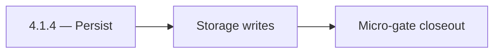

# 4.1.4 — Persist

- **Era:** `4.x` Extension/SN maturity — hub [`versions.md`](../versions.md) · minors start at [`4.0 — Harbor`](4.0%20%E2%80%94%20Harbor.md)
- **Minor:** [4.1 — Auth & Session](./4.1 — Auth & Session.md)
- **Codename:** Persist
- **Status:** ✅ Completed
## Focus
Storage writes

## Flowchart

## Micro-gate

| Track | Gate question | Answer / Evidence (fill at patch closeout) |
| --- | --- | --- |
| **Contract** | Extension/SN REST, GraphQL modules, CSP — `docs/backend/apis/` + endpoint matrices updated? | Document at patch closeout. |
| **Service** | SN scrape/save, Connectra upsert, jobs DAG, session refresh — smoke + idempotency? | Document smoke paths. |
| **Surface** | Extension popup, dashboard SN/campaign panels, operator flows changed? | Document UX delta or N/A. |
| **Frontend** | Which extension MV3 + dashboard routes/hooks for this patch? | Extension auth/session — `extension-auth.md`, storage + refresh flows. Document at closeout. |
| **Data** | Provenance fields, audience tables, `messages.contacts[]` — migrations + lineage? | Document lineage or N/A. |
| **Ops** | `logs.api` events, S3 evidence, runbooks, rate/retry — delta recorded? | Document ops delta or N/A. |

## Tasks
### Contract

- ✅ Completed: 📌 Planned: Document refresh request/response vs Appointment360 schema — [`extension-auth.md`](extension-auth.md).
- ✅ Completed: 📌 Planned: Error codes: expiry, invalid_grant, network — user-recoverable vs fatal.

### Service

- ✅ Completed: 📌 Planned: Refresh **before** hard expiry where possible; backoff on repeated failures.
- ✅ Completed: 📌 Planned: Single-flight refresh (no stampede).

### Surface

- ✅ Completed: 📌 Planned: Extension: “session expired — re-login” path matches dashboard copy.
- ✅ Completed: 📌 Planned: Telemetry: `extension.session.token_refreshed` — **Service task slices** below (includes former `logsapi-extension-salesnav-task-pack.md` scope).

### Data

- ✅ Completed: 📌 Planned: No long-lived secrets in `localStorage` if migration from legacy.
- ✅ Completed: 📌 Planned: Rotation audit fields if required by compliance.

### Ops

- ✅ Completed: 📌 Planned: KPI: **extension auth failure rate** per roadmap **4.1**.
- ✅ Completed: 📌 Planned: Dashboard for refresh failures by version.

## Service task slices
> Merged from era `4.x` extension/SN task packs (P0→`.0`–`.2`, P1→`.3`–`.6`, Ops→`.7`–`.9`).

### Appointment360 (gateway)
- Document LinkedIn module in docs/backend/apis/21_LINKEDIN_MODULE.md
- Document Sales Navigator module in docs/backend/apis/23_SALES_NAVIGATOR_MODULE.md
- Implement syncSalesNavigator mutation: trigger tkdjob sync task
- Implement exportLinkedinResults mutation: create contact360 export job via tkdjob
- Add extension session token validation for browser extension requests
- SN export button in contacts table → mutation exportLinkedinResults
- Extension badge count (unsaved profiles) synced via mutation syncSalesNavigator
- Extension auth state: JWT-based auth token validated per extension request
- Store extension session tokens in sessions table (appointment360 DB)
- Add SN + extension mutation tests in Postman collection
- Write E2E test: extension captures LinkedIn profile → appears in /contacts table
- Add X-Extension-Token header validation middleware or GraphQL guard

### logs.api
- Document dashboard ingestion status surfaces and source filters.
- Ensure empty/error states map to logs-derived aggregates.
- Define S3 CSV partition/prefix strategy for extension/SN event volume.
- Document retention and query-window expectations for operations.
- Confirm lineage in [`docs/backend/database/logsapi_data_lineage.md`](../backend/database/logsapi_data_lineage.md).
- Validate burst ingestion behavior after large SN harvests.
- Verify auth and error envelope for event writers.
- Correlate `trace_id` + `ingestion_batch_id` + lambda request id across pipeline.

### emailapis / emailapigo
- Document dashboard surfaces that chain to emailapis after SN ingest (`contacts/import`, campaign audience).
- Document hooks/services attaching provenance from extension to API requests.
- Confirm lineage expectations for `email_finder_cache` and `email_patterns`.
- Preserve traceability from verify/finder responses to logs (`trace_id`, `ingestion_batch_id`).
- Prevent SN-sourced rows from clobbering curated patterns without policy checks.
- Validate burst behavior for SN imports; avoid unbounded parallel verify/finder storms.
- Ensure auth, provider routing, and error envelopes for `audience_source=sn_batch` traffic.
- Keep `email_finder_cache` key policy stable across SN vs manual ingest paths.

## Evidence gate
Patch closeout includes contract diff, smoke output, data lineage delta, and ops note
