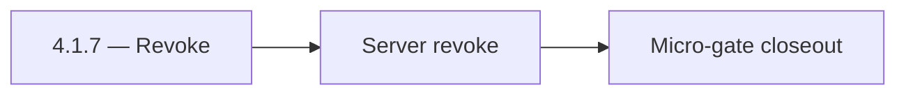

# 4.1.7 — Revoke

- **Era:** `4.x` Extension/SN maturity — hub [`versions.md`](../versions.md) · minors start at [`4.0 — Harbor`](4.0%20%E2%80%94%20Harbor.md)
- **Minor:** [4.1 — Auth & Session](./4.1 — Auth & Session.md)
- **Codename:** Revoke
- **Status:** planned

## Focus
Server revoke

## Flowchart

## Micro-gate

| Track | Gate question | Answer / Evidence (fill at patch closeout) |
| --- | --- | --- |
| **Contract** | Extension/SN REST, GraphQL modules, CSP — `docs/backend/apis/` + endpoint matrices updated? | Document at patch closeout. |
| **Service** | SN scrape/save, Connectra upsert, jobs DAG, session refresh — smoke + idempotency? | Document smoke paths. |
| **Surface** | Extension popup, dashboard SN/campaign panels, operator flows changed? | Document UX delta or N/A. |
| **Frontend** | Which extension MV3 + dashboard routes/hooks for this patch? | Extension auth/session — `extension-auth.md`, storage + refresh flows. Document at closeout. |
| **Data** | Provenance fields, audience tables, `messages.contacts[]` — migrations + lineage? | Document lineage or N/A. |
| **Ops** | `logs.api` events, S3 evidence, runbooks, rate/retry — delta recorded? | Document ops delta or N/A. |

## Tasks
### Contract

- 📌 Planned: Document refresh request/response vs Appointment360 schema — [`extension-auth.md`](extension-auth.md).  
- 📌 Planned: Error codes: expiry, invalid_grant, network — user-recoverable vs fatal.

### Service

- 📌 Planned: Refresh **before** hard expiry where possible; backoff on repeated failures.  
- 📌 Planned: Single-flight refresh (no stampede).

### Surface

- 📌 Planned: Extension: “session expired — re-login” path matches dashboard copy.  
- 📌 Planned: Telemetry: `extension.session.token_refreshed` — **Service task slices** below (includes former `logsapi-extension-salesnav-task-pack.md` scope).

### Data

- 📌 Planned: No long-lived secrets in `localStorage` if migration from legacy.  
- 📌 Planned: Rotation audit fields if required by compliance.

### Ops

- 📌 Planned: KPI: **extension auth failure rate** per roadmap **4.1**.  
- 📌 Planned: Dashboard for refresh failures by version.

## Service task slices
> Merged from era `4.x` extension/SN task packs (P0→`.0`–`.2`, P1→`.3`–`.6`, Ops→`.7`–`.9`).

### Appointment360 (gateway)
- Add SN + extension mutation tests in Postman collection
- Write E2E test: extension captures LinkedIn profile → appears in /contacts table
- Add X-Extension-Token header validation middleware or GraphQL guard

### logs.api
- Add dashboards and alerts for failed ingest, token-refresh failures, and conflict spikes.
- Publish replay/rollback runbook for poison payloads and schema breaks.
- Capture load-test evidence for peak extension cohort traffic.

### emailapis / emailapigo
- Add release evidence for burst latency, cache hit rate, and provider error share by source.
- Record rollback and incident runbook notes for post-harvest degradation.
- Verify no duplicate paid verification on replayed extension batches.

## Evidence gate
Patch closeout includes contract diff, smoke output, data lineage delta, and ops note
