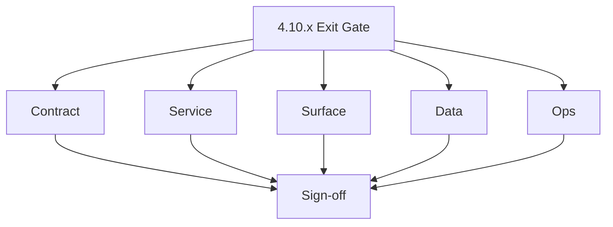
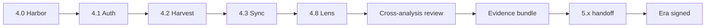

# Version 4.10 — Exit Gate (4.x sign-off)

- **Status:** ✅ Completed
- **Codename:** Exit Gate
- **Era:** 4.x (Extension and Sales Navigator maturity) — **retrospective / sign-off** minor before **5.x**
- **Roadmap:** Planning minor **4.10** — cross-analysis review, release evidence, **roadmap + versions** sync, **`4.x` → `5.x` handoff**.
- **Summary:** Prove the Extension + SN maturity era is **documented**, **integrated**, and **releasable**: codebase analyses agree with behaviour, task packs are consumed, telemetry (`logs.api`) and provenance (S3, Connectra) meet gates; explicit handoff notes for **5.x** AI workflow depth.
- **Owner:** Product + Platform
- **Patch closure:** Every codenamed patch file includes **Micro-gate** + **Service task slices**. Era hub: [`versions.md`](../versions.md).

## Scope

- **Target:** `4.10.x` patches.
- **In scope:** Documentation parity, integration smoke / cross-service tests, release artefact bundle, security & perf spot checks, compliance sign-off for SN PII flows.
- **Out of scope:** New feature development — belongs in **5.x** or earlier minors if missed (file debt list instead).

## Flowchart

### Runtime focus (unique to this minor)

## Task tracks

### Contract

- ✅ Completed: 📌 Planned: **[salesnavigator]** — refine duplicate task (was: 📌 planned: **[salesnavigator]** — refine duplicate task (was…) | patch `4.10.0` band `0` | reason: specialize this file vs sibling patches; see docs/codebases/salesnavigator-codebase-analysis.md
- ✅ Completed: 📌 Planned: **[salesnavigator]** — refine duplicate task (was: 📌 planned: **[salesnavigator]** — refine duplicate task (was…) | patch `4.10.0` band `0` | reason: specialize this file vs sibling patches; see docs/codebases/salesnavigator-codebase-analysis.md
- ✅ Completed: 📌 Planned: **[salesnavigator]** — refine duplicate task (was: 📌 planned: **[salesnavigator]** — refine duplicate task (was…) | patch `4.10.0` band `0` | reason: specialize this file vs sibling patches; see docs/codebases/salesnavigator-codebase-analysis.md

- ✅ Completed: 📌 Planned: **[salesnavigator]** — refine duplicate task (was: 📌 planned: **[architecture]** — product **graphql** remains …) | patch `4.10.0` band `0` | reason: specialize this file vs sibling patches; see docs/codebases/salesnavigator-codebase-analysis.md
### Service

- ✅ Completed: 📌 Planned: **[salesnavigator]** — refine duplicate task (was: 📌 planned: **[salesnavigator]** — refine duplicate task (was…) | patch `4.10.0` band `0` | reason: specialize this file vs sibling patches; see docs/codebases/salesnavigator-codebase-analysis.md
- ✅ Completed: 📌 Planned: **[salesnavigator]** — refine duplicate task (was: 📌 planned: **[salesnavigator]** — refine duplicate task (was…) | patch `4.10.0` band `0` | reason: specialize this file vs sibling patches; see docs/codebases/salesnavigator-codebase-analysis.md

- ✅ Completed: 📌 Planned: **[salesnavigator]** — refine duplicate task (was: 📌 planned: **[architecture]** — **go/gin satellites** in sco…) | patch `4.10.0` band `0` | reason: specialize this file vs sibling patches; see docs/codebases/salesnavigator-codebase-analysis.md
### Surface

- ✅ Completed: 📌 Planned: **[salesnavigator]** — refine duplicate task (was: 📌 planned: **[salesnavigator]** — refine duplicate task (was…) | patch `4.10.0` band `0` | reason: specialize this file vs sibling patches; see docs/codebases/salesnavigator-codebase-analysis.md
- ✅ Completed: 📌 Planned: **[salesnavigator]** — refine duplicate task (was: 📌 planned: **[salesnavigator]** — refine duplicate task (was…) | patch `4.10.0` band `0` | reason: specialize this file vs sibling patches; see docs/codebases/salesnavigator-codebase-analysis.md

- ✅ Completed: 📌 Planned: **[salesnavigator]** — refine duplicate task (was: 📌 planned: **[architecture]** — **next.js** customer surface…) | patch `4.10.0` band `0` | reason: specialize this file vs sibling patches; see docs/codebases/salesnavigator-codebase-analysis.md
- ✅ Completed: 📌 Planned: **[salesnavigator]** — refine duplicate task (was: 📌 planned: **[architecture]** — **chrome extension**: graphq…) | patch `4.10.0` band `0` | reason: specialize this file vs sibling patches; see docs/codebases/salesnavigator-codebase-analysis.md
### Data

- ✅ Completed: 📌 Planned: **[salesnavigator]** — refine duplicate task (was: 📌 planned: **[salesnavigator]** — refine duplicate task (was…) | patch `4.10.0` band `0` | reason: specialize this file vs sibling patches; see docs/codebases/salesnavigator-codebase-analysis.md
- ✅ Completed: 📌 Planned: **[salesnavigator]** — refine duplicate task (was: 📌 planned: **[salesnavigator]** — refine duplicate task (was…) | patch `4.10.0` band `0` | reason: specialize this file vs sibling patches; see docs/codebases/salesnavigator-codebase-analysis.md

- ✅ Completed: 📌 Planned: **[salesnavigator]** — refine duplicate task (was: 📌 planned: **[architecture]** — **postgresql-first** per `do…) | patch `4.10.0` band `0` | reason: specialize this file vs sibling patches; see docs/codebases/salesnavigator-codebase-analysis.md
### Ops

- ✅ Completed: 📌 Planned: **[salesnavigator]** — refine duplicate task (was: 📌 planned: **[salesnavigator]** — refine duplicate task (was…) | patch `4.10.0` band `0` | reason: specialize this file vs sibling patches; see docs/codebases/salesnavigator-codebase-analysis.md
- ✅ Completed: 📌 Planned: **[salesnavigator]** — refine duplicate task (was: 📌 planned: **[salesnavigator]** — refine duplicate task (was…) | patch `4.10.0` band `0` | reason: specialize this file vs sibling patches; see docs/codebases/salesnavigator-codebase-analysis.md

- ✅ Completed: 📌 Planned: **[salesnavigator]** — refine duplicate task (was: 📌 planned: **[architecture]** — **observability**: correlate…) | patch `4.10.0` band `0` | reason: specialize this file vs sibling patches; see docs/codebases/salesnavigator-codebase-analysis.md
## Task breakdown

| Slice | Outcome |
| --- | --- |
| Product | Go/no-go for **5.x** |
| Platform | Evidence archive |
| Security | Review complete |

## Immediate next execution queue

- 📌 Planned: Schedule **cross-analysis** meeting (all `docs/codebases/*` touched in **4.x**).
- 📌 Planned: Collect **release evidence** zip: traces, test reports, screenshot pack.
- 📌 Planned: Draft **`5.x` handoff** — open risks, deferred **6.x** reliability items (rate limit, chunk tokens).

## Cross-service ownership

| Service | Focus |
| --- | --- |
| Product | Sign-off |
| Platform | Evidence + roadmap sync |
| Each vertical owner | Minor completion attest |

## References

- [docs/codebases/admin-codebase-analysis.md](../codebases/admin-codebase-analysis.md)
- [docs/codebases/root-codebase-analysis.md](../codebases/root-codebase-analysis.md)
- [docs/codebases/email-codebase-analysis.md](../codebases/email-codebase-analysis.md)
- Era hub: [`docs/versions.md`](../versions.md) · codenamed patches `4.N.P — *.md` (**Micro-gate** + **Service task slices**)
- [`4.0 — Harbor.md`](4.0 — Harbor.md) … [`4.8 — Lens.md`](4.8 — Lens.md)
- [`docs/roadmap.md`](../roadmap.md) · [`docs/versions.md`](../versions.md)

## Backend API and endpoint scope

- **Retrospective** — verify no undocumented endpoints in prod for SN path.

## Database and data lineage scope

- Confirm lineage docs list **S3 CSV** for logs, not legacy stores.

## Frontend UX surface scope

- Final UX **diff** vs **4.0** charter screenshots (if captured).

## UI Elements Checklist

- 📌 Planned: SN-related primary entry point present
- 📌 Planned: Loading/progress state present
- 📌 Planned: Error and retry states present

## Audit and Compliance Notes

- Validate provenance (source, ingestion_batch_id, trace_id) is retained through this minor flow.
- Ensure PII handling aligns with [docs/audit-compliance.md](../audit-compliance.md).

## Flow / graph delta for this minor

- **Delta:** **Meta gate** — proves end-to-end graph for the era.

## Patch ladder (`4.10.0` – `4.10.9`)

### Micro-gate reference (apply at every `4.N.P`)

| Track | Gate question (must answer Yes or document waiver) |
| --- | --- |
| **Contract** | Extension/SN REST, GraphQL modules, CSP — `docs/backend/apis/` + endpoint matrices updated? |
| **Service** | SN scrape/save, Connectra upsert, jobs DAG, session refresh — smoke + idempotency documented? |
| **Surface** | Extension popup, dashboard SN/campaign panels, operator flows changed? |
| **Frontend** | Extension MV3 + dashboard routes/hooks (see minor scope / `extension-auth.md`, `extension-telemetry.md`)? |
| **Data** | Provenance, audience tables, `messages.contacts[]` — migrations + lineage docs? |
| **Ops** | `logs.api` events, S3 evidence, runbooks, rate/retry — delta recorded? |
| **Architecture** | Go/Gin satellites only via Python GraphQL gateway (`contact360.io/api`); Next.js `NEXT_PUBLIC_GRAPHQL_URL`; Postgres-first / Redis exit per `docs/docs/data-stores-postgres.md`. |

**Patch intent bands:** Codenames per minor — see **Patch ladder** table in this file (`.0` charter … `.9` seal/handoff).

Theme: **Exit Gate** — codenames in per-patch `4.10.P — *.md` files.

| Patch | Codename | Focus |
| --- | --- | --- |
| `4.10.0` | Review | Cross-analysis |
| `4.10.1` | Evidence | Artefacts |
| `4.10.2` | Drift-fix | Last doc fixes |
| `4.10.3` | Postman | Collection sign-off |
| `4.10.4` | Docs-sync | Roadmap/versions |
| `4.10.5` | Security | AuthZ/CSP |
| `4.10.6` | Perf | SLO verification |
| `4.10.7` | Compliance | PII retention |
| `4.10.8` | RC | Release candidate |
| `4.10.9` | Sign-off | **`5.x` handoff** |

## Release gate and evidence

- 📌 Planned: **4.x** exit criteria in this minor + [`versions.md`](../versions.md) satisfied or waived
- 📌 Planned: Evidence bundle stored per org policy
- 📌 Planned: Roadmap **4.x** stages mapped to shipped tags/commits
- 📌 Planned: **`5.x` kickoff** doc or ticket created
- 📌 Planned: Exec/product **sign-off** recorded

## Patches

| Patch | Codename | Doc |
| --- | --- | --- |
| `4.10.0` | Review | [`4.10.0` — Review](4.10.0 — Review.md) |
| `4.10.1` | Evidence | [`4.10.1` — Evidence](4.10.1 — Evidence.md) |
| `4.10.2` | Drift-fix | [`4.10.2` — Drift-fix](4.10.2 — Drift-fix.md) |
| `4.10.3` | Postman | [`4.10.3` — Postman](4.10.3 — Postman.md) |
| `4.10.4` | Docs-sync | [`4.10.4` — Docs-sync](4.10.4 — Docs-sync.md) |
| `4.10.5` | Security | [`4.10.5` — Security](4.10.5 — Security.md) |
| `4.10.6` | Perf | [`4.10.6` — Perf](4.10.6 — Perf.md) |
| `4.10.7` | Compliance | [`4.10.7` — Compliance](4.10.7 — Compliance.md) |
| `4.10.8` | RC | [`4.10.8` — RC](4.10.8 — RC.md) |
| `4.10.9` | Sign-off | [`4.10.9` — Sign-off](4.10.9 — Sign-off.md) |

## Release Gate and Evidence

### Master Task Checklist
- 📌 Planned: Track-level closure evidence linked

### Backend API and Endpoints
- 📌 Planned: Endpoint/contract parity verified

### Database and Data Lineage
- 📌 Planned: Migration and lineage references linked

### Frontend UX
- 📌 Planned: UX/route behavior evidence linked

### UI Elements
- 📌 Planned: Components/checklist closeout captured

### Flow and Graph
- 📌 Planned: Runtime graph reflects implementation

### Validation
- 📌 Planned: Smoke/CI/lint checks recorded

### Release Gate
- 📌 Planned: Minor ready for handoff to next minor
