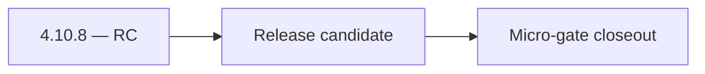

# 4.10.8 — RC

- **Era:** `4.x` Extension/SN maturity — hub [`versions.md`](../versions.md) · minors start at [`4.0 — Harbor`](4.0%20%E2%80%94%20Harbor.md)
- **Minor:** [4.10 — Exit Gate](./4.10 — Exit Gate.md)
- **Codename:** RC
- **Status:** ✅ Completed
## Focus
Release candidate

## Flowchart

## Micro-gate

| Track | Gate question | Answer / Evidence (fill at patch closeout) |
| --- | --- | --- |
| **Contract** | Extension/SN REST, GraphQL modules, CSP — `docs/backend/apis/` + endpoint matrices updated? | Document at patch closeout. |
| **Service** | SN scrape/save, Connectra upsert, jobs DAG, session refresh — smoke + idempotency? | Document smoke paths. |
| **Surface** | Extension popup, dashboard SN/campaign panels, operator flows changed? | Document UX delta or N/A. |
| **Frontend** | Which extension MV3 + dashboard routes/hooks for this patch? | Exit sweep — evidence/docs; avoid new UX unless ops-only. Document at closeout. |
| **Data** | Provenance fields, audience tables, `messages.contacts[]` — migrations + lineage? | Document lineage or N/A. |
| **Ops** | `logs.api` events, S3 evidence, runbooks, rate/retry — delta recorded? | Document ops delta or N/A. |

## Tasks
### Contract

- 📌 Planned: **[salesnavigator]** — refine duplicate task (was: ✅ completed: 📌 planned: all **4.x** minors have **accurate**…) | patch `4.10.8` band `8` | reason: specialize this file vs sibling patches; see docs/codebases/salesnavigator-codebase-analysis.md
- 📌 Planned: **[salesnavigator]** — refine duplicate task (was: ✅ completed: 📌 planned: postman / openapi coverage **indexed…) | patch `4.10.8` band `8` | reason: specialize this file vs sibling patches; see docs/codebases/salesnavigator-codebase-analysis.md
- 📌 Planned: **[salesnavigator]** — refine duplicate task (was: ✅ completed: 📌 planned: **p0/p1** items from `salesnavigator…) | patch `4.10.8` band `8` | reason: specialize this file vs sibling patches; see docs/codebases/salesnavigator-codebase-analysis.md

### Service

- 📌 Planned: **[salesnavigator]** — refine duplicate task (was: ✅ completed: 📌 planned: golden path: **extension** → **sales…) | patch `4.10.8` band `8` | reason: specialize this file vs sibling patches; see docs/codebases/salesnavigator-codebase-analysis.md
- 📌 Planned: **[salesnavigator]** — refine duplicate task (was: ✅ completed: 📌 planned: **jobs** + **s3storage** (if used) —…) | patch `4.10.8` band `8` | reason: specialize this file vs sibling patches; see docs/codebases/salesnavigator-codebase-analysis.md

### Surface

- 📌 Planned: **[salesnavigator]** — refine duplicate task (was: ✅ completed: 📌 planned: ux: sn save / retry / summary states…) | patch `4.10.8` band `8` | reason: specialize this file vs sibling patches; see docs/codebases/salesnavigator-codebase-analysis.md
- 📌 Planned: **[salesnavigator]** — refine duplicate task (was: ✅ completed: 📌 planned: optional **4.8** lens features — if …) | patch `4.10.8` band `8` | reason: specialize this file vs sibling patches; see docs/codebases/salesnavigator-codebase-analysis.md

### Data

- 📌 Planned: **[salesnavigator]** — refine duplicate task (was: ✅ completed: 📌 planned: es–pg **spot check** on sn-sourced s…) | patch `4.10.8` band `8` | reason: specialize this file vs sibling patches; see docs/codebases/salesnavigator-codebase-analysis.md
- 📌 Planned: **[salesnavigator]** — refine duplicate task (was: ✅ completed: 📌 planned: **`messages.contacts[]`** compatibil…) | patch `4.10.8` band `8` | reason: specialize this file vs sibling patches; see docs/codebases/salesnavigator-codebase-analysis.md

### Ops

- 📌 Planned: **[salesnavigator]** — refine duplicate task (was: ✅ completed: 📌 planned: kpis: auth failure (4.1), ingest p95…) | patch `4.10.8` band `8` | reason: specialize this file vs sibling patches; see docs/codebases/salesnavigator-codebase-analysis.md
- 📌 Planned: **[salesnavigator]** — refine duplicate task (was: ✅ completed: 📌 planned: incident runbooks for sn lambda + co…) | patch `4.10.8` band `8` | reason: specialize this file vs sibling patches; see docs/codebases/salesnavigator-codebase-analysis.md

## Service task slices
> Merged from era `4.x` extension/SN task packs (P0→`.0`–`.2`, P1→`.3`–`.6`, Ops→`.7`–`.9`).

### Appointment360 (gateway)
- Add SN + extension mutation tests in Postman collection
- Write E2E test: extension captures LinkedIn profile → appears in /contacts table
- Add X-Extension-Token header validation middleware or GraphQL guard

### Connectra
- **Drift detection hooks:** align with Connectra queue item “ES–PG reconciliation job” (analysis gaps) — define minimal SN acceptance query set
- Preserve **filter_data** facet consistency when SN bulk jobs update company/employer fields
- Alerting: bulk-upsert error rate by **source=sales_navigator** / extension session correlation

### contact.ai
- CSP review for extension: add `LAMBDA_AI_API_URL` to allowed `connect-src` origins.
- Test extension flow (optional): SN contact → extension popup → AI chat context → message sent → response received.
- No new Lambda timeout or memory changes expected in `4.x`.

### emailapis / emailapigo
- Add release evidence for burst latency, cache hit rate, and provider error share by source.
- Record rollback and incident runbook notes for post-harvest degradation.
- Verify no duplicate paid verification on replayed extension batches.

### Emailcampaign
- Campaign can be created from a SN LinkedIn URL list.
- Contacts without resolved emails are excluded from recipient list with a warning.
- "Add to Campaign" CTA visible in extension when viewing SN profile.

### Jobs
- Add dashboards for sync lag p95/max, retry churn, and stuck processing age.
- Publish stuck-job runbook with replay/cancel steps by `ingestion_batch_id`.
- Add rollback playbook for extension ingestion regressions.

### logs.api
- Add dashboards and alerts for failed ingest, token-refresh failures, and conflict spikes.
- Publish replay/rollback runbook for poison payloads and schema breaks.
- Capture load-test evidence for peak extension cohort traffic.

### Mailvetter
- Add extension-specific rate and error dashboards.
- Add source-based abuse detection and alerting.

### S3Storage
- Lineage: link **S3 object key → SN save batch id / request id** in metadata sidecar or jobs record
- Reliability: success rate for **complete / abort** flows originating from extension channel; alarms on stuck multipart
- Runbook: leaked object or wrong prefix — revoke URL class, audit tag gaps, backfill metadata

### Salesnavigator
- P95 latency target: `save-profiles` for 25 profiles < 3s; for 100 profiles < 5s
- CloudWatch alarm: `save-profiles` Lambda timeout rate > 1%
- Lambda timeout tuning: current 60s sufficient for 1000 profiles; confirm under load
- Test: 1000-profile batch end-to-end in staging
- Deploy via SAM to staging + production
- Extension CSP check: confirm Lambda API domain is allowed in extension manifest
- [docs/frontend/salesnavigator-ui-bindings.md](../frontend/salesnavigator-ui-bindings.md)
- [docs/backend/database/salesnavigator_data_lineage.md](../backend/database/salesnavigator_data_lineage.md)
- [docs/backend/endpoints/salesnavigator_endpoint_era_matrix.json](../backend/endpoints/salesnavigator_endpoint_era_matrix.json)
- `docs/codebases/salesnavigator-codebase-analysis.md`
- `docs/backend/apis/SALESNAVIGATOR_ERA_TASK_PACKS.md`
- `docs/frontend/salesnavigator-ui-bindings.md`
- `docs/backend/database/salesnavigator_data_lineage.md`

## Evidence gate
Patch closeout includes contract diff, smoke output, data lineage delta, and ops note
