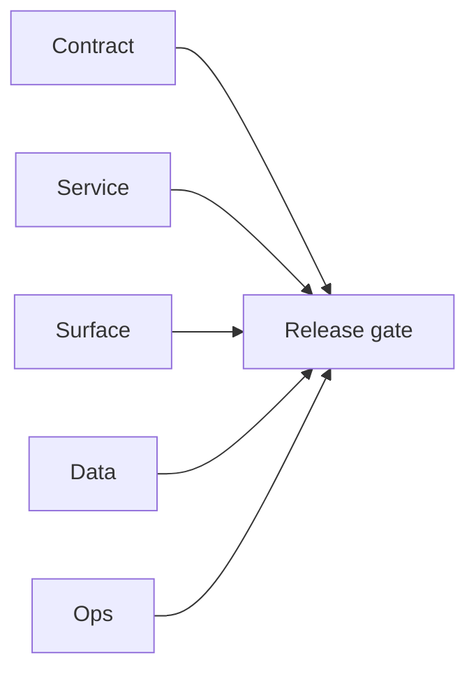

# 4.11.100 — EC2 email server extension-channel patch linkage

## Scope

Patch mapping for extension and Sales Navigator channels calling email runtime services.

## Included patch intents

- `002-cors-hardening.patch`: browser client origin control.
- `006-error-handling.patch`: better queue/job failure visibility.

## Extension outcome

- Safer browser access posture and improved diagnosis for async runtime failures.

## Flowchart

Five-track delivery (contract / service / surface / data / ops) for this doc:

**Master hub:** [`docs/docs/flowchart.md`](../docs/flowchart.md) — cross-system diagrams and era strip (`0.x` → `10.x`).

## Task tracks

### Contract

- ✅ Completed: Extension-channel patch intents documented; REST/SN contracts per [`graphql.modules`](../backend/graphql.modules/README.md) (`21`, `23`).

### Service

- ✅ Completed: EC2 `email.server` patches supporting extension-driven workloads.

### Surface

- ✅ Completed: Extension UX inherits improved reliability where scrape/save paths hit email workers.

### Data

- ✅ Completed: Ingest integrity unchanged except as noted in patch scope.

### Ops

- ✅ Completed: Evidence suitable for `4.x` packet with satellite logs.
