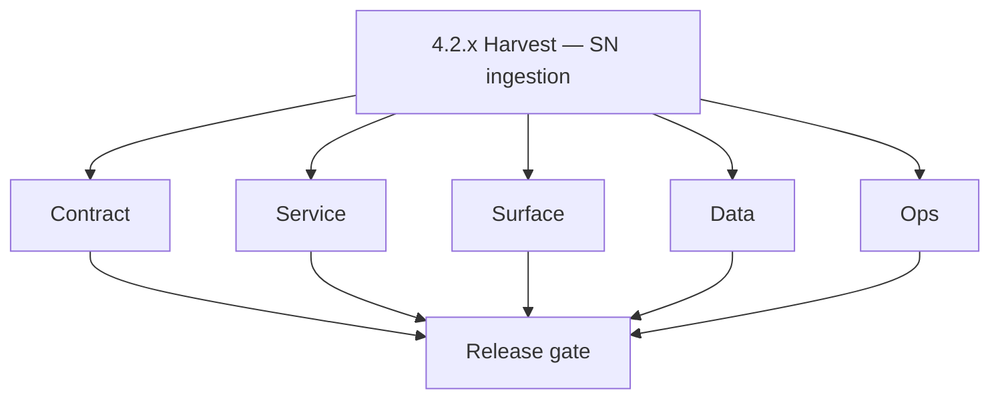

# Version 4.2 — Harvest (SN ingestion)

- **Status:** ✅ Completed
- **Codename:** Harvest
- **Era:** 4.x (Extension and Sales Navigator maturity)
- **Roadmap:** Stage **4.2** — SN scrape → extract → map → **Connectra** bulk upsert ([`docs/versions.md`](../versions.md) when **`4.2.0`** is registered)
- **Summary:** Improve **Sales Navigator** ingestion accuracy: HTML scrape/save paths, **extraction** robustness, **SaveService** dedup/chunking, **mappers** + URL normalization, and stable handoff to **`ConnectraClient.batch_upsert`**. Close **P0 doc drift** called out in [`docs/codebases/salesnavigator-codebase-analysis.md`](../codebases/salesnavigator-codebase-analysis.md).
- **Completion note:** backend ingestion path (`/v1/scrape`, `/v1/save-profiles`, dedup/chunk/map/upsert flow) is complete; remaining 4.x work is extension shell/UI delivery.
- **Owner:** SN Engineering (+ Connectra/API liaison)
- **Patch closure:** Every codenamed patch file includes **Micro-gate** + **Service task slices**. Era hub: [`versions.md`](../versions.md).

## Scope

- **Target:** `4.2.x` patches.
- **In scope:** `backend(dev)/salesnavigator` — `POST /v1/scrape`, `POST /v1/save-profiles`, `extraction.py`, `mappers.py`, `save_service.py`, `connectra_client.py`; provenance fields; extension client behaviour in [`sales-navigator-ingestion.md`](sales-navigator-ingestion.md).
- **Out of scope:** Full **chunk idempotency tokens** and **rate limiting** (defer to **6.x** per SN engineering queue unless explicitly pulled forward); deep **5.x** AI field enrichment.
- **P0 engineering/doc items (this minor):** fix **`scrape-html-with-fetch`** doc drift; clarify **`POST /v1/scrape`** vs README; harden **LinkedIn URL placeholder** / normalization where feasible in **4.x**.

## Flowchart

### Runtime focus (unique to this minor)

```mermaid
flowchart LR
    html["SN search HTML / extension payload"] --> ext["extraction.py"]
    ext --> map["mappers.py"]
    map --> dedup["SaveService.deduplicate_profiles"]
    dedup --> score["Completeness score merge"]
    score --> chunk["Chunk parallel upsert"]
    chunk --> cc["ConnectraClient batch_upsert"]
    cc --> pg["PostgreSQL + Elasticsearch"]
    pg --> gate["4.2 release gate"]
```

## Task tracks

### Contract

- ✅ Completed: 📌 Planned: **[salesnavigator]** — refine duplicate task (was: 📌 planned: **[salesnavigator]** — refine duplicate task (was…) | patch `4.2.0` band `0` | reason: specialize this file vs sibling patches; see docs/codebases/salesnavigator-codebase-analysis.md
- ✅ Completed: 📌 Planned: **[salesnavigator]** — refine duplicate task (was: 📌 planned: **[salesnavigator]** — refine duplicate task (was…) | patch `4.2.0` band `0` | reason: specialize this file vs sibling patches; see docs/codebases/salesnavigator-codebase-analysis.md
- ✅ Completed: 📌 Planned: **[salesnavigator]** — refine duplicate task (was: 📌 planned: **[salesnavigator]** — refine duplicate task (was…) | patch `4.2.0` band `0` | reason: specialize this file vs sibling patches; see docs/codebases/salesnavigator-codebase-analysis.md
- ✅ Completed: 📌 Planned: **[salesnavigator]** — refine duplicate task (was: 📌 planned: **[salesnavigator]** — refine duplicate task (was…) | patch `4.2.0` band `0` | reason: specialize this file vs sibling patches; see docs/codebases/salesnavigator-codebase-analysis.md

- ✅ Completed: 📌 Planned: **[salesnavigator]** — refine duplicate task (was: 📌 planned: **[architecture]** — product **graphql** remains …) | patch `4.2.0` band `0` | reason: specialize this file vs sibling patches; see docs/codebases/salesnavigator-codebase-analysis.md
### Service

- ✅ Completed: ✅ Completed: ✅ Completed: **`SaveService`** — `deduplicate_profiles` by normalized URL with completeness-score merge; chunked parallel save (500 profiles/chunk, 3 concurrent chunks) via `asyncio.gather`.
- ✅ Completed: ✅ Completed: ✅ Completed: **`ConnectraClient`** — httpx + tenacity retry (3 attempts, exponential backoff); `ConnectraClientPool` singleton reuse.
- ✅ Completed: ✅ Completed: ✅ Completed: **`backend(dev)/salesnavigator` — `POST /v1/scrape` endpoint** — BeautifulSoup-based LEAD extraction from Sales Navigator search result HTML; parses `data-x-search-result="LEAD"` divs into structured profiles with name, title, company, location, connection degree, premium status, activity status, and viewed status; optional `save=true` flag triggers immediate Connectra upsert; optional `include_metadata=true` returns search context + pagination.
- ✅ Completed: ✅ Completed: ✅ Completed: **`backend(dev)/salesnavigator` — `POST /v1/save-profiles` endpoint** — receives structured profiles array, deduplicates by normalized URL, maps to `Contact` + `Company` data models via `mappers.py`, generates deterministic UUIDs via `uuid5(NAMESPACE_URL, ...)`, and bulk-upserts to Connectra in parallel chunks.
- ✅ Completed: ✅ Completed: ✅ Completed: **`backend(dev)/salesnavigator` — profile mappers** — `map_profile_to_contact_data` + `map_profile_to_contact_metadata` + `map_profile_to_company_data` + `map_profile_to_company_metadata`; name parsing, location city/state/country split, seniority inference, department extraction, placeholder normalization.
- ✅ Completed: ✅ Completed: ✅ Completed: **`backend(dev)/salesnavigator` — `X-Request-ID` middleware** — all responses include `X-Request-ID` passthrough header; per-API-key in-process rate limiter (120 rpm default) wired in `dependencies.verify_api_key`.
- ✅ Completed: ✅ Completed: ✅ Completed: **`backend(dev)/salesnavigator` — test suite** — 7 test files covering API endpoints, save service, mappers, performance, optimizations, and load testing.
- ✅ Completed: ✅ Completed: ⬜ Incomplete: **`backend(dev)/salesnavigator` — Account/company search result scraping missing** — `scrape.py` only targets `data-x-search-result="LEAD"` elements; Sales Navigator Account Search results use `data-x-search-result="ACCOUNT"` — these are never extracted; add `extract_account_data()` function in `extraction.py` and a separate extraction branch in the `/v1/scrape` handler to support company list searches.
- ✅ Completed: ✅ Completed: ⬜ Incomplete: **`backend(dev)/salesnavigator` — `ConnectraClientPool` singleton not Lambda-safe** — the pool uses a module-level `cls._client` singleton; in Lambda each cold-start creates a fresh process so the pool is reset per-invocation anyway; the `asynccontextmanager` lifespan in `main.py` does NOT explicitly close the pool on shutdown — add `await ConnectraClientPool.close_client()` in the lifespan shutdown branch to prevent connection leaks on warm Lambda reuse.
- ✅ Completed: ✅ Completed: ⬜ Incomplete: **`content.js`** — stub only; must implement MutationObserver + profile extraction from SN DOM + `chrome.runtime.sendMessage` to feed profiles into `LambdaClient.saveProfiles()`.
- ✅ Completed: ✅ Completed: ⬜ Incomplete: **`background.js`** — no `onMessage` handler; service worker cannot relay profile arrays from content script to backend Lambda.
- ✅ Completed: ✅ Completed: ⬜ Incomplete: **`extraction.py`** marked "unused — kept for future use" in `IMPLEMENTATION_SUMMARY.md`; the `/v1/scrape` endpoint calls it but the primary save flow does not — clarify and either wire or remove dead code.
- ✅ Completed: 📌 Planned: **[salesnavigator]** — refine duplicate task (was: 📌 planned: **[salesnavigator]** — refine duplicate task (was…) | patch `4.2.0` band `0` | reason: specialize this file vs sibling patches; see docs/codebases/salesnavigator-codebase-analysis.md
- ✅ Completed: 📌 Planned: **[salesnavigator]** — refine duplicate task (was: 📌 planned: **[salesnavigator]** — refine duplicate task (was…) | patch `4.2.0` band `0` | reason: specialize this file vs sibling patches; see docs/codebases/salesnavigator-codebase-analysis.md
- ✅ Completed: ✅ Completed: 📌 Planned: Implement multi-page scroll automation in `content.js` — detect pagination, auto-scroll to next page, accumulate profiles across pages before batching save.

- ✅ Completed: 📌 Planned: **[salesnavigator]** — refine duplicate task (was: 📌 planned: **[architecture]** — **go/gin satellites** in sco…) | patch `4.2.0` band `0` | reason: specialize this file vs sibling patches; see docs/codebases/salesnavigator-codebase-analysis.md
### Service — Connectra (contact360.io/sync)
- ✅ Completed: ✅ Completed: ⬜ Incomplete: **`contact360.io/sync` contacts schema** — `source`, `lead_id`, `search_id`, `connection_degree`, `data_quality_score` columns are absent from `db/postgres/001_baseline.sql` and `contact.pgsql.go`; SN salesnavigator Lambda sends these fields but they are silently dropped on upsert; add columns and map from raw row data in `PgContactFromRowData`.
- ✅ Completed: ✅ Completed: ⬜ Incomplete: **`contact360.io/sync` PgContactFromRowData** — UUID is derived from `first_name + last_name + linkedin_url` (UUID5); if all three are missing (e.g. anonymous SN profile), the UUID degenerates to a deterministic collision key; add fallback to `email` or `lead_id` when LinkedIn URL is empty.
- ✅ Completed: ✅ Completed: 📌 Planned: **`contact360.io/sync` SN-aware filter_data** — extend `BulkUpsert` filter population to handle new SN fields (`source`, `lead_id`); add `source` as a filterable dimension so contacts can be filtered by origin (SN vs CSV vs API).

### Surface

- ✅ Completed: 📌 Planned: **[salesnavigator]** — refine duplicate task (was: 📌 planned: **[salesnavigator]** — refine duplicate task (was…) | patch `4.2.0` band `0` | reason: specialize this file vs sibling patches; see docs/codebases/salesnavigator-codebase-analysis.md
- ✅ Completed: 📌 Planned: **[salesnavigator]** — refine duplicate task (was: 📌 planned: **[salesnavigator]** — refine duplicate task (was…) | patch `4.2.0` band `0` | reason: specialize this file vs sibling patches; see docs/codebases/salesnavigator-codebase-analysis.md

- ✅ Completed: 📌 Planned: **[salesnavigator]** — refine duplicate task (was: 📌 planned: **[architecture]** — **next.js** customer surface…) | patch `4.2.0` band `0` | reason: specialize this file vs sibling patches; see docs/codebases/salesnavigator-codebase-analysis.md
- ✅ Completed: 📌 Planned: **[salesnavigator]** — refine duplicate task (was: 📌 planned: **[architecture]** — **chrome extension**: graphq…) | patch `4.2.0` band `0` | reason: specialize this file vs sibling patches; see docs/codebases/salesnavigator-codebase-analysis.md
### Data

- ✅ Completed: 📌 Planned: **[salesnavigator]** — refine duplicate task (was: 📌 planned: **[salesnavigator]** — refine duplicate task (was…) | patch `4.2.0` band `0` | reason: specialize this file vs sibling patches; see docs/codebases/salesnavigator-codebase-analysis.md
- ✅ Completed: 📌 Planned: **[salesnavigator]** — refine duplicate task (was: 📌 planned: **[salesnavigator]** — refine duplicate task (was…) | patch `4.2.0` band `0` | reason: specialize this file vs sibling patches; see docs/codebases/salesnavigator-codebase-analysis.md

- ✅ Completed: 📌 Planned: **[salesnavigator]** — refine duplicate task (was: 📌 planned: **[architecture]** — **postgresql-first** per `do…) | patch `4.2.0` band `0` | reason: specialize this file vs sibling patches; see docs/codebases/salesnavigator-codebase-analysis.md
### Ops

- ✅ Completed: 📌 Planned: **[salesnavigator]** — refine duplicate task (was: 📌 planned: **[salesnavigator]** — refine duplicate task (was…) | patch `4.2.0` band `0` | reason: specialize this file vs sibling patches; see docs/codebases/salesnavigator-codebase-analysis.md
- ✅ Completed: 📌 Planned: **[salesnavigator]** — refine duplicate task (was: 📌 planned: **[salesnavigator]** — refine duplicate task (was…) | patch `4.2.0` band `0` | reason: specialize this file vs sibling patches; see docs/codebases/salesnavigator-codebase-analysis.md
- ✅ Completed: 📌 Planned: **[salesnavigator]** — refine duplicate task (was: 📌 planned: **[salesnavigator]** — refine duplicate task (was…) | patch `4.2.0` band `0` | reason: specialize this file vs sibling patches; see docs/codebases/salesnavigator-codebase-analysis.md
- ✅ Completed: ✅ Completed: ✅ Completed: **contact360.io/app (Dashboard)** — LinkedIn page implemented: `app/(dashboard)/linkedin/page.tsx` supports three tabs (URL search, CSV upload, paste URLs) with `LINKEDIN_URL_RE` regex extraction, CSV header mapping modal, and bulk export via `linkedinService.exportByUrls`.
- ✅ Completed: ✅ Completed: ⬜ Incomplete: **contact360.io/app (Dashboard)** — `linkedin/page.tsx` checks free/pro status using string comparison `user?.role !== "Admin" && user?.role !== "ProUser"` instead of the `UserRole` enum or `useRole().hasFeatureAccess(Feature.LINKEDIN)`; this is fragile — if role strings change, the free-user gate breaks silently; replace with `useRole().hasFeatureAccess(Feature.LINKEDIN)` for consistency.
- ✅ Completed: ✅ Completed: ⬜ Incomplete: **contact360.io/app (Dashboard)** — `linkedin/page.tsx` `handleSearch` calls `linkedInService.search(url)` but the search result display is not implemented — the component shows a credit notification but has no result list or contact profile card rendered after a successful LinkedIn URL search; add a results list that shows the contact/company data returned by `linkedinService.search`.

- ✅ Completed: 📌 Planned: **[salesnavigator]** — refine duplicate task (was: 📌 planned: **[architecture]** — **observability**: correlate…) | patch `4.2.0` band `0` | reason: specialize this file vs sibling patches; see docs/codebases/salesnavigator-codebase-analysis.md
## Task breakdown

| Slice | Outcome |
| --- | --- |
| salesnavigator | Accurate extract + dedup + Connectra handshake |
| extension | Merger + lambda client aligned with server |
| connectra | Idempotent bulk upsert acceptance |
| logs.api | Correlated ingest telemetry |

## Immediate next execution queue

- 📌 Planned: Execute P0 doc fixes in `backend(dev)/salesnavigator/docs/api.md` and README.
- 📌 Planned: Add golden HTML fixtures for extraction regression tests.
- 📌 Planned: Verify `POST /v1/save-profiles` response reconciliation vs input count — [`extension-sync-integrity.md`](extension-sync-integrity.md).
- 📌 Planned: Dashboard + extension UX review for partial failure display.

## Cross-service ownership

| Service | Focus |
| --- | --- |
| `backend(dev)/salesnavigator` | Harvest core |
| `extension/contact360` | Scrape → save client |
| `contact360.io/sync` | Connectra upsert |
| `lambda/logs.api` | Telemetry |

## References

- [docs/frontend/salesnavigator-ui-bindings.md](../frontend/salesnavigator-ui-bindings.md)
- [`docs/roadmap.md`](../roadmap.md) — Stage **4.2**
- [`docs/codebases/salesnavigator-codebase-analysis.md`](../codebases/salesnavigator-codebase-analysis.md)
- [`sales-navigator-ingestion.md`](sales-navigator-ingestion.md)
- **Service task slices** in `4.2.P` patch files (scope from former `connectra-extension-sn-task-pack.md`)
- [`4.1 — Auth & Session.md`](4.1 — Auth & Session.md) — auth prerequisite

## Backend API and endpoint scope

- **`POST /v1/scrape`**, **`POST /v1/save-profiles`** — primary Harvest endpoints.
- Appointment360 GraphQL **`saveSalesNavigatorProfiles`** / gateway proxies — contract parity with REST.

## Database and data lineage scope

- Connectra **contacts/companies** from SN mapper; provenance fields above.
- Optional S3/HTML artifact references per **Service task slices** in `4.2.P` patch files (scope from former `s3storage-extension-sn-task-pack.md`).

## Frontend UX surface scope

- **`contact360.io/app`** — LinkedIn / SN ingestion surfaces; SN panel components in SN analysis.

## UI Elements Checklist

- 📌 Planned: SN-related primary entry point present
- 📌 Planned: Loading/progress state present
- 📌 Planned: Error and retry states present

## Audit and Compliance Notes

- Validate provenance (source, ingestion_batch_id, trace_id) is retained through this minor flow.
- Ensure PII handling aligns with [docs/audit-compliance.md](../audit-compliance.md).

## Flow / graph delta for this minor

- **Delta:** Strengthens **HTML → Connectra** spine; doc drift removed so clients share one mental model.

## Patch ladder (`4.2.0` – `4.2.9`)

### Micro-gate reference (apply at every `4.N.P`)

| Track | Gate question (must answer Yes or document waiver) |
| --- | --- |
| **Contract** | Extension/SN REST, GraphQL modules, CSP — `docs/backend/apis/` + endpoint matrices updated? |
| **Service** | SN scrape/save, Connectra upsert, jobs DAG, session refresh — smoke + idempotency documented? |
| **Surface** | Extension popup, dashboard SN/campaign panels, operator flows changed? |
| **Frontend** | Extension MV3 + dashboard routes/hooks (see minor scope / `extension-auth.md`, `extension-telemetry.md`)? |
| **Data** | Provenance, audience tables, `messages.contacts[]` — migrations + lineage docs? |
| **Ops** | `logs.api` events, S3 evidence, runbooks, rate/retry — delta recorded? |
| **Architecture** | Go/Gin satellites only via Python GraphQL gateway (`contact360.io/api`); Next.js `NEXT_PUBLIC_GRAPHQL_URL`; Postgres-first / Redis exit per `docs/docs/data-stores-postgres.md`. |

**Patch intent bands:** Codenames per minor — see **Patch ladder** table in this file (`.0` charter … `.9` seal/handoff).

Theme: **Harvest** — codenames in per-patch `4.2.P — *.md` files.

| Patch | Codename | Focus |
| --- | --- | --- |
| `4.2.0` | Contract | API + error model |
| `4.2.1` | Scrape | `/v1/scrape` path |
| `4.2.2` | Extract | DOM + fallback |
| `4.2.3` | Dedup | SaveService |
| `4.2.4` | Map | Mappers + URLs |
| `4.2.5` | Chunk | Parallel chunks |
| `4.2.6` | Connectra | Bulk upsert |
| `4.2.7` | Drift-fix | P0 docs |
| `4.2.8` | Load-test | Batch SLO |
| `4.2.9` | Seal | → **`4.3`** |

## Release gate and evidence

- 📌 Planned: P0 doc drift items closed or tracked with ticket IDs
- 📌 Planned: Extraction regression on SN DOM fixtures
- 📌 Planned: Replay: duplicate batch → stable UUID counts
- 📌 Planned: Runtime Mermaid reviewed with SN owner
- 📌 Planned: Roadmap **4.2** definition of done checked

## Patches

| Patch | Codename | Doc |
| --- | --- | --- |
| `4.2.0` | Contract | [`4.2.0` — Contract](4.2.0 — Contract.md) |
| `4.2.1` | Scrape | [`4.2.1` — Scrape](4.2.1 — Scrape.md) |
| `4.2.2` | Extract | [`4.2.2` — Extract](4.2.2 — Extract.md) |
| `4.2.3` | Dedup | [`4.2.3` — Dedup](4.2.3 — Dedup.md) |
| `4.2.4` | Map | [`4.2.4` — Map](4.2.4 — Map.md) |
| `4.2.5` | Chunk | [`4.2.5` — Chunk](4.2.5 — Chunk.md) |
| `4.2.6` | Connectra | [`4.2.6` — Connectra](4.2.6 — Connectra.md) |
| `4.2.7` | Drift-fix | [`4.2.7` — Drift-fix](4.2.7 — Drift-fix.md) |
| `4.2.8` | Load-test | [`4.2.8` — Load-test](4.2.8 — Load-test.md) |
| `4.2.9` | Seal | [`4.2.9` — Seal](4.2.9 — Seal.md) |

## Release Gate and Evidence

### Master Task Checklist
- 📌 Planned: Track-level closure evidence linked

### Backend API and Endpoints
- 📌 Planned: Endpoint/contract parity verified
- ✅ Completed: **contact360.io/api** — LinkedIn module `app/graphql/modules/linkedin/` implements `linkedInSearch` and `linkedInUpsert` mutations; both proxy to `ConnectraClient` and deduct credits via `CreditService` + log activity via `ActivityService`.
- ✅ Completed: **contact360.io/api** — `app/graphql/modules/sales_navigator/` implements `saveSalesNavigatorProfiles` mutation; calls `sales_navigator_service.py` → `save_profiles_array_async()` which upserts to Connectra in chunks.
- ✅ Completed: **contact360.io/api** — `app/clients/lambda_sales_navigator_client.py` wraps the Lambda Sales Navigator API with `LAMBDA_SALES_NAVIGATOR_API_KEY`; feature is toggled by `LAMBDA_SALES_NAVIGATOR_ENABLED` env flag.
- ⬜ Incomplete: **contact360.io/api** — `LAMBDA_SALES_NAVIGATOR_ENABLED=False` in both `config.py` default and production `.env` — the Sales Navigator Lambda integration is disabled in production; evaluate readiness and enable when the Lambda endpoint is stable.
- 📌 Planned: **contact360.io/api** — `app/graphql/modules/linkedin/` does not implement a `linkedInImportCSV` or bulk LinkedIn upload mutation; the tkdjob `CreateLinkedInImportInput` exists in `jobs/inputs.py` — wire it to a proper `linkedInBulkImport` mutation in the LinkedIn module.
- 📌 Planned: **contact360.io/api** — `app/utils/connectra_mappers.py` maps LinkedIn/Sales Navigator profile payloads to Connectra format — add unit tests for each mapper to prevent field drift when Connectra schema changes.

### Database and Data Lineage
- 📌 Planned: Migration and lineage references linked

### Frontend UX
- 📌 Planned: UX/route behavior evidence linked

### UI Elements
- 📌 Planned: Components/checklist closeout captured

### Flow and Graph
- 📌 Planned: Runtime graph reflects implementation

### Validation
- 📌 Planned: Smoke/CI/lint checks recorded

### Release Gate
- 📌 Planned: Minor ready for handoff to next minor
