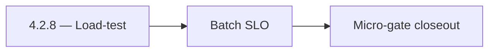

# 4.2.8 — Load-test

- **Era:** `4.x` Extension/SN maturity — hub [`versions.md`](../versions.md) · minors start at [`4.0 — Harbor`](4.0%20%E2%80%94%20Harbor.md)
- **Minor:** [4.2 — Harvest](./4.2 — Harvest.md)
- **Codename:** Load-test
- **Status:** planned

## Focus
Batch SLO

## Flowchart

## Micro-gate

| Track | Gate question | Answer / Evidence (fill at patch closeout) |
| --- | --- | --- |
| **Contract** | Extension/SN REST, GraphQL modules, CSP — `docs/backend/apis/` + endpoint matrices updated? | Document at patch closeout. |
| **Service** | SN scrape/save, Connectra upsert, jobs DAG, session refresh — smoke + idempotency? | Document smoke paths. |
| **Surface** | Extension popup, dashboard SN/campaign panels, operator flows changed? | Document UX delta or N/A. |
| **Frontend** | Which extension MV3 + dashboard routes/hooks for this patch? | SN scrape/save client surfaces; ingestion provenance display if any. Document at closeout. |
| **Data** | Provenance fields, audience tables, `messages.contacts[]` — migrations + lineage? | Document lineage or N/A. |
| **Ops** | `logs.api` events, S3 evidence, runbooks, rate/retry — delta recorded? | Document ops delta or N/A. |

## Tasks
### Contract

- 📌 Planned: Lock **request/response** for `save-profiles` and `scrape` (errors[], saved counts, provenance).  
- 📌 Planned: Close **P0 doc drift:** `scrape-html-with-fetch` vs implementation; README **scrape active** statement — SN analysis §11 queue.  
- 📌 Planned: Define **X-Request-ID** propagation target (may land in **4.2** design doc even if middleware follows in **6.x**).  
- 📌 Planned: **URL normalization** contract: SN sales URL vs standard `linkedin_url`, document PLACEHOLDER behaviour.

### Service

- 📌 Planned: **extraction.py** — DOM variant coverage; fallback when anonymized nodes move.  
- 📌 Planned: **SaveService** — dedup by normalized URL; chunk size / parallelism safe for Connectra timeouts.  
- 📌 Planned: **ConnectraClient** — adaptive timeout + retry budget aligned with batch size.  
- 📌 Planned: **Mapper fixes** — `data_quality_score`, `connection_degree`, `lead_id` / `search_id` provenance.

### Surface

- 📌 Planned: Extension / dashboard: **saved_count**, created/updated split, retry CTA — SN analysis UI map.  
- 📌 Planned: **SNIngestionPanel** — reflects Harvest errors without losing partial success state.

### Data

- 📌 Planned: Provenance: `source=sales_navigator`, `lead_id`, `search_id`, `data_quality_score`, `connection_degree` per era **4.x** SN breakdown.  
- 📌 Planned: DB lineage: Connectra row identity via **UUID5** recipe in SN analysis; align with [`docs/enrichment-dedup.md`](../enrichment-dedup.md).

### Ops

- 📌 Planned: **p95** save latency target for ~25-profile batches (SN analysis **4.x** ops).  
- 📌 Planned: CloudWatch / `logs.api` events: `sn.ingest.*` correlation — [`extension-telemetry.md`](extension-telemetry.md).  
- 📌 Planned: Load-smoke: single user large batch vs Connectra cold start.

## Service task slices
> Merged from era `4.x` extension/SN task packs (P0→`.0`–`.2`, P1→`.3`–`.6`, Ops→`.7`–`.9`).

### Salesnavigator
- P95 latency target: `save-profiles` for 25 profiles < 3s; for 100 profiles < 5s
- CloudWatch alarm: `save-profiles` Lambda timeout rate > 1%
- Lambda timeout tuning: current 60s sufficient for 1000 profiles; confirm under load
- Test: 1000-profile batch end-to-end in staging
- Deploy via SAM to staging + production
- Extension CSP check: confirm Lambda API domain is allowed in extension manifest
- [docs/frontend/salesnavigator-ui-bindings.md](../frontend/salesnavigator-ui-bindings.md)
- [docs/backend/database/salesnavigator_data_lineage.md](../backend/database/salesnavigator_data_lineage.md)
- [docs/backend/endpoints/salesnavigator_endpoint_era_matrix.json](../backend/endpoints/salesnavigator_endpoint_era_matrix.json)
- `docs/codebases/salesnavigator-codebase-analysis.md`
- `docs/backend/apis/SALESNAVIGATOR_ERA_TASK_PACKS.md`
- `docs/frontend/salesnavigator-ui-bindings.md`
- `docs/backend/database/salesnavigator_data_lineage.md`

### Connectra
- **Drift detection hooks:** align with Connectra queue item “ES–PG reconciliation job” (analysis gaps) — define minimal SN acceptance query set
- Preserve **filter_data** facet consistency when SN bulk jobs update company/employer fields
- Alerting: bulk-upsert error rate by **source=sales_navigator** / extension session correlation

### Jobs
- Add dashboards for sync lag p95/max, retry churn, and stuck processing age.
- Publish stuck-job runbook with replay/cancel steps by `ingestion_batch_id`.
- Add rollback playbook for extension ingestion regressions.

### Appointment360 (gateway)
- Add SN + extension mutation tests in Postman collection
- Write E2E test: extension captures LinkedIn profile → appears in /contacts table
- Add X-Extension-Token header validation middleware or GraphQL guard

## Evidence gate
Patch closeout includes contract diff, smoke output, data lineage delta, and ops note
