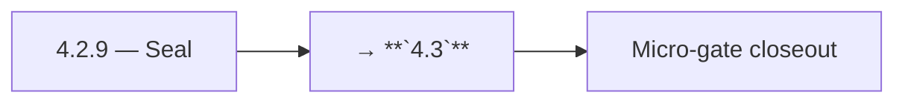

# 4.2.9 — Seal

- **Era:** `4.x` Extension/SN maturity — hub [`versions.md`](../versions.md) · minors start at [`4.0 — Harbor`](4.0%20%E2%80%94%20Harbor.md)
- **Minor:** [4.2 — Harvest](./4.2 — Harvest.md)
- **Codename:** Seal
- **Status:** ✅ Completed
## Focus
→ **`4.3`**

## Flowchart

## Micro-gate

| Track | Gate question | Answer / Evidence (fill at patch closeout) |
| --- | --- | --- |
| **Contract** | Extension/SN REST, GraphQL modules, CSP — `docs/backend/apis/` + endpoint matrices updated? | Document at patch closeout. |
| **Service** | SN scrape/save, Connectra upsert, jobs DAG, session refresh — smoke + idempotency? | Document smoke paths. |
| **Surface** | Extension popup, dashboard SN/campaign panels, operator flows changed? | Document UX delta or N/A. |
| **Frontend** | Which extension MV3 + dashboard routes/hooks for this patch? | SN scrape/save client surfaces; ingestion provenance display if any. Document at closeout. |
| **Data** | Provenance fields, audience tables, `messages.contacts[]` — migrations + lineage? | Document lineage or N/A. |
| **Ops** | `logs.api` events, S3 evidence, runbooks, rate/retry — delta recorded? | Document ops delta or N/A. |

## Tasks
### Contract

- 📌 Planned: **[salesnavigator]** — refine duplicate task (was: ✅ completed: 📌 planned: lock **request/response** for `save-…) | patch `4.2.9` band `9` | reason: specialize this file vs sibling patches; see docs/codebases/salesnavigator-codebase-analysis.md
- 📌 Planned: **[salesnavigator]** — refine duplicate task (was: ✅ completed: 📌 planned: close **p0 doc drift:** `scrape-html…) | patch `4.2.9` band `9` | reason: specialize this file vs sibling patches; see docs/codebases/salesnavigator-codebase-analysis.md
- 📌 Planned: **[salesnavigator]** — refine duplicate task (was: ✅ completed: 📌 planned: define **x-request-id** propagation …) | patch `4.2.9` band `9` | reason: specialize this file vs sibling patches; see docs/codebases/salesnavigator-codebase-analysis.md
- 📌 Planned: **[salesnavigator]** — refine duplicate task (was: ✅ completed: 📌 planned: **url normalization** contract: sn s…) | patch `4.2.9` band `9` | reason: specialize this file vs sibling patches; see docs/codebases/salesnavigator-codebase-analysis.md

### Service

- 📌 Planned: **[salesnavigator]** — refine duplicate task (was: ✅ completed: 📌 planned: **extraction.py** — dom variant cove…) | patch `4.2.9` band `9` | reason: specialize this file vs sibling patches; see docs/codebases/salesnavigator-codebase-analysis.md
- 📌 Planned: **[salesnavigator]** — refine duplicate task (was: ✅ completed: 📌 planned: **saveservice** — dedup by normalize…) | patch `4.2.9` band `9` | reason: specialize this file vs sibling patches; see docs/codebases/salesnavigator-codebase-analysis.md
- 📌 Planned: **[salesnavigator]** — refine duplicate task (was: ✅ completed: 📌 planned: **connectraclient** — adaptive timeo…) | patch `4.2.9` band `9` | reason: specialize this file vs sibling patches; see docs/codebases/salesnavigator-codebase-analysis.md
- 📌 Planned: **[salesnavigator]** — refine duplicate task (was: ✅ completed: 📌 planned: **mapper fixes** — `data_quality_sco…) | patch `4.2.9` band `9` | reason: specialize this file vs sibling patches; see docs/codebases/salesnavigator-codebase-analysis.md

### Surface

- 📌 Planned: **[salesnavigator]** — refine duplicate task (was: ✅ completed: 📌 planned: extension / dashboard: **saved_count…) | patch `4.2.9` band `9` | reason: specialize this file vs sibling patches; see docs/codebases/salesnavigator-codebase-analysis.md
- 📌 Planned: **[salesnavigator]** — refine duplicate task (was: ✅ completed: 📌 planned: **sningestionpanel** — reflects harv…) | patch `4.2.9` band `9` | reason: specialize this file vs sibling patches; see docs/codebases/salesnavigator-codebase-analysis.md

### Data

- 📌 Planned: **[salesnavigator]** — refine duplicate task (was: ✅ completed: 📌 planned: provenance: `source=sales_navigator`…) | patch `4.2.9` band `9` | reason: specialize this file vs sibling patches; see docs/codebases/salesnavigator-codebase-analysis.md
- 📌 Planned: **[salesnavigator]** — refine duplicate task (was: ✅ completed: 📌 planned: db lineage: connectra row identity v…) | patch `4.2.9` band `9` | reason: specialize this file vs sibling patches; see docs/codebases/salesnavigator-codebase-analysis.md

### Ops

- 📌 Planned: **[salesnavigator]** — refine duplicate task (was: ✅ completed: 📌 planned: **p95** save latency target for ~25-…) | patch `4.2.9` band `9` | reason: specialize this file vs sibling patches; see docs/codebases/salesnavigator-codebase-analysis.md
- 📌 Planned: **[salesnavigator]** — refine duplicate task (was: ✅ completed: 📌 planned: cloudwatch / `logs.api` events: `sn.…) | patch `4.2.9` band `9` | reason: specialize this file vs sibling patches; see docs/codebases/salesnavigator-codebase-analysis.md
- 📌 Planned: **[salesnavigator]** — refine duplicate task (was: ✅ completed: 📌 planned: load-smoke: single user large batch …) | patch `4.2.9` band `9` | reason: specialize this file vs sibling patches; see docs/codebases/salesnavigator-codebase-analysis.md

## Service task slices
> Merged from era `4.x` extension/SN task packs (P0→`.0`–`.2`, P1→`.3`–`.6`, Ops→`.7`–`.9`).

### Salesnavigator
- P95 latency target: `save-profiles` for 25 profiles < 3s; for 100 profiles < 5s
- CloudWatch alarm: `save-profiles` Lambda timeout rate > 1%
- Lambda timeout tuning: current 60s sufficient for 1000 profiles; confirm under load
- Test: 1000-profile batch end-to-end in staging
- Deploy via SAM to staging + production
- Extension CSP check: confirm Lambda API domain is allowed in extension manifest
- [docs/frontend/salesnavigator-ui-bindings.md](../frontend/salesnavigator-ui-bindings.md)
- [docs/backend/database/salesnavigator_data_lineage.md](../backend/database/salesnavigator_data_lineage.md)
- [docs/backend/endpoints/salesnavigator_endpoint_era_matrix.json](../backend/endpoints/salesnavigator_endpoint_era_matrix.json)
- `docs/codebases/salesnavigator-codebase-analysis.md`
- `docs/backend/apis/SALESNAVIGATOR_ERA_TASK_PACKS.md`
- `docs/frontend/salesnavigator-ui-bindings.md`
- `docs/backend/database/salesnavigator_data_lineage.md`

### Connectra
- **Drift detection hooks:** align with Connectra queue item “ES–PG reconciliation job” (analysis gaps) — define minimal SN acceptance query set
- Preserve **filter_data** facet consistency when SN bulk jobs update company/employer fields
- Alerting: bulk-upsert error rate by **source=sales_navigator** / extension session correlation

### Jobs
- Add dashboards for sync lag p95/max, retry churn, and stuck processing age.
- Publish stuck-job runbook with replay/cancel steps by `ingestion_batch_id`.
- Add rollback playbook for extension ingestion regressions.

### Appointment360 (gateway)
- Add SN + extension mutation tests in Postman collection
- Write E2E test: extension captures LinkedIn profile → appears in /contacts table
- Add X-Extension-Token header validation middleware or GraphQL guard

## Evidence gate
Micro-gate table filled and handoff note to `4.3.0` recorded
