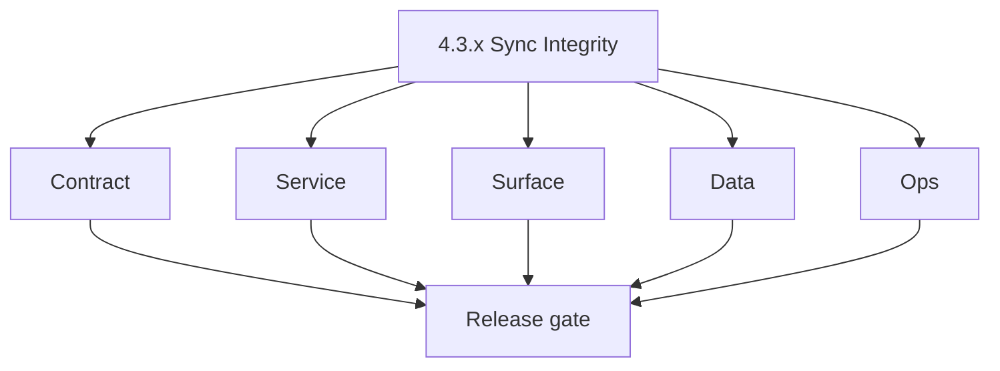
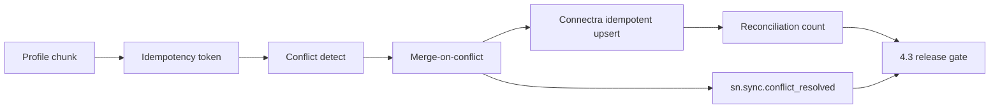

# Version 4.3 — Sync Integrity

- **Status:** ✅ Completed
- **Codename:** Sync Integrity  
- **Era:** 4.x (Extension and Sales Navigator maturity)  
- **Roadmap:** Stage **4.3** — sync integrity and conflict handling ([`docs/versions.md`](../versions.md) **`4.3.0`**)  
- **Summary:** **Deterministic** multi-write path: profile **chunk** → **idempotency token** → **conflict detect** → **merge-on-conflict** → Connectra **idempotent upsert** → **reconciliation** counts vs expected batch size.  
- **Patch closure:** Every codenamed patch file includes **Micro-gate** + **Service task slices**. Era hub: [`versions.md`](../versions.md).

## Scope

- **Target:** `4.3.x` patches.  
- **In scope:** Dedup keys, replay, ES/PG parity checks, operator visibility into conflicts.  
- **Out of scope:** New SN extractors (**`4.2`**); telemetry dashboards (**`4.4`**).  
- **Owners:** Extension + Data Engineering.

## Flowchart

### Runtime focus (unique to this minor)

## Task tracks

### Contract

- ✅ Completed: 📌 Planned: Idempotency + merge rules documented — [`extension-sync-integrity.md`](extension-sync-integrity.md).
- ✅ Completed: 📌 Planned: Connectra error codes for conflict vs validation — **Service task slices** in `4.3.P` patch files (scope from former `connectra-extension-sn-task-pack.md`).

### Service

- ✅ Completed: 📌 Planned: Replay same batch → stable row count.
- ✅ Completed: 📌 Planned: No duplicate identities for same LinkedIn URL when URL is valid.

### Surface

- ✅ Completed: 📌 Planned: Dashboard or admin: conflict summary (may pair with **4.6** tables).

### Data

- ✅ Completed: 📌 Planned: PG + ES document fields for merge outcome and timestamp.
- ✅ Completed: 📌 Planned: Drift detection hooks (deep link **3.7** patterns if reuse).

### Ops

- ✅ Completed: 📌 Planned: KPI: **sync conflict auto-resolution success rate** (roadmap **4.3**).
- ✅ Completed: 📌 Planned: Runbook: forced manual merge.

## Task Breakdown

| Slice | Outcome |
| --- | --- |
| Connectra | Idempotent bulk |
| Jobs | Batch replay safety |
| logs.api | Conflict events |

## Immediate next execution queue

- 📌 Planned: Property-based test: random reorder chunk → same final state.  
- 📌 Planned: Reconciliation query saved as evidence.

## Cross-service ownership

| Service | Focus |
| --- | --- |
| `contact360.io/sync` | Upsert + merge |
| `contact360.io/jobs` | Batch orchestration |
| `lambda/logs.api` | `sn.sync.conflict_resolved` |

## References

- [`docs/roadmap.md`](../roadmap.md) — Stage **4.3**  
- **Service task slices** in `4.3.P` patch files (scope from former `jobs-extension-sn-task-pack.md`)

## Backend API and Endpoint Scope

- Connectra bulk upsert; optional reconciliation job endpoints.

## Database and Data Lineage Scope

- Authoritative PG + ES; merge metadata fields.

## Frontend UX Surface Scope

- Sync history / conflict indicators (**4.6** may own most UI).

## UI Elements Checklist

- 📌 Planned: Conflict badge or filter chip (with **4.6**)

## Flow / Graph Delta for This Minor

- **Delta:** Adds **idempotency + merge + reconciliation** loop.

## Audit and Compliance Notes

- Conflict resolution may overwrite PII — audit fields required.

## Patch ladder (`4.3.0` – `4.3.9`)

### Micro-gate reference (apply at every `4.N.P`)

| Track | Gate question (must answer Yes or document waiver) |
| --- | --- |
| **Contract** | Extension/SN REST, GraphQL modules, CSP — `docs/backend/apis/` + endpoint matrices updated? |
| **Service** | SN scrape/save, Connectra upsert, jobs DAG, session refresh — smoke + idempotency documented? |
| **Surface** | Extension popup, dashboard SN/campaign panels, operator flows changed? |
| **Frontend** | Extension MV3 + dashboard routes/hooks (see minor scope / `extension-auth.md`, `extension-telemetry.md`)? |
| **Data** | Provenance, audience tables, `messages.contacts[]` — migrations + lineage docs? |
| **Ops** | `logs.api` events, S3 evidence, runbooks, rate/retry — delta recorded? |

**Patch intent bands:** Codenames per minor — see **Patch ladder** table in this file (`.0` charter … `.9` seal/handoff).

Theme: **Weave** — codenames in per-patch `4.3.P — *.md` files.

| Patch | Codename | Focus |
| --- | --- | --- |
| `4.3.0` | Chunk | Charter |
| `4.3.1` | Token | Idempotency |
| `4.3.2` | Detect | Conflict find |
| `4.3.3` | Merge | Rules engine |
| `4.3.4` | Resolve | Policy edge |
| `4.3.5` | Apply | Persist |
| `4.3.6` | Confirm | Row proof |
| `4.3.7` | Report | Reconciliation |
| `4.3.8` | Archive | Old versions |
| `4.3.9` | Gate | Freeze → **`4.4`** |

## Release Gate and Evidence

- 📌 Planned: Replay tests archived  
- 📌 Planned: Conflict KPI baseline  
- 📌 Planned: `sn.sync.conflict_resolved` schema validated

## Patches

| Patch | Codename | Doc |
| --- | --- | --- |
| `4.3.0` | Chunk | [`4.3.0` — Chunk](4.3.0 — Chunk.md) |
| `4.3.1` | Token | [`4.3.1` — Token](4.3.1 — Token.md) |
| `4.3.2` | Detect | [`4.3.2` — Detect](4.3.2 — Detect.md) |
| `4.3.3` | Merge | [`4.3.3` — Merge](4.3.3 — Merge.md) |
| `4.3.4` | Resolve | [`4.3.4` — Resolve](4.3.4 — Resolve.md) |
| `4.3.5` | Apply | [`4.3.5` — Apply](4.3.5 — Apply.md) |
| `4.3.6` | Confirm | [`4.3.6` — Confirm](4.3.6 — Confirm.md) |
| `4.3.7` | Report | [`4.3.7` — Report](4.3.7 — Report.md) |
| `4.3.8` | Archive | [`4.3.8` — Archive](4.3.8 — Archive.md) |
| `4.3.9` | Gate | [`4.3.9` — Gate](4.3.9 — Gate.md) |
