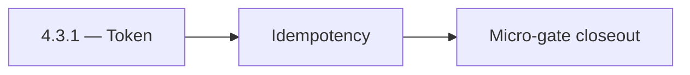

# 4.3.1 — Token

- **Era:** `4.x` Extension/SN maturity — hub [`versions.md`](../versions.md) · minors start at [`4.0 — Harbor`](4.0%20%E2%80%94%20Harbor.md)
- **Minor:** [4.3 — Sync Integrity](./4.3 — Sync Integrity.md)
- **Codename:** Token
- **Status:** planned

## Focus
Idempotency

## Flowchart

## Micro-gate

| Track | Gate question | Answer / Evidence (fill at patch closeout) |
| --- | --- | --- |
| **Contract** | Extension/SN REST, GraphQL modules, CSP — `docs/backend/apis/` + endpoint matrices updated? | Document at patch closeout. |
| **Service** | SN scrape/save, Connectra upsert, jobs DAG, session refresh — smoke + idempotency? | Document smoke paths. |
| **Surface** | Extension popup, dashboard SN/campaign panels, operator flows changed? | Document UX delta or N/A. |
| **Frontend** | Which extension MV3 + dashboard routes/hooks for this patch? | Sync/conflict narratives in extension or dashboard. Document at closeout. |
| **Data** | Provenance fields, audience tables, `messages.contacts[]` — migrations + lineage? | Document lineage or N/A. |
| **Ops** | `logs.api` events, S3 evidence, runbooks, rate/retry — delta recorded? | Document ops delta or N/A. |

## Tasks
### Contract

- 📌 Planned: Idempotency + merge rules documented — [`extension-sync-integrity.md`](extension-sync-integrity.md).  
- 📌 Planned: Connectra error codes for conflict vs validation — **Service task slices** below (includes former `connectra-extension-sn-task-pack.md` scope).

### Service

- 📌 Planned: Replay same batch → stable row count.  
- 📌 Planned: No duplicate identities for same LinkedIn URL when URL is valid.

### Surface

- 📌 Planned: Dashboard or admin: conflict summary (may pair with **4.6** tables).

### Data

- 📌 Planned: PG + ES document fields for merge outcome and timestamp.  
- 📌 Planned: Drift detection hooks (deep link **3.7** patterns if reuse).

### Ops

- 📌 Planned: KPI: **sync conflict auto-resolution success rate** (roadmap **4.3**).  
- 📌 Planned: Runbook: forced manual merge.

## Service task slices
> Merged from era `4.x` extension/SN task packs (P0→`.0`–`.2`, P1→`.3`–`.6`, Ops→`.7`–`.9`).

### Connectra
- Lock **SN → Connectra** contact/company payload fields: provenance (source, lead_id, search_id, data_quality_score, connection_degree where applicable)
- Align UUID5 rules with [docs/enrichment-dedup.md](../enrichment-dedup.md) and SN mapper (salesnavigator analysis — linkedin_url + email recipe)
- Cross-link REST contracts in docs/backend/apis/ + endpoint matrix JSON when batch-upsert schema changes
- Guarantee **idempotent batch-upsert** for SN: same deterministic UUID → safe retry from SaveService / ConnectraClient
- Verify **parallel write fan-out** (PG + ES + filters_data) preserves SN provenance fields on update paths
- Operator visibility: **conflict resolution** summaries (created vs updated vs error) fed back through Appointment360 / dashboard SN panel
- **PG + ES parity** for SN rows: mapping updates must land in both stores in one logical upsert
- KPI: **sync conflict auto-resolution success rate** (roadmap **4.3**) — dedup + upsert success without manual fix
- Runbook: **ES–PG drift** triage for SN ingestion windows (sample VQL vs PG uuid lookups, reindex procedure)
- Release gate: **replay test** evidence — same SN CSV/batch twice → stable UUID counts

### Jobs
- Define required metadata: `source`, `workspace_id`, `channel`, `ingestion_batch_id`, `idempotency_token`, `trace_id`.
- Define sync batch contract for extension submissions: payload limits, chunk boundaries, retry headers, completion callbacks.
- Enforce source tagging and dedupe-safe scheduling for replayed batches.
- Harden retries with exponential backoff + jitter and capped attempts.
- Expose sync lag metrics from `save-profiles` success to job completion.
- Persist idempotency evidence fields (`idempotency_token`, content hash, ingestion batch id).
- Link API traces to job records and logs.api events.

### logs.api
- Freeze `4.x` event names and required fields.
- Ensure canonical event set includes: `extension.session.token_refreshed`, `sn.ingest.started`, `sn.ingest.completed`, `sn.ingest.failed`, `sn.sync.conflict_resolved`.
- Require provenance fields: `workspace_id`, `ingestion_batch_id`, `source`, optional `extension_version`, `trace_id`.
- Update endpoint matrix on write/auth changes: [`docs/backend/endpoints/logsapi_endpoint_era_matrix.json`](../backend/endpoints/logsapi_endpoint_era_matrix.json).
- Validate burst ingestion behavior after large SN harvests.
- Verify auth and error envelope for event writers.
- Correlate `trace_id` + `ingestion_batch_id` + lambda request id across pipeline.
- Define S3 CSV partition/prefix strategy for extension/SN event volume.
- Document retention and query-window expectations for operations.

### Salesnavigator
- Lock final API contract for `POST /v1/save-profiles` and `POST /v1/scrape`
- Fix documentation drift: remove `POST /v1/scrape-html-with-fetch` from `docs/api.md` (not implemented) OR implement it
- Clarify `POST /v1/scrape` active status in `README.md` (README incorrectly states scraping is removed)
- Define error response structure: `{success: false, errors: [{profile_url, message}]}`
- Define partial-success semantics: `saved_count > 0` with non-empty `errors[]` is valid
- Lock `ScrapeHtmlRequest` max HTML size (10 MB) as tested and documented
- Freeze `SaveProfilesRequest` max profiles (1000) with rejection behavior documented
- Harden HTML extraction across multiple SN DOM variants:
- Standard search results page
- Account map view
- People tab on company page
- Optimize extraction for 25-profile search result pages (primary extension use case)
- Validate deduplication correctness: same `profile_url` → single record, best-completeness kept
- Fix `convert_sales_nav_url_to_linkedin()` coverage — document when PLACEHOLDER is returned
- Implement extraction fallback for missing fields (graceful null, not error)
- Add `X-Request-ID` correlation header to all responses
- Test chunk boundary behavior: exactly 500, 501, 1000 profiles
- Confirm provenance fields written per profile: `lead_id`, `search_id`, `data_quality_score`, `connection_degree`, `recently_hired`, `is_premium`
- Add `source="sales_navigator"` tag on all contacts from this service
- Validate `data_quality_score` computation accuracy (70% required + 30% optional weighted)

## Evidence gate
Patch closeout includes contract diff, smoke output, data lineage delta, and ops note
