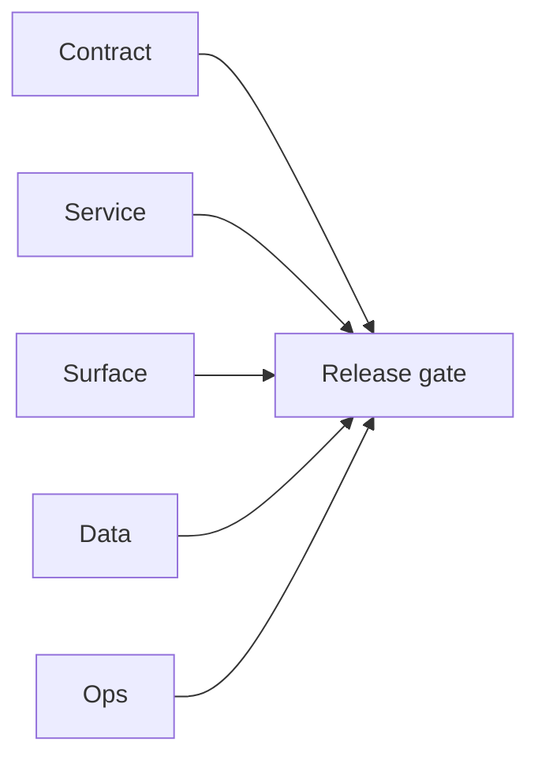

# 4.3.100 - Docker extension API smoke evidence

## Focus

Docker-based endpoint verification for `EC2/extension.server` contract behavior.

## Micro-gate

- `GET /health` => `200` in `0.018526s`.
- `POST /v1/scrape` => `501` in `0.010210s` with expected "scrape in extension" behavior.
- `POST /v1/save-profiles` with malformed payload path returns parse `400`.
- `POST /v1/save-profiles` with valid JSON (`{"profiles":[]}`) returns `200` with `{"accepted":0}`.

## Tasks

### Contract

- [ ] Document both malformed-json and valid-empty payload behavior for `/v1/save-profiles`.

### Service

- [ ] Enforce stable auth-first response path for missing API key independent of payload parse outcome.

### Surface

- [ ] Align extension popup copy for 400 parse errors vs 401/403 auth errors.

### Data

- [ ] Add docker fixture payloads (`empty`, `5-valid`, `>500`, `malformed`) for deterministic smoke runs.

### Ops

- [ ] Add contract assertions for `501 /v1/scrape` and `200 accepted:0` on empty valid profile list.

## Evidence gate

- `tmp/evidence/docker-go/ext-health.txt`
- `tmp/evidence/docker-go/ext-scrape.txt`
- `tmp/evidence/docker-go/ext-save-profiles.txt`
- `tmp/evidence/docker-go/ext-save-profiles-validjson-ps.txt`

## Flowchart

Five-track delivery (contract / service / surface / data / ops) for this doc:

**Master hub:** [`docs/docs/flowchart.md`](../docs/flowchart.md) — cross-system diagrams and era strip (`0.x` → `10.x`).
