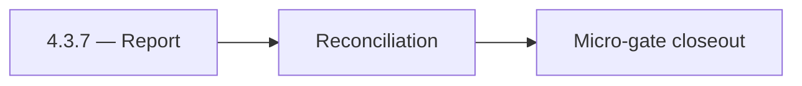

# 4.3.7 — Report

- **Era:** `4.x` Extension/SN maturity — hub [`versions.md`](../versions.md) · minors start at [`4.0 — Harbor`](4.0%20%E2%80%94%20Harbor.md)
- **Minor:** [4.3 — Sync Integrity](./4.3 — Sync Integrity.md)
- **Codename:** Report
- **Status:** ✅ Completed
## Focus
Reconciliation

## Flowchart

## Micro-gate

| Track | Gate question | Answer / Evidence (fill at patch closeout) |
| --- | --- | --- |
| **Contract** | Extension/SN REST, GraphQL modules, CSP — `docs/backend/apis/` + endpoint matrices updated? | Document at patch closeout. |
| **Service** | SN scrape/save, Connectra upsert, jobs DAG, session refresh — smoke + idempotency? | Document smoke paths. |
| **Surface** | Extension popup, dashboard SN/campaign panels, operator flows changed? | Document UX delta or N/A. |
| **Frontend** | Which extension MV3 + dashboard routes/hooks for this patch? | Sync/conflict narratives in extension or dashboard. Document at closeout. |
| **Data** | Provenance fields, audience tables, `messages.contacts[]` — migrations + lineage? | Document lineage or N/A. |
| **Ops** | `logs.api` events, S3 evidence, runbooks, rate/retry — delta recorded? | Document ops delta or N/A. |

## Tasks
### Contract

- ✅ Completed: 📌 Planned: Idempotency + merge rules documented — [`extension-sync-integrity.md`](extension-sync-integrity.md).
- ✅ Completed: 📌 Planned: Connectra error codes for conflict vs validation — **Service task slices** below (includes former `connectra-extension-sn-task-pack.md` scope).

### Service

- ✅ Completed: 📌 Planned: Replay same batch → stable row count.
- ✅ Completed: 📌 Planned: No duplicate identities for same LinkedIn URL when URL is valid.

### Surface

- ✅ Completed: 📌 Planned: Dashboard or admin: conflict summary (may pair with **4.6** tables).

### Data

- ✅ Completed: 📌 Planned: PG + ES document fields for merge outcome and timestamp.
- ✅ Completed: 📌 Planned: Drift detection hooks (deep link **3.7** patterns if reuse).

### Ops

- ✅ Completed: 📌 Planned: KPI: **sync conflict auto-resolution success rate** (roadmap **4.3**).
- ✅ Completed: 📌 Planned: Runbook: forced manual merge.

## Service task slices
> Merged from era `4.x` extension/SN task packs (P0→`.0`–`.2`, P1→`.3`–`.6`, Ops→`.7`–`.9`).

### Connectra
- **Drift detection hooks:** align with Connectra queue item “ES–PG reconciliation job” (analysis gaps) — define minimal SN acceptance query set
- Preserve **filter_data** facet consistency when SN bulk jobs update company/employer fields
- Alerting: bulk-upsert error rate by **source=sales_navigator** / extension session correlation

### Jobs
- Add dashboards for sync lag p95/max, retry churn, and stuck processing age.
- Publish stuck-job runbook with replay/cancel steps by `ingestion_batch_id`.
- Add rollback playbook for extension ingestion regressions.

### logs.api
- Add dashboards and alerts for failed ingest, token-refresh failures, and conflict spikes.
- Publish replay/rollback runbook for poison payloads and schema breaks.
- Capture load-test evidence for peak extension cohort traffic.

### Salesnavigator
- P95 latency target: `save-profiles` for 25 profiles < 3s; for 100 profiles < 5s
- CloudWatch alarm: `save-profiles` Lambda timeout rate > 1%
- Lambda timeout tuning: current 60s sufficient for 1000 profiles; confirm under load
- Test: 1000-profile batch end-to-end in staging
- Deploy via SAM to staging + production
- Extension CSP check: confirm Lambda API domain is allowed in extension manifest
- [docs/frontend/salesnavigator-ui-bindings.md](../frontend/salesnavigator-ui-bindings.md)
- [docs/backend/database/salesnavigator_data_lineage.md](../backend/database/salesnavigator_data_lineage.md)
- [docs/backend/endpoints/salesnavigator_endpoint_era_matrix.json](../backend/endpoints/salesnavigator_endpoint_era_matrix.json)
- `docs/codebases/salesnavigator-codebase-analysis.md`
- `docs/backend/apis/SALESNAVIGATOR_ERA_TASK_PACKS.md`
- `docs/frontend/salesnavigator-ui-bindings.md`
- `docs/backend/database/salesnavigator_data_lineage.md`

## Evidence gate
Patch closeout includes contract diff, smoke output, data lineage delta, and ops note
