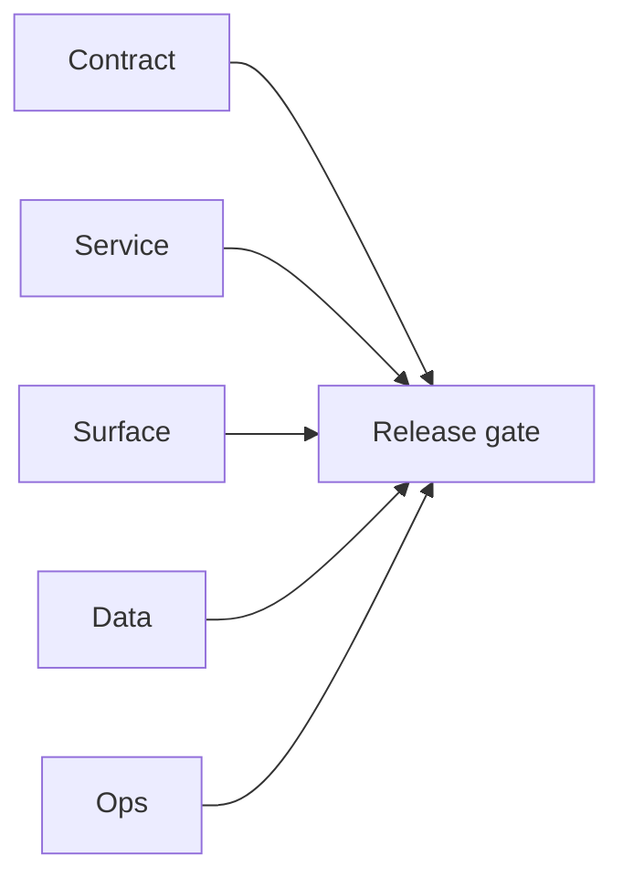

## Focus

Local execution evidence for extension sync surfaces (`EC2/extension.server`) in era `4.3`.

## Micro-gate

- `POST /v1/scrape` => `501` in `0.079157s` with expected message ("scrape handled in extension").
- `POST /v1/save-profiles` no key / malformed request currently returns parse-path `400` in local smoke (`invalid character 'p' ...`), which hides auth semantics.

## Tasks

### Contract

- [ ] Confirm and document strict request schema for `/v1/save-profiles`.
- [ ] Ensure missing key and invalid JSON are differentiated with consistent error envelopes.

### Service

- [ ] Add explicit auth-first validation path so no-key requests return stable auth error regardless of body shape.

### Surface

- [ ] Keep extension popup error handling aligned with backend parse/auth responses.

### Data

- [ ] Validate dedup + save-profiles path with a valid 5-profile payload in next smoke pass.

### Ops

- [ ] Add automated smoke request fixtures for valid, empty, over-limit, and malformed payload variants.

## Evidence gate

- `tmp/evidence/extension/scrape.json`
- `tmp/evidence/extension/save_profiles_no_key.json`

## Flowchart

Five-track delivery (contract / service / surface / data / ops) for this doc:

**Master hub:** [`docs/docs/flowchart.md`](../docs/flowchart.md) — cross-system diagrams and era strip (`0.x` → `10.x`).
