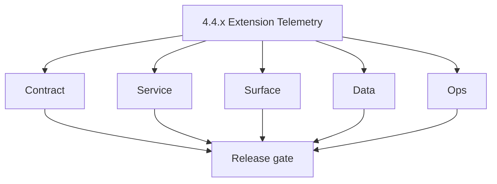
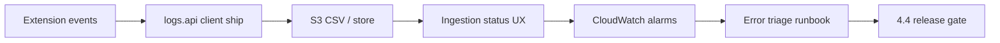

# Version 4.4 — Extension Telemetry

- **Status:** ✅ Completed
- **Codename:** Extension Telemetry
- **Era:** 4.x (Extension and Sales Navigator maturity)
- **Roadmap:** Stage **4.4** — extension telemetry and reliability ([`docs/versions.md`](../versions.md) **`4.4.0`**)
- **Summary:** **Production observability**: extension/browser events → **logs.api** shipping → **ingestion status** UX signals → **CloudWatch** (or equivalent) alarms → fast **error triage** runbooks.
- **Patch closure:** Every codenamed patch file includes **Micro-gate** + **Service task slices**. Era hub: [`versions.md`](../versions.md).

## Scope

- **Target:** `4.4.x` patches.
- **In scope:** Event schema, sampling, PII redaction, correlation IDs, dashboards.
- **Out of scope:** Functional SN mapper fixes (**`4.2`**); merge logic (**`4.3`**).
- **Owners:** Extension Engineering + Platform.

## Flowchart

### Runtime focus (unique to this minor)

## Task tracks

### Contract

- ✅ Completed: 📌 Planned: Freeze **`4.x`** extension/SN event types — **Service task slices** in `4.4.P` patch files (scope from former `logsapi-extension-salesnav-task-pack.md`), [`extension-telemetry.md`](extension-telemetry.md).

- 📌 Planned: **[salesnavigator]** — refine duplicate task (was: 📌 planned: **[architecture]** — product **graphql** remains …) | patch `4.4.0` band `0` | reason: specialize this file vs sibling patches; see docs/codebases/salesnavigator-codebase-analysis.md
### Service

- 📌 Planned: **[salesnavigator]** — refine duplicate task (was: 📌 planned: **[salesnavigator]** — refine duplicate task (was…) | patch `4.4.0` band `0` | reason: specialize this file vs sibling patches; see docs/codebases/salesnavigator-codebase-analysis.md
- 📌 Planned: **[salesnavigator]** — refine duplicate task (was: 📌 planned: **[salesnavigator]** — refine duplicate task (was…) | patch `4.4.0` band `0` | reason: specialize this file vs sibling patches; see docs/codebases/salesnavigator-codebase-analysis.md

- 📌 Planned: **[salesnavigator]** — refine duplicate task (was: 📌 planned: **[architecture]** — **go/gin satellites** in sco…) | patch `4.4.0` band `0` | reason: specialize this file vs sibling patches; see docs/codebases/salesnavigator-codebase-analysis.md
### Surface

- 📌 Planned: **[salesnavigator]** — refine duplicate task (was: 📌 planned: **[salesnavigator]** — refine duplicate task (was…) | patch `4.4.0` band `0` | reason: specialize this file vs sibling patches; see docs/codebases/salesnavigator-codebase-analysis.md

- 📌 Planned: **[salesnavigator]** — refine duplicate task (was: 📌 planned: **[architecture]** — **next.js** customer surface…) | patch `4.4.0` band `0` | reason: specialize this file vs sibling patches; see docs/codebases/salesnavigator-codebase-analysis.md
- 📌 Planned: **[salesnavigator]** — refine duplicate task (was: 📌 planned: **[architecture]** — **chrome extension**: graphq…) | patch `4.4.0` band `0` | reason: specialize this file vs sibling patches; see docs/codebases/salesnavigator-codebase-analysis.md
### Data

- 📌 Planned: **[salesnavigator]** — refine duplicate task (was: 📌 planned: **[salesnavigator]** — refine duplicate task (was…) | patch `4.4.0` band `0` | reason: specialize this file vs sibling patches; see docs/codebases/salesnavigator-codebase-analysis.md
- 📌 Planned: **[salesnavigator]** — refine duplicate task (was: 📌 planned: **[salesnavigator]** — refine duplicate task (was…) | patch `4.4.0` band `0` | reason: specialize this file vs sibling patches; see docs/codebases/salesnavigator-codebase-analysis.md

- 📌 Planned: **[salesnavigator]** — refine duplicate task (was: 📌 planned: **[architecture]** — **postgresql-first** per `do…) | patch `4.4.0` band `0` | reason: specialize this file vs sibling patches; see docs/codebases/salesnavigator-codebase-analysis.md
### Ops

- 📌 Planned: **[salesnavigator]** — refine duplicate task (was: 📌 planned: **[salesnavigator]** — refine duplicate task (was…) | patch `4.4.0` band `0` | reason: specialize this file vs sibling patches; see docs/codebases/salesnavigator-codebase-analysis.md
- 📌 Planned: **[salesnavigator]** — refine duplicate task (was: 📌 planned: **[salesnavigator]** — refine duplicate task (was…) | patch `4.4.0` band `0` | reason: specialize this file vs sibling patches; see docs/codebases/salesnavigator-codebase-analysis.md

- 📌 Planned: **[salesnavigator]** — refine duplicate task (was: 📌 planned: **[architecture]** — **observability**: correlate…) | patch `4.4.0` band `0` | reason: specialize this file vs sibling patches; see docs/codebases/salesnavigator-codebase-analysis.md
## Task Breakdown

| Slice | Outcome |
| --- | --- |
| logs.api | Schema + scale |
| Extension | Reliable emitter |
| App | Status UX |

## Immediate next execution queue

- 📌 Planned: Load test event flood; verify no client crash.
- 📌 Planned: Dashboard panel mock + API aggregate.

## Cross-service ownership

| Service | Focus |
| --- | --- |
| `lambda/logs.api` | Ingest + query |
| `extension/contact360` | Emit |
| `contact360.io/app` | Display |

## References

- [`docs/roadmap.md`](../roadmap.md) — Stage **4.4**
- [`docs/backend/endpoints/logsapi_endpoint_era_matrix.json`](../backend/endpoints/logsapi_endpoint_era_matrix.json) (when updated)

## Backend API and Endpoint Scope

- logs.api write/search endpoints for **`4.x`** fields.

## Database and Data Lineage Scope

- S3 CSV lineage for logs; optional aggregate tables.

## Frontend UX Surface Scope

- Ingestion status component(s); error detail drawer.

## UI Elements Checklist

- 📌 Planned: Status badge
- 📌 Planned: “View details” → last errors

## Flow / Graph Delta for This Minor

- **Delta:** Adds **close-loop telemetry** from browser to ops.

## Audit and Compliance Notes

- No raw HTML in logs; redact employer/title if policy requires.

## Patch ladder (`4.4.0` – `4.4.9`)

### Micro-gate reference (apply at every `4.N.P`)

| Track | Gate question (must answer Yes or document waiver) |
| --- | --- |
| **Contract** | Extension/SN REST, GraphQL modules, CSP — `docs/backend/apis/` + endpoint matrices updated? |
| **Service** | SN scrape/save, Connectra upsert, jobs DAG, session refresh — smoke + idempotency documented? |
| **Surface** | Extension popup, dashboard SN/campaign panels, operator flows changed? |
| **Frontend** | Extension MV3 + dashboard routes/hooks (see minor scope / `extension-auth.md`, `extension-telemetry.md`)? |
| **Data** | Provenance, audience tables, `messages.contacts[]` — migrations + lineage docs? |
| **Ops** | `logs.api` events, S3 evidence, runbooks, rate/retry — delta recorded? |
| **Architecture** | Go/Gin satellites only via Python GraphQL gateway (`contact360.io/api`); Next.js `NEXT_PUBLIC_GRAPHQL_URL`; Postgres-first / Redis exit per `docs/docs/data-stores-postgres.md`. |

**Patch intent bands:** Codenames per minor — see **Patch ladder** table in this file (`.0` charter … `.9` seal/handoff).

Theme: **Trace** — codenames in per-patch `4.4.P — *.md` files.

| Patch | Codename | Focus |
| --- | --- | --- |
| `4.4.0` | Emit | Charter |
| `4.4.1` | Ship | Client batch |
| `4.4.2` | Route | log routing |
| `4.4.3` | Ingest | API validate |
| `4.4.4` | Alert | CW alarms |
| `4.4.5` | Triage | Runbook |
| `4.4.6` | Replay | Debug replay |
| `4.4.7` | Report | Weekly digest |
| `4.4.8` | Calibrate | Sampling |
| `4.4.9` | Freeze | Handoff → **`4.5`** |

## Release Gate and Evidence

- 📌 Planned: Telemetry KPI baseline (triage time) captured
- 📌 Planned: `extension.session.*` / `sn.ingest.*` events validated in staging
- 📌 Planned: Alarm playbooks linked from [`extension-telemetry.md`](extension-telemetry.md)
- 📌 Planned: Roadmap **4.4** definition of done checked

## Patches

| Patch | Codename | Doc |
| --- | --- | --- |
| `4.4.0` | Emit | [`4.4.0` — Emit](4.4.0 — Emit.md) |
| `4.4.1` | Ship | [`4.4.1` — Ship](4.4.1 — Ship.md) |
| `4.4.2` | Route | [`4.4.2` — Route](4.4.2 — Route.md) |
| `4.4.3` | Ingest | [`4.4.3` — Ingest](4.4.3 — Ingest.md) |
| `4.4.4` | Alert | [`4.4.4` — Alert](4.4.4 — Alert.md) |
| `4.4.5` | Triage | [`4.4.5` — Triage](4.4.5 — Triage.md) |
| `4.4.6` | Replay | [`4.4.6` — Replay](4.4.6 — Replay.md) |
| `4.4.7` | Report | [`4.4.7` — Report](4.4.7 — Report.md) |
| `4.4.8` | Calibrate | [`4.4.8` — Calibrate](4.4.8 — Calibrate.md) |
| `4.4.9` | Freeze | [`4.4.9` — Freeze](4.4.9 — Freeze.md) |
