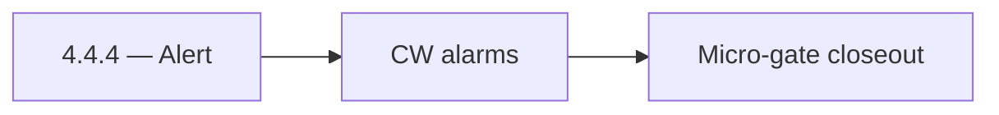

# 4.4.4 — Alert

- **Era:** `4.x` Extension/SN maturity — hub [`versions.md`](../versions.md) · minors start at [`4.0 — Harbor`](4.0%20%E2%80%94%20Harbor.md)
- **Minor:** [4.4 — Extension Telemetry](./4.4 — Extension Telemetry.md)
- **Codename:** Alert
- **Status:** ✅ Completed
## Focus
CW alarms

## Flowchart

## Micro-gate

| Track | Gate question | Answer / Evidence (fill at patch closeout) |
| --- | --- | --- |
| **Contract** | Extension/SN REST, GraphQL modules, CSP — `docs/backend/apis/` + endpoint matrices updated? | Document at patch closeout. |
| **Service** | SN scrape/save, Connectra upsert, jobs DAG, session refresh — smoke + idempotency? | Document smoke paths. |
| **Surface** | Extension popup, dashboard SN/campaign panels, operator flows changed? | Document UX delta or N/A. |
| **Frontend** | Which extension MV3 + dashboard routes/hooks for this patch? | `extension-telemetry.md` / operator dashboards. Document at closeout. |
| **Data** | Provenance fields, audience tables, `messages.contacts[]` — migrations + lineage? | Document lineage or N/A. |
| **Ops** | `logs.api` events, S3 evidence, runbooks, rate/retry — delta recorded? | Document ops delta or N/A. |

## Tasks
### Contract

- 📌 Planned: **[salesnavigator]** — refine duplicate task (was: ✅ completed: 📌 planned: freeze **`4.x`** extension/sn event …) | patch `4.4.4` band `4` | reason: specialize this file vs sibling patches; see docs/codebases/salesnavigator-codebase-analysis.md

### Service

- 📌 Planned: **[salesnavigator]** — refine duplicate task (was: ✅ completed: 📌 planned: batching + backoff from extension; 4…) | patch `4.4.4` band `4` | reason: specialize this file vs sibling patches; see docs/codebases/salesnavigator-codebase-analysis.md
- 📌 Planned: **[salesnavigator]** — refine duplicate task (was: ✅ completed: 📌 planned: server-side validation rejects malfo…) | patch `4.4.4` band `4` | reason: specialize this file vs sibling patches; see docs/codebases/salesnavigator-codebase-analysis.md

### Surface

- 📌 Planned: **[salesnavigator]** — refine duplicate task (was: ✅ completed: 📌 planned: dashboard shows **last ingest outcom…) | patch `4.4.4` band `4` | reason: specialize this file vs sibling patches; see docs/codebases/salesnavigator-codebase-analysis.md

### Data

- 📌 Planned: **[salesnavigator]** — refine duplicate task (was: ✅ completed: 📌 planned: retention and partition for burst tr…) | patch `4.4.4` band `4` | reason: specialize this file vs sibling patches; see docs/codebases/salesnavigator-codebase-analysis.md
- 📌 Planned: **[salesnavigator]** — refine duplicate task (was: ✅ completed: 📌 planned: correlation: `trace_id`, `ingestion_…) | patch `4.4.4` band `4` | reason: specialize this file vs sibling patches; see docs/codebases/salesnavigator-codebase-analysis.md

### Ops

- 📌 Planned: **[salesnavigator]** — refine duplicate task (was: ✅ completed: 📌 planned: kpi: **error triage time** (roadmap …) | patch `4.4.4` band `4` | reason: specialize this file vs sibling patches; see docs/codebases/salesnavigator-codebase-analysis.md
- 📌 Planned: **[salesnavigator]** — refine duplicate task (was: ✅ completed: 📌 planned: pager playbook: sn ingest failure st…) | patch `4.4.4` band `4` | reason: specialize this file vs sibling patches; see docs/codebases/salesnavigator-codebase-analysis.md

## Service task slices
> Merged from era `4.x` extension/SN task packs (P0→`.0`–`.2`, P1→`.3`–`.6`, Ops→`.7`–`.9`).

### logs.api
- Document dashboard ingestion status surfaces and source filters.
- Ensure empty/error states map to logs-derived aggregates.
- Define S3 CSV partition/prefix strategy for extension/SN event volume.
- Document retention and query-window expectations for operations.
- Confirm lineage in [`docs/backend/database/logsapi_data_lineage.md`](../backend/database/logsapi_data_lineage.md).
- Validate burst ingestion behavior after large SN harvests.
- Verify auth and error envelope for event writers.
- Correlate `trace_id` + `ingestion_batch_id` + lambda request id across pipeline.

### Salesnavigator
- `SNSaveButton` — "Save to Contact360" button with loading state
- `SNSyncCTA` — "Sync Page" button (scrape + save)
- `SNProfileCountBadge` — "25 profiles found"
- `SNSaveProgress` — progress bar: idle → extracting (20%) → dedup (40%) → saving (60–90%) → done (100%)
- `SNSaveSummaryCard` — shows saved count, created/updated split
- `SNErrorToast` — quick error notification
- `SNErrorDrawer` — detailed failed profiles list with reason
- `SNRetryButton` — retry after partial failure
- `DataQualityBadge` — per-profile quality indicator (green/yellow/red)
- `AlreadySavedBadge` — show if profile UUID already in Contact360
- `ProfileCheckbox` + `ProfileSelectAll` — selective save
- `ConnectionDegreeBadge` — 1st/2nd/3rd degree indicator
- `SNIngestionPanel` — `/contacts/import` tab with SN section
- `SNSyncHistoryTable` — past SN sync sessions with stats
- `SNIngestionStatsCard` — saved count, quality average, error rate
- `SNSourceFilterChip` — filter contacts by `source=sales_navigator`
- Confirm provenance fields written per profile: `lead_id`, `search_id`, `data_quality_score`, `connection_degree`, `recently_hired`, `is_premium`
- Add `source="sales_navigator"` tag on all contacts from this service
- Validate `data_quality_score` computation accuracy (70% required + 30% optional weighted)
- Dedup evidence: log `duplicate_count` per save session
- Harden HTML extraction across multiple SN DOM variants:
- Standard search results page
- Account map view
- People tab on company page
- Optimize extraction for 25-profile search result pages (primary extension use case)
- Validate deduplication correctness: same `profile_url` → single record, best-completeness kept
- Fix `convert_sales_nav_url_to_linkedin()` coverage — document when PLACEHOLDER is returned
- Implement extraction fallback for missing fields (graceful null, not error)
- Add `X-Request-ID` correlation header to all responses
- Test chunk boundary behavior: exactly 500, 501, 1000 profiles

### Jobs
- Document sync status cards, retry controls, and execution history for extension-origin jobs.
- Map backend states (`queued`, `processing`, `failed`, `completed`, `stuck`) to user labels/actions.
- Persist idempotency evidence fields (`idempotency_token`, content hash, ingestion batch id).
- Link API traces to job records and logs.api events.
- Document retention for audit and replay investigations.
- Enforce source tagging and dedupe-safe scheduling for replayed batches.
- Harden retries with exponential backoff + jitter and capped attempts.
- Expose sync lag metrics from `save-profiles` success to job completion.

## Evidence gate
Patch closeout includes contract diff, smoke output, data lineage delta, and ops note
