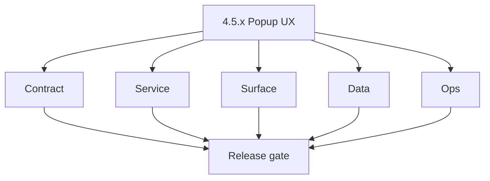
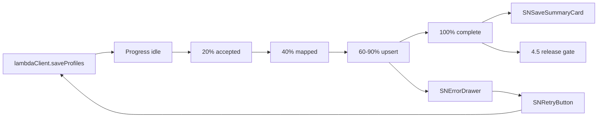

# Version 4.5 — Popup UX

- **Status:** ✅ Completed
- **Codename:** Popup UX  
- **Era:** 4.x (Extension and Sales Navigator maturity)  
- **Roadmap:** Extension depth minor (patch ladder in this file + [`versions.md`](../versions.md); promote rows when scheduled)  
- **Summary:** **Honest, recoverable** extension popup: `lambdaClient.saveProfiles` → **progress** (idle → 20% → 40% → 60–90% → 100%) → **SNSaveSummaryCard** → **SNErrorDrawer** → **SNRetryButton** on failure.  
- **Patch closure:** Every codenamed patch file includes **Micro-gate** + **Service task slices**. Era hub: [`versions.md`](../versions.md).

## Scope

- **Target:** `4.5.x` patches.  
- **In scope:** MV3 popup constraints, progress semantics, error taxonomy, accessibility.  
- **Out of scope:** Dashboard LinkedIn tab (**`4.6`**); campaign audience (**`4.7`**).  
- **Owners:** Extension + Frontend.

## Flowchart

### Runtime focus (unique to this minor)

## Task tracks

### Contract

- ✅ Completed: 📌 Planned: Progress stages ↔ backend callbacks (or polling) documented.
- ✅ Completed: 📌 Planned: Error codes map to drawer copy — **Service task slices** in `4.5.P` patch files (scope from former `salesnavigator-extension-sn-task-pack.md`).

### Service

- ✅ Completed: 📌 Planned: Idempotent **retry** does not double-charge credits or duplicate side effects.

### Surface

- ✅ Completed: 📌 Planned: All UI states: idle / running / partial / success / error.
- ✅ Completed: 📌 Planned: Keyboard focus order in drawer.

### Data

- ✅ Completed: 📌 Planned: Summary card shows counts consistent with reconciliation (**4.3**).

### Ops

- ✅ Completed: 📌 Planned: UX metrics: completion rate, retry rate.

## Task Breakdown

| Slice | Outcome |
| --- | --- |
| Extension | Popup polish |
| SN Lambda | Progress hooks |

## Immediate next execution queue

- 📌 Planned: Visual QA on SN page + popup together.  
- 📌 Planned: Screenshot bundle for release evidence.

## Cross-service ownership

| Service | Focus |
| --- | --- |
| `extension/contact360` | Popup UI |
| `salesnavigator` | Save API behavior |

## References

- **Service task slices** in `4.5.P` patch files (scope from former `salesnavigator-extension-sn-task-pack.md`)  
- [`docs/codebases/extension-codebase-analysis.md`](../codebases/extension-codebase-analysis.md)

## Backend API and Endpoint Scope

- save-profiles progress mechanism (polling, websocket, or step callbacks) — finalize in implementation.

## Database and Data Lineage Scope

- None beyond ingest outcomes surfacing in summary.

## Frontend UX Surface Scope

- Extension popup only.

## UI Elements Checklist

- 📌 Planned: Progress bar  
- 📌 Planned: Summary card  
- 📌 Planned: Error drawer  
- 📌 Planned: Retry button  
- 📌 Planned: Cancel / close

## Flow / Graph Delta for This Minor

- **Delta:** User-visible **progress + recovery** graph tied to save pipeline.

## Audit and Compliance Notes

- Summary must not leak other users’ data in multi-account edge (if any).

## Patch ladder (`4.5.0` – `4.5.9`)

### Micro-gate reference (apply at every `4.N.P`)

| Track | Gate question (must answer Yes or document waiver) |
| --- | --- |
| **Contract** | Extension/SN REST, GraphQL modules, CSP — `docs/backend/apis/` + endpoint matrices updated? |
| **Service** | SN scrape/save, Connectra upsert, jobs DAG, session refresh — smoke + idempotency documented? |
| **Surface** | Extension popup, dashboard SN/campaign panels, operator flows changed? |
| **Frontend** | Extension MV3 + dashboard routes/hooks (see minor scope / `extension-auth.md`, `extension-telemetry.md`)? |
| **Data** | Provenance, audience tables, `messages.contacts[]` — migrations + lineage docs? |
| **Ops** | `logs.api` events, S3 evidence, runbooks, rate/retry — delta recorded? |

**Patch intent bands:** Codenames per minor — see **Patch ladder** table in this file (`.0` charter … `.9` seal/handoff).

Theme: **Pixel** — codenames in per-patch `4.5.P — *.md` files.

| Patch | Codename | Focus |
| --- | --- | --- |
| `4.5.0` | Idle | Charter |
| `4.5.1` | Start | Kickoff UX |
| `4.5.2` | Extract | Pre-upload state |
| `4.5.3` | Dedup | Client pre-dedup |
| `4.5.4` | Submit | Fire save |
| `4.5.5` | Progress | Bar accuracy |
| `4.5.6` | Complete | Success path |
| `4.5.7` | Summary | Card data |
| `4.5.8` | Error | Drawer |
| `4.5.9` | Retry | Freeze → **`4.6`** |

## Release Gate and Evidence

- 📌 Planned: Progress semantics reviewed against network traces  
- 📌 Planned: Accessibility spot check  
- 📌 Planned: Error/retry e2e recording

## Patches

| Patch | Codename | Doc |
| --- | --- | --- |
| `4.5.0` | Idle | [`4.5.0` — Idle](4.5.0 — Idle.md) |
| `4.5.1` | Start | [`4.5.1` — Start](4.5.1 — Start.md) |
| `4.5.2` | Extract | [`4.5.2` — Extract](4.5.2 — Extract.md) |
| `4.5.3` | Dedup | [`4.5.3` — Dedup](4.5.3 — Dedup.md) |
| `4.5.4` | Submit | [`4.5.4` — Submit](4.5.4 — Submit.md) |
| `4.5.5` | Progress | [`4.5.5` — Progress](4.5.5 — Progress.md) |
| `4.5.6` | Complete | [`4.5.6` — Complete](4.5.6 — Complete.md) |
| `4.5.7` | Summary | [`4.5.7` — Summary](4.5.7 — Summary.md) |
| `4.5.8` | Error | [`4.5.8` — Error](4.5.8 — Error.md) |
| `4.5.9` | Retry | [`4.5.9` — Retry](4.5.9 — Retry.md) |
