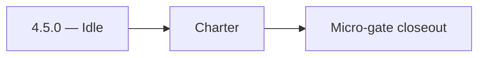

# 4.5.0 — Idle

- **Era:** `4.x` Extension/SN maturity — hub [`versions.md`](../versions.md) · minors start at [`4.0 — Harbor`](4.0%20%E2%80%94%20Harbor.md)
- **Minor:** [4.5 — Popup UX](./4.5 — Popup UX.md)
- **Codename:** Idle
- **Status:** ✅ Completed
## Focus
Charter

## Flowchart

## Micro-gate

| Track | Gate question | Answer / Evidence (fill at patch closeout) |
| --- | --- | --- |
| **Contract** | Extension/SN REST, GraphQL modules, CSP — `docs/backend/apis/` + endpoint matrices updated? | Document at patch closeout. |
| **Service** | SN scrape/save, Connectra upsert, jobs DAG, session refresh — smoke + idempotency? | Document smoke paths. |
| **Surface** | Extension popup, dashboard SN/campaign panels, operator flows changed? | Document UX delta or N/A. |
| **Frontend** | Which extension MV3 + dashboard routes/hooks for this patch? | Popup MV3 — progress, retry, error UI. Document at closeout. |
| **Data** | Provenance fields, audience tables, `messages.contacts[]` — migrations + lineage? | Document lineage or N/A. |
| **Ops** | `logs.api` events, S3 evidence, runbooks, rate/retry — delta recorded? | Document ops delta or N/A. |

## Tasks
### Contract

- ✅ Completed: 📌 Planned: Progress stages ↔ backend callbacks (or polling) documented.
- ✅ Completed: 📌 Planned: Error codes map to drawer copy — **Service task slices** below (includes former `salesnavigator-extension-sn-task-pack.md` scope).

### Service

- ✅ Completed: 📌 Planned: Idempotent **retry** does not double-charge credits or duplicate side effects.

### Surface

- ✅ Completed: 📌 Planned: All UI states: idle / running / partial / success / error.
- ✅ Completed: 📌 Planned: Keyboard focus order in drawer.

### Data

- ✅ Completed: 📌 Planned: Summary card shows counts consistent with reconciliation (**4.3**).

### Ops

- ✅ Completed: 📌 Planned: UX metrics: completion rate, retry rate.

## Service task slices
> Merged from era `4.x` extension/SN task packs (P0→`.0`–`.2`, P1→`.3`–`.6`, Ops→`.7`–`.9`).

### Salesnavigator
- Lock final API contract for `POST /v1/save-profiles` and `POST /v1/scrape`
- Fix documentation drift: remove `POST /v1/scrape-html-with-fetch` from `docs/api.md` (not implemented) OR implement it
- Clarify `POST /v1/scrape` active status in `README.md` (README incorrectly states scraping is removed)
- Define error response structure: `{success: false, errors: [{profile_url, message}]}`
- Define partial-success semantics: `saved_count > 0` with non-empty `errors[]` is valid
- Lock `ScrapeHtmlRequest` max HTML size (10 MB) as tested and documented
- Freeze `SaveProfilesRequest` max profiles (1000) with rejection behavior documented
- Harden HTML extraction across multiple SN DOM variants:
- Standard search results page
- Account map view
- People tab on company page
- Optimize extraction for 25-profile search result pages (primary extension use case)
- Validate deduplication correctness: same `profile_url` → single record, best-completeness kept
- Fix `convert_sales_nav_url_to_linkedin()` coverage — document when PLACEHOLDER is returned
- Implement extraction fallback for missing fields (graceful null, not error)
- Add `X-Request-ID` correlation header to all responses
- Test chunk boundary behavior: exactly 500, 501, 1000 profiles
- Confirm provenance fields written per profile: `lead_id`, `search_id`, `data_quality_score`, `connection_degree`, `recently_hired`, `is_premium`
- Add `source="sales_navigator"` tag on all contacts from this service
- Validate `data_quality_score` computation accuracy (70% required + 30% optional weighted)

### Appointment360 (gateway)
- Define LinkedInMutation { upsertByLinkedinUrl, searchLinkedin, exportLinkedinResults }
- Define SalesNavigatorQuery { salesNavigatorSearch(query) }
- Define SalesNavigatorMutation { saveSalesNavigatorProfiles, syncSalesNavigator }
- Define LinkedInProfileType, SalesNavigatorResultType GraphQL output types
- Define LinkedInUpsertInput, SalesNavigatorSearchInput GraphQL input types
- Implement upsertByLinkedinUrl mutation: call ConnectraClient.search_by_linkedin_url(url) then upsert
- Implement searchLinkedin mutation: call Sales Navigator external service, return profile list
- Implement saveSalesNavigatorProfiles mutation: bulk upsert to Connectra via batch_upsert_contacts
- Add sales_navigator_client.py in app/clients/ wrapping SN external API
- Add credit deduction for Sales Navigator search queries
- Extension popup → mutation upsertByLinkedinUrl(url) to save LinkedIn contact
- Extension search results panel → mutation saveSalesNavigatorProfiles([...]) bulk save
- /contacts page, LinkedIn import tab → mutation searchLinkedin
- useSalesNavigatorSearch hook: manage search state, batch save
- useLinkedInSync hook: extension-to-dashboard sync trigger
- Contact/company records from LinkedIn upserts stored in Connectra (not appointment360 DB)
- Track SN searches in activities table: type=sales_navigator_search, metadata.query
- Deduct credits for each SN search or export operation
- Log source=linkedin / source=sales_navigator on Connectra records
- Configure Sales Navigator API key in .env.example
- Ensure upsertByLinkedinUrl is rate-limited (abuse guard middleware)

### logs.api
- Freeze `4.x` event names and required fields.
- Ensure canonical event set includes: `extension.session.token_refreshed`, `sn.ingest.started`, `sn.ingest.completed`, `sn.ingest.failed`, `sn.sync.conflict_resolved`.
- Require provenance fields: `workspace_id`, `ingestion_batch_id`, `source`, optional `extension_version`, `trace_id`.
- Update endpoint matrix on write/auth changes: [`docs/backend/endpoints/logsapi_endpoint_era_matrix.json`](../backend/endpoints/logsapi_endpoint_era_matrix.json).
- Validate burst ingestion behavior after large SN harvests.
- Verify auth and error envelope for event writers.
- Correlate `trace_id` + `ingestion_batch_id` + lambda request id across pipeline.
- Define S3 CSV partition/prefix strategy for extension/SN event volume.
- Document retention and query-window expectations for operations.

## Evidence gate
Primary charter artifact created and linked in the parent minor doc
