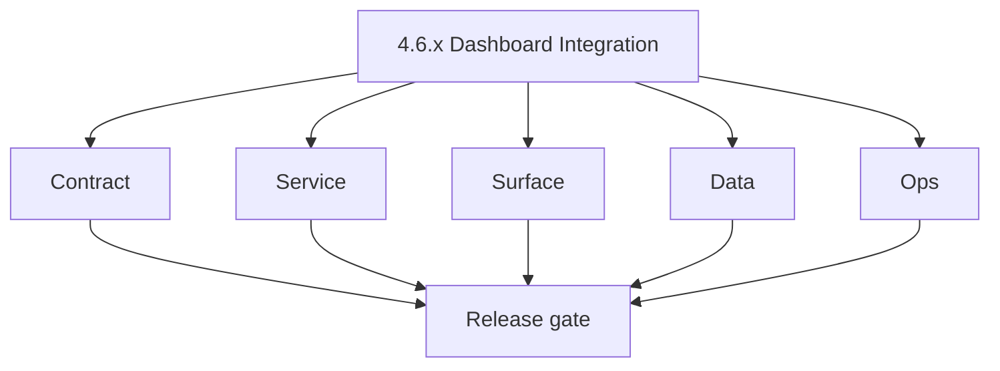
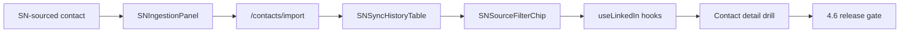

# Version 4.6 — Dashboard Integration

- **Status:** planned  
- **Codename:** Dashboard Integration  
- **Era:** 4.x (Extension and Sales Navigator maturity)  
- **Roadmap:** Extension depth minor (patch ladder in this file + [`versions.md`](../versions.md); promote rows when scheduled)  
- **Summary:** **App** surfaces for SN imports: SN contact → **SNIngestionPanel** → `/contacts/import` (or equivalent) → **SNSyncHistoryTable** → **SNSourceFilterChip** → **`useLinkedIn`** hooks; **LinkedIn import** tab parity with extension outcomes.  
- **Patch closure:** Every codenamed patch file includes **Micro-gate** + **Service task slices**. Era hub: [`versions.md`](../versions.md).

## Scope

- **Target:** `4.6.x` patches.  
- **In scope:** Routes, tables, filters, empty states, link-out to contact detail.  
- **Out of scope:** Campaign audience assembly (**`4.7`**).  
- **Owners:** Frontend + Platform API.

## Flowchart

### Runtime focus (unique to this minor)

## Task tracks

### Contract

- 📌 Planned: GraphQL / REST for import history + filters — **Service task slices** in `4.6.P` patch files (scope from former `appointment360-extension-sn-task-pack.md`).

### Service

- 📌 Planned: Pagination + stable sort; provenance filter correctness.

### Surface

- 📌 Planned: LinkedIn import tab discoverable from contacts.  
- 📌 Planned: Loading/skeleton for history table.

### Data

- 📌 Planned: Row linkage to Connectra UUID; deep links.

### Ops

- 📌 Planned: Feature flag for phased rollout.

## Task Breakdown

| Slice | Outcome |
| --- | --- |
| App | Import + history UX |
| API | Queries |

## Immediate next execution queue

- 📌 Planned: UX review: match extension terminology (“Sales Navigator”, “Last sync”).  
- 📌 Planned: Cross-browser smoke.

## Cross-service ownership

| Service | Focus |
| --- | --- |
| `contact360.io/app` | Panels + hooks |
| `contact360.io/api` | Data |

## References

- [docs/frontend/salesnavigator-ui-bindings.md](../frontend/salesnavigator-ui-bindings.md)
- [`docs/codebases/app-codebase-analysis.md`](../codebases/app-codebase-analysis.md)

## Backend API and Endpoint Scope

- Import history, stats, contact list filtered by `source`.

## Database and Data Lineage Scope

- Uses existing PG/ES; no duplicate SN store in app.

## Frontend UX Surface Scope

- Contacts area; import flows.

## UI Elements Checklist

- 📌 Planned: Panel  
- 📌 Planned: Table (sort, page)  
- 📌 Planned: Source filter chip  
- 📌 Planned: LinkedIn tab

## Flow / Graph Delta for This Minor

- **Delta:** **Dashboard** becomes first-class consumer of SN provenance.

## Audit and Compliance Notes

- Import history may list PII — RBAC on admin views.

## Patch ladder (`4.6.0` – `4.6.9`)

### Micro-gate reference (apply at every `4.N.P`)

| Track | Gate question (must answer Yes or document waiver) |
| --- | --- |
| **Contract** | Extension/SN REST, GraphQL modules, CSP — `docs/backend/apis/` + endpoint matrices updated? |
| **Service** | SN scrape/save, Connectra upsert, jobs DAG, session refresh — smoke + idempotency documented? |
| **Surface** | Extension popup, dashboard SN/campaign panels, operator flows changed? |
| **Frontend** | Extension MV3 + dashboard routes/hooks (see minor scope / `extension-auth.md`, `extension-telemetry.md`)? |
| **Data** | Provenance, audience tables, `messages.contacts[]` — migrations + lineage docs? |
| **Ops** | `logs.api` events, S3 evidence, runbooks, rate/retry — delta recorded? |

**Patch intent bands:** Codenames per minor — see **Patch ladder** table in this file (`.0` charter … `.9` seal/handoff).

Theme: **Panel** — codenames in per-patch `4.6.P — *.md` files.

| Patch | Codename | Focus |
| --- | --- | --- |
| `4.6.0` | Import | Charter |
| `4.6.1` | List | Row display |
| `4.6.2` | History | Table v1 |
| `4.6.3` | Stats | Aggregate cards |
| `4.6.4` | Source | Provenance column |
| `4.6.5` | Filter | Chip behavior |
| `4.6.6` | Sort | Stable sort |
| `4.6.7` | Drill | Detail link |
| `4.6.8` | Export | CSV optional |
| `4.6.9` | Sync | Freeze → **`4.7`** |

## Release Gate and Evidence

- 📌 Planned: Import tab screenshot evidence  
- 📌 Planned: Filter-by-SN-source query correct  
- 📌 Planned: Permissions tested

## Patches

| Patch | Codename | Doc |
| --- | --- | --- |
| `4.6.0` | Import | [`4.6.0` — Import](4.6.0 — Import.md) |
| `4.6.1` | List | [`4.6.1` — List](4.6.1 — List.md) |
| `4.6.2` | History | [`4.6.2` — History](4.6.2 — History.md) |
| `4.6.3` | Stats | [`4.6.3` — Stats](4.6.3 — Stats.md) |
| `4.6.4` | Source | [`4.6.4` — Source](4.6.4 — Source.md) |
| `4.6.5` | Filter | [`4.6.5` — Filter](4.6.5 — Filter.md) |
| `4.6.6` | Sort | [`4.6.6` — Sort](4.6.6 — Sort.md) |
| `4.6.7` | Drill | [`4.6.7` — Drill](4.6.7 — Drill.md) |
| `4.6.8` | Export | [`4.6.8` — Export](4.6.8 — Export.md) |
| `4.6.9` | Sync | [`4.6.9` — Sync](4.6.9 — Sync.md) |
