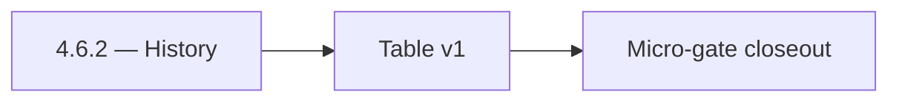

# 4.6.2 — History

- **Era:** `4.x` Extension/SN maturity — hub [`versions.md`](../versions.md) · minors start at [`4.0 — Harbor`](4.0%20%E2%80%94%20Harbor.md)
- **Minor:** [4.6 — Dashboard Integration](./4.6 — Dashboard Integration.md)
- **Codename:** History
- **Status:** ✅ Completed
## Focus
Table v1

## Flowchart

## Micro-gate

| Track | Gate question | Answer / Evidence (fill at patch closeout) |
| --- | --- | --- |
| **Contract** | Extension/SN REST, GraphQL modules, CSP — `docs/backend/apis/` + endpoint matrices updated? | Document at patch closeout. |
| **Service** | SN scrape/save, Connectra upsert, jobs DAG, session refresh — smoke + idempotency? | Document smoke paths. |
| **Surface** | Extension popup, dashboard SN/campaign panels, operator flows changed? | Document UX delta or N/A. |
| **Frontend** | Which extension MV3 + dashboard routes/hooks for this patch? | Dashboard SN panels, history/source filters. Document at closeout. |
| **Data** | Provenance fields, audience tables, `messages.contacts[]` — migrations + lineage? | Document lineage or N/A. |
| **Ops** | `logs.api` events, S3 evidence, runbooks, rate/retry — delta recorded? | Document ops delta or N/A. |

## Tasks
### Contract

- 📌 Planned: **[salesnavigator]** — refine duplicate task (was: ✅ completed: 📌 planned: graphql / rest for import history + …) | patch `4.6.2` band `2` | reason: specialize this file vs sibling patches; see docs/codebases/salesnavigator-codebase-analysis.md

### Service

- 📌 Planned: **[salesnavigator]** — refine duplicate task (was: ✅ completed: 📌 planned: pagination + stable sort; provenance…) | patch `4.6.2` band `2` | reason: specialize this file vs sibling patches; see docs/codebases/salesnavigator-codebase-analysis.md

### Surface

- 📌 Planned: **[salesnavigator]** — refine duplicate task (was: ✅ completed: 📌 planned: linkedin import tab discoverable fro…) | patch `4.6.2` band `2` | reason: specialize this file vs sibling patches; see docs/codebases/salesnavigator-codebase-analysis.md
- 📌 Planned: **[salesnavigator]** — refine duplicate task (was: ✅ completed: 📌 planned: loading/skeleton for history table.) | patch `4.6.2` band `2` | reason: specialize this file vs sibling patches; see docs/codebases/salesnavigator-codebase-analysis.md

### Data

- 📌 Planned: **[salesnavigator]** — refine duplicate task (was: ✅ completed: 📌 planned: row linkage to connectra uuid; deep …) | patch `4.6.2` band `2` | reason: specialize this file vs sibling patches; see docs/codebases/salesnavigator-codebase-analysis.md

### Ops

- 📌 Planned: **[salesnavigator]** — refine duplicate task (was: ✅ completed: 📌 planned: feature flag for phased rollout.) | patch `4.6.2` band `2` | reason: specialize this file vs sibling patches; see docs/codebases/salesnavigator-codebase-analysis.md

## Service task slices
> Merged from era `4.x` extension/SN task packs (P0→`.0`–`.2`, P1→`.3`–`.6`, Ops→`.7`–`.9`).

### Appointment360 (gateway)
- Define LinkedInMutation { upsertByLinkedinUrl, searchLinkedin, exportLinkedinResults }
- Define SalesNavigatorQuery { salesNavigatorSearch(query) }
- Define SalesNavigatorMutation { saveSalesNavigatorProfiles, syncSalesNavigator }
- Define LinkedInProfileType, SalesNavigatorResultType GraphQL output types
- Define LinkedInUpsertInput, SalesNavigatorSearchInput GraphQL input types
- Implement upsertByLinkedinUrl mutation: call ConnectraClient.search_by_linkedin_url(url) then upsert
- Implement searchLinkedin mutation: call Sales Navigator external service, return profile list
- Implement saveSalesNavigatorProfiles mutation: bulk upsert to Connectra via batch_upsert_contacts
- Add sales_navigator_client.py in app/clients/ wrapping SN external API
- Add credit deduction for Sales Navigator search queries
- Extension popup → mutation upsertByLinkedinUrl(url) to save LinkedIn contact
- Extension search results panel → mutation saveSalesNavigatorProfiles([...]) bulk save
- /contacts page, LinkedIn import tab → mutation searchLinkedin
- useSalesNavigatorSearch hook: manage search state, batch save
- useLinkedInSync hook: extension-to-dashboard sync trigger
- Contact/company records from LinkedIn upserts stored in Connectra (not appointment360 DB)
- Track SN searches in activities table: type=sales_navigator_search, metadata.query
- Deduct credits for each SN search or export operation
- Log source=linkedin / source=sales_navigator on Connectra records
- Configure Sales Navigator API key in .env.example
- Ensure upsertByLinkedinUrl is rate-limited (abuse guard middleware)

### Connectra
- Lock **SN → Connectra** contact/company payload fields: provenance (source, lead_id, search_id, data_quality_score, connection_degree where applicable)
- Align UUID5 rules with [docs/enrichment-dedup.md](../enrichment-dedup.md) and SN mapper (salesnavigator analysis — linkedin_url + email recipe)
- Cross-link REST contracts in docs/backend/apis/ + endpoint matrix JSON when batch-upsert schema changes
- Guarantee **idempotent batch-upsert** for SN: same deterministic UUID → safe retry from SaveService / ConnectraClient
- Verify **parallel write fan-out** (PG + ES + filters_data) preserves SN provenance fields on update paths
- Operator visibility: **conflict resolution** summaries (created vs updated vs error) fed back through Appointment360 / dashboard SN panel
- **PG + ES parity** for SN rows: mapping updates must land in both stores in one logical upsert
- KPI: **sync conflict auto-resolution success rate** (roadmap **4.3**) — dedup + upsert success without manual fix
- Runbook: **ES–PG drift** triage for SN ingestion windows (sample VQL vs PG uuid lookups, reindex procedure)
- Release gate: **replay test** evidence — same SN CSV/batch twice → stable UUID counts

### Salesnavigator
- Lock final API contract for `POST /v1/save-profiles` and `POST /v1/scrape`
- Fix documentation drift: remove `POST /v1/scrape-html-with-fetch` from `docs/api.md` (not implemented) OR implement it
- Clarify `POST /v1/scrape` active status in `README.md` (README incorrectly states scraping is removed)
- Define error response structure: `{success: false, errors: [{profile_url, message}]}`
- Define partial-success semantics: `saved_count > 0` with non-empty `errors[]` is valid
- Lock `ScrapeHtmlRequest` max HTML size (10 MB) as tested and documented
- Freeze `SaveProfilesRequest` max profiles (1000) with rejection behavior documented
- Harden HTML extraction across multiple SN DOM variants:
- Standard search results page
- Account map view
- People tab on company page
- Optimize extraction for 25-profile search result pages (primary extension use case)
- Validate deduplication correctness: same `profile_url` → single record, best-completeness kept
- Fix `convert_sales_nav_url_to_linkedin()` coverage — document when PLACEHOLDER is returned
- Implement extraction fallback for missing fields (graceful null, not error)
- Add `X-Request-ID` correlation header to all responses
- Test chunk boundary behavior: exactly 500, 501, 1000 profiles
- Confirm provenance fields written per profile: `lead_id`, `search_id`, `data_quality_score`, `connection_degree`, `recently_hired`, `is_premium`
- Add `source="sales_navigator"` tag on all contacts from this service
- Validate `data_quality_score` computation accuracy (70% required + 30% optional weighted)

## Evidence gate
Patch closeout includes contract diff, smoke output, data lineage delta, and ops note
