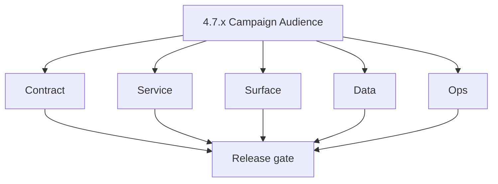
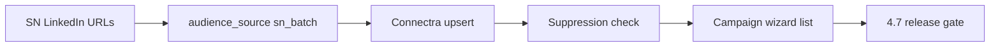

# Version 4.7 — Campaign Audience

- **Status:** planned  
- **Codename:** Campaign Audience  
- **Era:** 4.x (Extension and Sales Navigator maturity)  
- **Roadmap:** Extension depth minor (patch ladder in this file + [`versions.md`](../versions.md); promote rows when scheduled)  
- **Summary:** Turn **SN LinkedIn URLs** into campaign recipients: **`audience_source=sn_batch`** → Connectra **upsert** → **suppression** / DNC checks → **campaign wizard** recipient list with traceability to batch id.  
- **Patch closure:** Every codenamed patch file includes **Micro-gate** + **Service task slices**. Era hub: [`versions.md`](../versions.md).

## Scope

- **Target:** `4.7.x` patches.  
- **In scope:** Audience builder, suppression rules, jobs for large batches, emailapis burst awareness.  
- **Out of scope:** **4.8** AI context panel; generic **5.x** prompt governance.  
- **Owners:** Email Campaign + Connectra + Jobs.

## Flowchart

### Runtime focus (unique to this minor)

## Task tracks

### Contract

- 📌 Planned: Audience payload + `audience_source` enum — **Service task slices** in `4.7.P` patch files (ex-`emailcampaign-extension-sn-task-pack.md` + `connectra-extension-sn-task-pack.md`).

### Service

- 📌 Planned: Idempotent audience build job — **Service task slices** in `4.7.P` patch files (scope from former `jobs-extension-sn-task-pack.md`).  
- 📌 Planned: Throttled verify/finder if campaign triggers **emailapis** — **Service task slices** in `4.7.P` patch files (scope from former `emailapis-extension-salesnav-task-pack.md`).

### Surface

- 📌 Planned: Preview counts: eligible vs suppressed vs invalid URL.

### Data

- 📌 Planned: Lineage: campaign ← audience ← SN batch id.

### Ops

- 📌 Planned: Alarm on suppression mismatch spike.

## Task Breakdown

| Slice | Outcome |
| --- | --- |
| Email campaign | Wizard integration |
| Connectra | SN-tagged rows |
| Jobs | Build pipeline |

## Immediate next execution queue

- 📌 Planned: Dry-run audience 10k URLs in staging.  
- 📌 Planned: Document opt-out precedence.

## Cross-service ownership

| Service | Focus |
| --- | --- |
| Email campaign | UX + send |
| Connectra | Contacts |
| Jobs | Async build |

## References

- [docs/codebases/emailcampaign-codebase-analysis.md](../codebases/emailcampaign-codebase-analysis.md)
- [docs/backend/database/emailcampaign_data_lineage.md](../backend/database/emailcampaign_data_lineage.md)
- **Service task slices** in `4.7.P` patch files (ex-`emailcampaign-extension-sn-task-pack.md`, `connectra-extension-sn-task-pack.md`, `jobs-extension-sn-task-pack.md`)

## Backend API and Endpoint Scope

- Audience create/list; Connectra queries filtered by SN batch.

## Database and Data Lineage Scope

- Campaign + recipient link tables; provenance snapshot.

## Frontend UX Surface Scope

- Campaign wizard; SN audience picker.

## UI Elements Checklist

- 📌 Planned: URL paste / pick from import  
- 📌 Planned: Preview table  
- 📌 Planned: Confirm send

## Flow / Graph Delta for This Minor

- **Delta:** **Marketing** path consumes SN harvest safely.

## Audit and Compliance Notes

- Suppression/DNC is legal-sensitive — audit log mandatory.

## Patch ladder (`4.7.0` – `4.7.9`)

### Micro-gate reference (apply at every `4.N.P`)

| Track | Gate question (must answer Yes or document waiver) |
| --- | --- |
| **Contract** | Extension/SN REST, GraphQL modules, CSP — `docs/backend/apis/` + endpoint matrices updated? |
| **Service** | SN scrape/save, Connectra upsert, jobs DAG, session refresh — smoke + idempotency documented? |
| **Surface** | Extension popup, dashboard SN/campaign panels, operator flows changed? |
| **Frontend** | Extension MV3 + dashboard routes/hooks (see minor scope / `extension-auth.md`, `extension-telemetry.md`)? |
| **Data** | Provenance, audience tables, `messages.contacts[]` — migrations + lineage docs? |
| **Ops** | `logs.api` events, S3 evidence, runbooks, rate/retry — delta recorded? |

**Patch intent bands:** Codenames per minor — see **Patch ladder** table in this file (`.0` charter … `.9` seal/handoff).

Theme: **Audience** — codenames in per-patch `4.7.P — *.md` files.

| Patch | Codename | Focus |
| --- | --- | --- |
| `4.7.0` | Select | Charter |
| `4.7.1` | Resolve | URL → entity |
| `4.7.2` | Enrich | Missing email path |
| `4.7.3` | Suppress | DNC rules |
| `4.7.4` | Preview | Table UX |
| `4.7.5` | Confirm | User ack |
| `4.7.6` | Schedule | Job enqueue |
| `4.7.7` | Send | Campaign attach |
| `4.7.8` | Report | Outcomes |
| `4.7.9` | Archive | Freeze → **`4.8`** |

## Release Gate and Evidence

- 📌 Planned: Suppression tests passed  
- 📌 Planned: Burst test on emailapis/Mailvetter  
- 📌 Planned: Campaign lineage query saved

## Patches

| Patch | Codename | Doc |
| --- | --- | --- |
| `4.7.0` | Select | [`4.7.0` — Select](4.7.0 — Select.md) |
| `4.7.1` | Resolve | [`4.7.1` — Resolve](4.7.1 — Resolve.md) |
| `4.7.2` | Enrich | [`4.7.2` — Enrich](4.7.2 — Enrich.md) |
| `4.7.3` | Suppress | [`4.7.3` — Suppress](4.7.3 — Suppress.md) |
| `4.7.4` | Preview | [`4.7.4` — Preview](4.7.4 — Preview.md) |
| `4.7.5` | Confirm | [`4.7.5` — Confirm](4.7.5 — Confirm.md) |
| `4.7.6` | Schedule | [`4.7.6` — Schedule](4.7.6 — Schedule.md) |
| `4.7.7` | Send | [`4.7.7` — Send](4.7.7 — Send.md) |
| `4.7.8` | Report | [`4.7.8` — Report](4.7.8 — Report.md) |
| `4.7.9` | Archive | [`4.7.9` — Archive](4.7.9 — Archive.md) |
