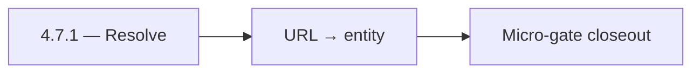

# 4.7.1 — Resolve

- **Era:** `4.x` Extension/SN maturity — hub [`versions.md`](../versions.md) · minors start at [`4.0 — Harbor`](4.0%20%E2%80%94%20Harbor.md)
- **Minor:** [4.7 — Campaign Audience](./4.7 — Campaign Audience.md)
- **Codename:** Resolve
- **Status:** ✅ Completed
## Focus
URL → entity

## Flowchart

## Micro-gate

| Track | Gate question | Answer / Evidence (fill at patch closeout) |
| --- | --- | --- |
| **Contract** | Extension/SN REST, GraphQL modules, CSP — `docs/backend/apis/` + endpoint matrices updated? | Document at patch closeout. |
| **Service** | SN scrape/save, Connectra upsert, jobs DAG, session refresh — smoke + idempotency? | Document smoke paths. |
| **Surface** | Extension popup, dashboard SN/campaign panels, operator flows changed? | Document UX delta or N/A. |
| **Frontend** | Which extension MV3 + dashboard routes/hooks for this patch? | Campaign audience UX, preview/send confirmations. Document at closeout. |
| **Data** | Provenance fields, audience tables, `messages.contacts[]` — migrations + lineage? | Document lineage or N/A. |
| **Ops** | `logs.api` events, S3 evidence, runbooks, rate/retry — delta recorded? | Document ops delta or N/A. |

## Tasks
### Contract

- 📌 Planned: **[salesnavigator]** — refine duplicate task (was: ✅ completed: 📌 planned: audience payload + `audience_source`…) | patch `4.7.1` band `1` | reason: specialize this file vs sibling patches; see docs/codebases/salesnavigator-codebase-analysis.md

### Service

- 📌 Planned: **[salesnavigator]** — refine duplicate task (was: ✅ completed: 📌 planned: idempotent audience build job — **se…) | patch `4.7.1` band `1` | reason: specialize this file vs sibling patches; see docs/codebases/salesnavigator-codebase-analysis.md
- 📌 Planned: **[salesnavigator]** — refine duplicate task (was: ✅ completed: 📌 planned: throttled verify/finder if campaign …) | patch `4.7.1` band `1` | reason: specialize this file vs sibling patches; see docs/codebases/salesnavigator-codebase-analysis.md

### Surface

- 📌 Planned: **[salesnavigator]** — refine duplicate task (was: ✅ completed: 📌 planned: preview counts: eligible vs suppress…) | patch `4.7.1` band `1` | reason: specialize this file vs sibling patches; see docs/codebases/salesnavigator-codebase-analysis.md

### Data

- 📌 Planned: **[salesnavigator]** — refine duplicate task (was: ✅ completed: 📌 planned: lineage: campaign ← audience ← sn ba…) | patch `4.7.1` band `1` | reason: specialize this file vs sibling patches; see docs/codebases/salesnavigator-codebase-analysis.md

### Ops

- 📌 Planned: **[salesnavigator]** — refine duplicate task (was: ✅ completed: 📌 planned: alarm on suppression mismatch spike.) | patch `4.7.1` band `1` | reason: specialize this file vs sibling patches; see docs/codebases/salesnavigator-codebase-analysis.md

## Service task slices
> Merged from era `4.x` extension/SN task packs (P0→`.0`–`.2`, P1→`.3`–`.6`, Ops→`.7`–`.9`).

### Emailcampaign
- Campaign can be created from a SN LinkedIn URL list.
- Contacts without resolved emails are excluded from recipient list with a warning.
- "Add to Campaign" CTA visible in extension when viewing SN profile.

### Jobs
- Define required metadata: `source`, `workspace_id`, `channel`, `ingestion_batch_id`, `idempotency_token`, `trace_id`.
- Define sync batch contract for extension submissions: payload limits, chunk boundaries, retry headers, completion callbacks.
- Enforce source tagging and dedupe-safe scheduling for replayed batches.
- Harden retries with exponential backoff + jitter and capped attempts.
- Expose sync lag metrics from `save-profiles` success to job completion.
- Persist idempotency evidence fields (`idempotency_token`, content hash, ingestion batch id).
- Link API traces to job records and logs.api events.

### Appointment360 (gateway)
- Define LinkedInMutation { upsertByLinkedinUrl, searchLinkedin, exportLinkedinResults }
- Define SalesNavigatorQuery { salesNavigatorSearch(query) }
- Define SalesNavigatorMutation { saveSalesNavigatorProfiles, syncSalesNavigator }
- Define LinkedInProfileType, SalesNavigatorResultType GraphQL output types
- Define LinkedInUpsertInput, SalesNavigatorSearchInput GraphQL input types
- Implement upsertByLinkedinUrl mutation: call ConnectraClient.search_by_linkedin_url(url) then upsert
- Implement searchLinkedin mutation: call Sales Navigator external service, return profile list
- Implement saveSalesNavigatorProfiles mutation: bulk upsert to Connectra via batch_upsert_contacts
- Add sales_navigator_client.py in app/clients/ wrapping SN external API
- Add credit deduction for Sales Navigator search queries
- Extension popup → mutation upsertByLinkedinUrl(url) to save LinkedIn contact
- Extension search results panel → mutation saveSalesNavigatorProfiles([...]) bulk save
- /contacts page, LinkedIn import tab → mutation searchLinkedin
- useSalesNavigatorSearch hook: manage search state, batch save
- useLinkedInSync hook: extension-to-dashboard sync trigger
- Contact/company records from LinkedIn upserts stored in Connectra (not appointment360 DB)
- Track SN searches in activities table: type=sales_navigator_search, metadata.query
- Deduct credits for each SN search or export operation
- Log source=linkedin / source=sales_navigator on Connectra records
- Configure Sales Navigator API key in .env.example
- Ensure upsertByLinkedinUrl is rate-limited (abuse guard middleware)

### Mailvetter
- Define provenance contract: `source=extension|sales_navigator|dashboard`.
- Define idempotency contract for repeated extension verification submits.
- Add source-tag support in verification payloads and persisted results.
- Add anti-abuse safeguards for extension burst traffic.
- Add priority queueing policy for interactive extension calls.
- Add `source` and `source_session_id` in `results` metadata.
- Add dedupe key for repeated verification within short windows.

### Connectra
- Lock **SN → Connectra** contact/company payload fields: provenance (source, lead_id, search_id, data_quality_score, connection_degree where applicable)
- Align UUID5 rules with [docs/enrichment-dedup.md](../enrichment-dedup.md) and SN mapper (salesnavigator analysis — linkedin_url + email recipe)
- Cross-link REST contracts in docs/backend/apis/ + endpoint matrix JSON when batch-upsert schema changes
- Guarantee **idempotent batch-upsert** for SN: same deterministic UUID → safe retry from SaveService / ConnectraClient
- Verify **parallel write fan-out** (PG + ES + filters_data) preserves SN provenance fields on update paths
- Operator visibility: **conflict resolution** summaries (created vs updated vs error) fed back through Appointment360 / dashboard SN panel
- **PG + ES parity** for SN rows: mapping updates must land in both stores in one logical upsert
- KPI: **sync conflict auto-resolution success rate** (roadmap **4.3**) — dedup + upsert success without manual fix
- Runbook: **ES–PG drift** triage for SN ingestion windows (sample VQL vs PG uuid lookups, reindex procedure)
- Release gate: **replay test** evidence — same SN CSV/batch twice → stable UUID counts

## Evidence gate
Patch closeout includes contract diff, smoke output, data lineage delta, and ops note
