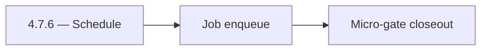

# 4.7.6 — Schedule

- **Era:** `4.x` Extension/SN maturity — hub [`versions.md`](../versions.md) · minors start at [`4.0 — Harbor`](4.0%20%E2%80%94%20Harbor.md)
- **Minor:** [4.7 — Campaign Audience](./4.7 — Campaign Audience.md)
- **Codename:** Schedule
- **Status:** ✅ Completed
## Focus
Job enqueue

## Flowchart

## Micro-gate

| Track | Gate question | Answer / Evidence (fill at patch closeout) |
| --- | --- | --- |
| **Contract** | Extension/SN REST, GraphQL modules, CSP — `docs/backend/apis/` + endpoint matrices updated? | Document at patch closeout. |
| **Service** | SN scrape/save, Connectra upsert, jobs DAG, session refresh — smoke + idempotency? | Document smoke paths. |
| **Surface** | Extension popup, dashboard SN/campaign panels, operator flows changed? | Document UX delta or N/A. |
| **Frontend** | Which extension MV3 + dashboard routes/hooks for this patch? | Campaign audience UX, preview/send confirmations. Document at closeout. |
| **Data** | Provenance fields, audience tables, `messages.contacts[]` — migrations + lineage? | Document lineage or N/A. |
| **Ops** | `logs.api` events, S3 evidence, runbooks, rate/retry — delta recorded? | Document ops delta or N/A. |

## Tasks
### Contract

- ✅ Completed: 📌 Planned: Audience payload + `audience_source` enum — **Service task slices** below (includes former `emailcampaign-extension-sn-task-pack.md` + `connectra-extension-sn-task-pack.md` scope).

### Service

- ✅ Completed: 📌 Planned: Idempotent audience build job — **Service task slices** below (includes former `jobs-extension-sn-task-pack.md` scope).
- ✅ Completed: 📌 Planned: Throttled verify/finder if campaign triggers **emailapis** — **Service task slices** below (includes former `emailapis-extension-salesnav-task-pack.md` scope).

### Surface

- ✅ Completed: 📌 Planned: Preview counts: eligible vs suppressed vs invalid URL.

### Data

- ✅ Completed: 📌 Planned: Lineage: campaign ← audience ← SN batch id.

### Ops

- ✅ Completed: 📌 Planned: Alarm on suppression mismatch spike.

## Service task slices
> Merged from era `4.x` extension/SN task packs (P0→`.0`–`.2`, P1→`.3`–`.6`, Ops→`.7`–`.9`).

### Emailcampaign
- Campaign can be created from a SN LinkedIn URL list.
- Contacts without resolved emails are excluded from recipient list with a warning.
- "Add to Campaign" CTA visible in extension when viewing SN profile.

### Jobs
- Document sync status cards, retry controls, and execution history for extension-origin jobs.
- Map backend states (`queued`, `processing`, `failed`, `completed`, `stuck`) to user labels/actions.
- Persist idempotency evidence fields (`idempotency_token`, content hash, ingestion batch id).
- Link API traces to job records and logs.api events.
- Document retention for audit and replay investigations.
- Enforce source tagging and dedupe-safe scheduling for replayed batches.
- Harden retries with exponential backoff + jitter and capped attempts.
- Expose sync lag metrics from `save-profiles` success to job completion.

### Appointment360 (gateway)
- Document LinkedIn module in docs/backend/apis/21_LINKEDIN_MODULE.md
- Document Sales Navigator module in docs/backend/apis/23_SALES_NAVIGATOR_MODULE.md
- Implement syncSalesNavigator mutation: trigger tkdjob sync task
- Implement exportLinkedinResults mutation: create contact360 export job via tkdjob
- Add extension session token validation for browser extension requests
- SN export button in contacts table → mutation exportLinkedinResults
- Extension badge count (unsaved profiles) synced via mutation syncSalesNavigator
- Extension auth state: JWT-based auth token validated per extension request
- Store extension session tokens in sessions table (appointment360 DB)
- Add SN + extension mutation tests in Postman collection
- Write E2E test: extension captures LinkedIn profile → appears in /contacts table
- Add X-Extension-Token header validation middleware or GraphQL guard

### Mailvetter
- Extension: show verification progress and final state badges.
- SN import flow: pre-verify selected leads before save/export.
- Add `source` and `source_session_id` in `results` metadata.
- Add dedupe key for repeated verification within short windows.
- Add source-tag support in verification payloads and persisted results.
- Add anti-abuse safeguards for extension burst traffic.
- Add priority queueing policy for interactive extension calls.

### Connectra
- Document **conflict / validation** error codes on POST /contacts/batch-upsert for SN-sourced batches (operator-readable)
- Record **CORS** posture: today AllowAllOrigins; add era note for gateway-only extension traffic vs hardened env
- Add **circuit-breaker friendly** error surfaces for SN Lambda (timeout vs 4xx vs Connectra 5xx)
- Expose **health / dependency** signals Connectra uses when SN bulk save degrades (Connectra unavailable)
- Dashboard: surface **ES vs PG drift** hints when SN-sourced contacts fail list/count parity
- Document **VQL** expectations for SN-sourced contacts (source / provenance filters)
- **Drift detection hooks:** align with Connectra queue item “ES–PG reconciliation job” (analysis gaps) — define minimal SN acceptance query set
- Preserve **filter_data** facet consistency when SN bulk jobs update company/employer fields
- Alerting: bulk-upsert error rate by **source=sales_navigator** / extension session correlation

## Evidence gate
Patch closeout includes contract diff, smoke output, data lineage delta, and ops note
