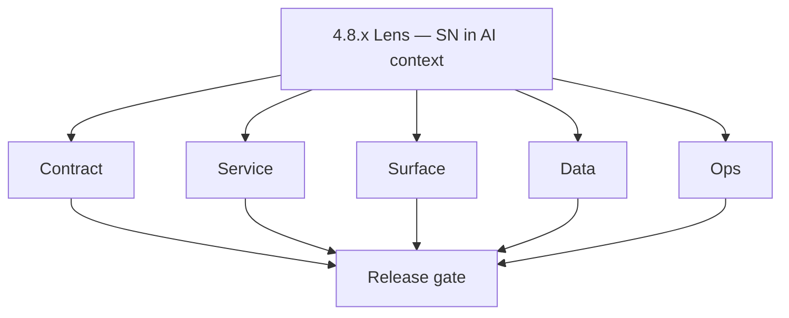
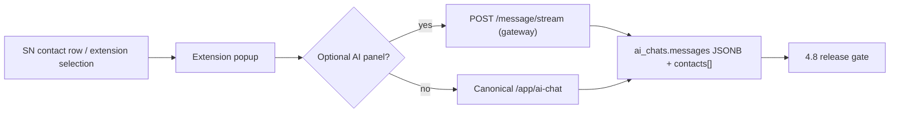

# Version 4.8 — Lens (AI context + SN JSONB)

- **Status:** ✅ Completed
- **Codename:** Lens
- **Era:** 4.x (Extension and Sales Navigator maturity)
- **Roadmap:** Planning minor **4.8** — align **Sales Navigator** contact shapes with **`messages.contacts[]` JSONB** (`ContactInMessage`) and optional **extension-side AI** context; **CSP** for AI Lambda URLs.
- **Summary:** Ensure SN-sourced contacts round-trip into **contact.ai** message storage without field loss; **optional** “Open in AI chat” / context panel from extension; harden **Content-Security-Policy** (`connect-src` for `LAMBDA_AI_API_URL`). Ground tasks in **Service task slices** in `4.8.P` patch files (scope from former `contact-ai-extension-sn-task-pack.md`) and [`docs/codebases/contact-ai-codebase-analysis.md`](../codebases/contact-ai-codebase-analysis.md).
- **Owner:** Contact AI + Extension Engineering
- **Patch closure:** Every codenamed patch file includes **Micro-gate** + **Service task slices**. Era hub: [`versions.md`](../versions.md).

## Scope

- **Target:** `4.8.x` patches.
- **In scope:** `messages.contacts[]` schema compatibility; extension manifest **CSP**; optional AI panel behind feature flag (`ENABLE_AI_CHAT` pattern in task pack); privacy of SN PII in prompts.
- **Out of scope:** New **5.x** AI workflow endpoints or heavy model changes; mandatory extension AI (remains **optional**).

## Flowchart

### Runtime focus (unique to this minor)

## Task tracks

### Contract

- ✅ Completed: 📌 Planned: **[salesnavigator]** — refine duplicate task (was: 📌 planned: **[salesnavigator]** — refine duplicate task (was…) | patch `4.8.0` band `0` | reason: specialize this file vs sibling patches; see docs/codebases/salesnavigator-codebase-analysis.md
- ✅ Completed: 📌 Planned: **[salesnavigator]** — refine duplicate task (was: 📌 planned: **[salesnavigator]** — refine duplicate task (was…) | patch `4.8.0` band `0` | reason: specialize this file vs sibling patches; see docs/codebases/salesnavigator-codebase-analysis.md
- ✅ Completed: 📌 Planned: **[salesnavigator]** — refine duplicate task (was: 📌 planned: **[salesnavigator]** — refine duplicate task (was…) | patch `4.8.0` band `0` | reason: specialize this file vs sibling patches; see docs/codebases/salesnavigator-codebase-analysis.md
- ✅ Completed: 📌 Planned: **[salesnavigator]** — refine duplicate task (was: 📌 planned: **[salesnavigator]** — refine duplicate task (was…) | patch `4.8.0` band `0` | reason: specialize this file vs sibling patches; see docs/codebases/salesnavigator-codebase-analysis.md

- ✅ Completed: 📌 Planned: **[salesnavigator]** — refine duplicate task (was: 📌 planned: **[architecture]** — product **graphql** remains …) | patch `4.8.0` band `0` | reason: specialize this file vs sibling patches; see docs/codebases/salesnavigator-codebase-analysis.md
### Service

- ✅ Completed: 📌 Planned: **[salesnavigator]** — refine duplicate task (was: 📌 planned: **[salesnavigator]** — refine duplicate task (was…) | patch `4.8.0` band `0` | reason: specialize this file vs sibling patches; see docs/codebases/salesnavigator-codebase-analysis.md
- ✅ Completed: 📌 Planned: **[salesnavigator]** — refine duplicate task (was: 📌 planned: **[salesnavigator]** — refine duplicate task (was…) | patch `4.8.0` band `0` | reason: specialize this file vs sibling patches; see docs/codebases/salesnavigator-codebase-analysis.md
- ✅ Completed: 📌 Planned: **[salesnavigator]** — refine duplicate task (was: 📌 planned: **[salesnavigator]** — refine duplicate task (was…) | patch `4.8.0` band `0` | reason: specialize this file vs sibling patches; see docs/codebases/salesnavigator-codebase-analysis.md

- ✅ Completed: 📌 Planned: **[salesnavigator]** — refine duplicate task (was: 📌 planned: **[architecture]** — **go/gin satellites** in sco…) | patch `4.8.0` band `0` | reason: specialize this file vs sibling patches; see docs/codebases/salesnavigator-codebase-analysis.md
### Surface

- ✅ Completed: 📌 Planned: **[salesnavigator]** — refine duplicate task (was: 📌 planned: **[salesnavigator]** — refine duplicate task (was…) | patch `4.8.0` band `0` | reason: specialize this file vs sibling patches; see docs/codebases/salesnavigator-codebase-analysis.md
- ✅ Completed: 📌 Planned: **[salesnavigator]** — refine duplicate task (was: 📌 planned: **[salesnavigator]** — refine duplicate task (was…) | patch `4.8.0` band `0` | reason: specialize this file vs sibling patches; see docs/codebases/salesnavigator-codebase-analysis.md

- ✅ Completed: 📌 Planned: **[salesnavigator]** — refine duplicate task (was: 📌 planned: **[architecture]** — **next.js** customer surface…) | patch `4.8.0` band `0` | reason: specialize this file vs sibling patches; see docs/codebases/salesnavigator-codebase-analysis.md
- ✅ Completed: 📌 Planned: **[salesnavigator]** — refine duplicate task (was: 📌 planned: **[architecture]** — **chrome extension**: graphq…) | patch `4.8.0` band `0` | reason: specialize this file vs sibling patches; see docs/codebases/salesnavigator-codebase-analysis.md
### Data

- ✅ Completed: 📌 Planned: **[salesnavigator]** — refine duplicate task (was: 📌 planned: **[salesnavigator]** — refine duplicate task (was…) | patch `4.8.0` band `0` | reason: specialize this file vs sibling patches; see docs/codebases/salesnavigator-codebase-analysis.md
- ✅ Completed: 📌 Planned: **[salesnavigator]** — refine duplicate task (was: 📌 planned: **[salesnavigator]** — refine duplicate task (was…) | patch `4.8.0` band `0` | reason: specialize this file vs sibling patches; see docs/codebases/salesnavigator-codebase-analysis.md

- ✅ Completed: 📌 Planned: **[salesnavigator]** — refine duplicate task (was: 📌 planned: **[architecture]** — **postgresql-first** per `do…) | patch `4.8.0` band `0` | reason: specialize this file vs sibling patches; see docs/codebases/salesnavigator-codebase-analysis.md
### Ops

- ✅ Completed: 📌 Planned: **[salesnavigator]** — refine duplicate task (was: 📌 planned: **[salesnavigator]** — refine duplicate task (was…) | patch `4.8.0` band `0` | reason: specialize this file vs sibling patches; see docs/codebases/salesnavigator-codebase-analysis.md
- ✅ Completed: 📌 Planned: **[salesnavigator]** — refine duplicate task (was: 📌 planned: **[salesnavigator]** — refine duplicate task (was…) | patch `4.8.0` band `0` | reason: specialize this file vs sibling patches; see docs/codebases/salesnavigator-codebase-analysis.md

- ✅ Completed: 📌 Planned: **[salesnavigator]** — refine duplicate task (was: 📌 planned: **[architecture]** — **observability**: correlate…) | patch `4.8.0` band `0` | reason: specialize this file vs sibling patches; see docs/codebases/salesnavigator-codebase-analysis.md
## Task breakdown

| Slice | Outcome |
| --- | --- |
| contact.ai | JSONB compat + tests |
| extension | CSP + optional panel |
| app | Dashboard parity for AI entry |

## Immediate next execution queue

- 📌 Planned: Schema diff: SN mapper output vs `ContactInMessage`.
- 📌 Planned: E2E: save SN contact → open AI chat → verify `messages.contacts[]`.
- 📌 Planned: Security review: CSP + token usage for extension AI calls.

## Cross-service ownership

| Service | Focus |
| --- | --- |
| `backend(dev)/contact.ai` | JSONB + stream |
| `extension/contact360` | CSP + optional UI |
| `contact360.io/app` | AI chat canonical surface |

## References

- **Service task slices** in `4.8.P` patch files (scope from former `contact-ai-extension-sn-task-pack.md`)
- [`docs/codebases/contact-ai-codebase-analysis.md`](../codebases/contact-ai-codebase-analysis.md)
- [`docs/frontend/contact-ai-ui-bindings.md`](../frontend/contact-ai-ui-bindings.md)
- [`4.2 — Harvest.md`](4.2 — Harvest.md) — SN field quality upstream

## Backend API and endpoint scope

- Existing **`/message/stream`** (or equivalent) contracts — no new routes unless task pack updated.
- Appointment360-only paths untouched unless gateway shared.

## Database and data lineage scope

- **`ai_chats`**, **`messages`** JSONB columns; provenance for SN-sourced contacts.

## Frontend UX surface scope

- Extension **optional** AI affordances; dashboard **AI chat** as primary.

## Flow / graph delta for this minor

- **Delta:** Adds **Lens** path from SN identity into AI context with **privacy/CSP** gates.

## Patch ladder (`4.8.0` – `4.8.9`)

### Micro-gate reference (apply at every `4.N.P`)

| Track | Gate question (must answer Yes or document waiver) |
| --- | --- |
| **Contract** | Extension/SN REST, GraphQL modules, CSP — `docs/backend/apis/` + endpoint matrices updated? |
| **Service** | SN scrape/save, Connectra upsert, jobs DAG, session refresh — smoke + idempotency documented? |
| **Surface** | Extension popup, dashboard SN/campaign panels, operator flows changed? |
| **Frontend** | Extension MV3 + dashboard routes/hooks (see minor scope / `extension-auth.md`, `extension-telemetry.md`)? |
| **Data** | Provenance, audience tables, `messages.contacts[]` — migrations + lineage docs? |
| **Ops** | `logs.api` events, S3 evidence, runbooks, rate/retry — delta recorded? |
| **Architecture** | Go/Gin satellites only via Python GraphQL gateway (`contact360.io/api`); Next.js `NEXT_PUBLIC_GRAPHQL_URL`; Postgres-first / Redis exit per `docs/docs/data-stores-postgres.md`. |

**Patch intent bands:** Codenames per minor — see **Patch ladder** table in this file (`.0` charter … `.9` seal/handoff).

Theme: **Lens** — codenames in per-patch `4.8.P — *.md` files.

| Patch | Codename | Focus |
| --- | --- | --- |
| `4.8.0` | JSONB | Schema compat |
| `4.8.1` | Gateway | Stream contract |
| `4.8.2` | CSP | Extension policy |
| `4.8.3` | Optional-panel | Feature flag |
| `4.8.4` | UX | Copy + paths |
| `4.8.5` | Privacy | Prompt rules |
| `4.8.6` | Lineage | Docs |
| `4.8.7` | Ops | Telemetry |
| `4.8.8` | Load | Stream smoke |
| `4.8.9` | Seal | Toward **4.10** review |

## Release gate and evidence

- 📌 Planned: JSONB round-trip tests green
- 📌 Planned: CSP signed off by security/extension owner
- 📌 Planned: Optional panel off by default or behind flag
- 📌 Planned: Data lineage doc updated
- 📌 Planned: Roadmap **4.8** DoD checked

## Patches

| Patch | Codename | Doc |
| --- | --- | --- |
| `4.8.0` | JSONB | [`4.8.0` — JSONB](4.8.0 — JSONB.md) |
| `4.8.1` | Gateway | [`4.8.1` — Gateway](4.8.1 — Gateway.md) |
| `4.8.2` | CSP | [`4.8.2` — CSP](4.8.2 — CSP.md) |
| `4.8.3` | Optional-panel | [`4.8.3` — Optional-panel](4.8.3 — Optional-panel.md) |
| `4.8.4` | UX | [`4.8.4` — UX](4.8.4 — UX.md) |
| `4.8.5` | Privacy | [`4.8.5` — Privacy](4.8.5 — Privacy.md) |
| `4.8.6` | Lineage | [`4.8.6` — Lineage](4.8.6 — Lineage.md) |
| `4.8.7` | Ops | [`4.8.7` — Ops](4.8.7 — Ops.md) |
| `4.8.8` | Load | [`4.8.8` — Load](4.8.8 — Load.md) |
| `4.8.9` | Seal | [`4.8.9` — Seal](4.8.9 — Seal.md) |

## Release Gate and Evidence

### Master Task Checklist
- 📌 Planned: Track-level closure evidence linked

### Backend API and Endpoints
- 📌 Planned: Endpoint/contract parity verified

### Database and Data Lineage
- 📌 Planned: Migration and lineage references linked

### Frontend UX
- 📌 Planned: UX/route behavior evidence linked

### UI Elements
- 📌 Planned: Components/checklist closeout captured

### Flow and Graph
- 📌 Planned: Runtime graph reflects implementation

### Validation
- 📌 Planned: Smoke/CI/lint checks recorded

### Release Gate
- 📌 Planned: Minor ready for handoff to next minor
