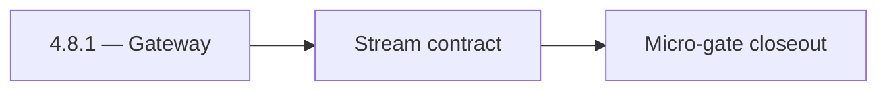

# 4.8.1 — Gateway

- **Era:** `4.x` Extension/SN maturity — hub [`versions.md`](../versions.md) · minors start at [`4.0 — Harbor`](4.0%20%E2%80%94%20Harbor.md)
- **Minor:** [4.8 — Lens](./4.8 — Lens.md)
- **Codename:** Gateway
- **Status:** ✅ Completed
## Focus
Stream contract

## Flowchart

## Micro-gate

| Track | Gate question | Answer / Evidence (fill at patch closeout) |
| --- | --- | --- |
| **Contract** | Extension/SN REST, GraphQL modules, CSP — `docs/backend/apis/` + endpoint matrices updated? | Document at patch closeout. |
| **Service** | SN scrape/save, Connectra upsert, jobs DAG, session refresh — smoke + idempotency? | Document smoke paths. |
| **Surface** | Extension popup, dashboard SN/campaign panels, operator flows changed? | Document UX delta or N/A. |
| **Frontend** | Which extension MV3 + dashboard routes/hooks for this patch? | `messages.contacts[]` consumers, optional AI panel, CSP. Document at closeout. |
| **Data** | Provenance fields, audience tables, `messages.contacts[]` — migrations + lineage? | Document lineage or N/A. |
| **Ops** | `logs.api` events, S3 evidence, runbooks, rate/retry — delta recorded? | Document ops delta or N/A. |

## Tasks
### Contract

- 📌 Planned: **[salesnavigator]** — refine duplicate task (was: ✅ completed: 📌 planned: confirm **no new contact.ai public e…) | patch `4.8.1` band `1` | reason: specialize this file vs sibling patches; see docs/codebases/salesnavigator-codebase-analysis.md
- 📌 Planned: **[salesnavigator]** — refine duplicate task (was: ✅ completed: 📌 planned: validate **`contactinmessage`** vs s…) | patch `4.8.1` band `1` | reason: specialize this file vs sibling patches; see docs/codebases/salesnavigator-codebase-analysis.md
- 📌 Planned: **[salesnavigator]** — refine duplicate task (was: ✅ completed: 📌 planned: document optional **`source: sales_n…) | patch `4.8.1` band `1` | reason: specialize this file vs sibling patches; see docs/codebases/salesnavigator-codebase-analysis.md
- 📌 Planned: **[salesnavigator]** — refine duplicate task (was: ✅ completed: 📌 planned: **csp:** allow `lambda_ai_api_url` i…) | patch `4.8.1` band `1` | reason: specialize this file vs sibling patches; see docs/codebases/salesnavigator-codebase-analysis.md

### Service

- 📌 Planned: **[salesnavigator]** — refine duplicate task (was: ✅ completed: 📌 planned: round-trip tests: sn object → **`mes…) | patch `4.8.1` band `1` | reason: specialize this file vs sibling patches; see docs/codebases/salesnavigator-codebase-analysis.md
- 📌 Planned: **[salesnavigator]** — refine duplicate task (was: ✅ completed: 📌 planned: gateway/stream path accepts extensio…) | patch `4.8.1` band `1` | reason: specialize this file vs sibling patches; see docs/codebases/salesnavigator-codebase-analysis.md
- 📌 Planned: **[salesnavigator]** — refine duplicate task (was: ✅ completed: 📌 planned: optional panel: gate with **`enable_…) | patch `4.8.1` band `1` | reason: specialize this file vs sibling patches; see docs/codebases/salesnavigator-codebase-analysis.md

### Surface

- 📌 Planned: **[salesnavigator]** — refine duplicate task (was: ✅ completed: 📌 planned: optional: “**open in ai chat**” from…) | patch `4.8.1` band `1` | reason: specialize this file vs sibling patches; see docs/codebases/salesnavigator-codebase-analysis.md
- 📌 Planned: **[salesnavigator]** — refine duplicate task (was: ✅ completed: 📌 planned: canonical ux remains **`/app/ai-chat…) | patch `4.8.1` band `1` | reason: specialize this file vs sibling patches; see docs/codebases/salesnavigator-codebase-analysis.md

### Data

- 📌 Planned: **[salesnavigator]** — refine duplicate task (was: ✅ completed: 📌 planned: **privacy:** only include sn fields …) | patch `4.8.1` band `1` | reason: specialize this file vs sibling patches; see docs/codebases/salesnavigator-codebase-analysis.md
- 📌 Planned: **[salesnavigator]** — refine duplicate task (was: ✅ completed: 📌 planned: lineage: update **`contact_ai_data_l…) | patch `4.8.1` band `1` | reason: specialize this file vs sibling patches; see docs/codebases/salesnavigator-codebase-analysis.md

### Ops

- 📌 Planned: **[salesnavigator]** — refine duplicate task (was: ✅ completed: 📌 planned: csp change regression (extension loa…) | patch `4.8.1` band `1` | reason: specialize this file vs sibling patches; see docs/codebases/salesnavigator-codebase-analysis.md
- 📌 Planned: **[salesnavigator]** — refine duplicate task (was: ✅ completed: 📌 planned: telemetry: optional panel usage vs e…) | patch `4.8.1` band `1` | reason: specialize this file vs sibling patches; see docs/codebases/salesnavigator-codebase-analysis.md

## Service task slices
> Merged from era `4.x` extension/SN task packs (P0→`.0`–`.2`, P1→`.3`–`.6`, Ops→`.7`–`.9`).

### contact.ai
- Confirm no new Contact AI endpoints are introduced in `4.x`.
- Validate `messages.contacts[]` JSONB `ContactInMessage` schema is compatible with SN profile objects.
- Document SN contact provenance: if needed, add `source` field to `ContactInMessage` (e.g. `"source": "sales_navigator"`).
- Confirm extension CSP (Content Security Policy) allows requests to `LAMBDA_AI_API_URL` domain.
- Test SN contact object fields against `ContactInMessage` schema:
- `uuid`, `firstName`, `lastName`, `title`, `company`, `email`, `city`, `state`, `country`
- Confirm SN contacts stored via `ai_chats.messages` JSONB round-trip without field loss.
- Optional: surface AI context panel in extension popup if SN contact is selected and `ENABLE_AI_CHAT=true`.
- Confirm SN contact fields are not PII-leaked to HF/Gemini unless explicitly included in chat message prompt.
- Review prompt construction: only include SN contact fields that are explicitly referenced in user query.

### Appointment360 (gateway)
- Define LinkedInMutation { upsertByLinkedinUrl, searchLinkedin, exportLinkedinResults }
- Define SalesNavigatorQuery { salesNavigatorSearch(query) }
- Define SalesNavigatorMutation { saveSalesNavigatorProfiles, syncSalesNavigator }
- Define LinkedInProfileType, SalesNavigatorResultType GraphQL output types
- Define LinkedInUpsertInput, SalesNavigatorSearchInput GraphQL input types
- Implement upsertByLinkedinUrl mutation: call ConnectraClient.search_by_linkedin_url(url) then upsert
- Implement searchLinkedin mutation: call Sales Navigator external service, return profile list
- Implement saveSalesNavigatorProfiles mutation: bulk upsert to Connectra via batch_upsert_contacts
- Add sales_navigator_client.py in app/clients/ wrapping SN external API
- Add credit deduction for Sales Navigator search queries
- Extension popup → mutation upsertByLinkedinUrl(url) to save LinkedIn contact
- Extension search results panel → mutation saveSalesNavigatorProfiles([...]) bulk save
- /contacts page, LinkedIn import tab → mutation searchLinkedin
- useSalesNavigatorSearch hook: manage search state, batch save
- useLinkedInSync hook: extension-to-dashboard sync trigger
- Contact/company records from LinkedIn upserts stored in Connectra (not appointment360 DB)
- Track SN searches in activities table: type=sales_navigator_search, metadata.query
- Deduct credits for each SN search or export operation
- Log source=linkedin / source=sales_navigator on Connectra records
- Configure Sales Navigator API key in .env.example
- Ensure upsertByLinkedinUrl is rate-limited (abuse guard middleware)

### emailapis / emailapigo
- Freeze `4.x` finder/verify payload compatibility for extension-originated flows.
- Require provenance fields: `source`, `workspace_id`, `ingestion_batch_id` (or equivalent), `trace_id`.
- Update endpoint matrix when fields/routes change: [`docs/backend/endpoints/emailapis_endpoint_era_matrix.json`](../backend/endpoints/emailapis_endpoint_era_matrix.json).
- Validate burst behavior for SN imports; avoid unbounded parallel verify/finder storms.
- Ensure auth, provider routing, and error envelopes for `audience_source=sn_batch` traffic.
- Keep `email_finder_cache` key policy stable across SN vs manual ingest paths.
- Confirm lineage expectations for `email_finder_cache` and `email_patterns`.
- Preserve traceability from verify/finder responses to logs (`trace_id`, `ingestion_batch_id`).

### Salesnavigator
- Lock final API contract for `POST /v1/save-profiles` and `POST /v1/scrape`
- Fix documentation drift: remove `POST /v1/scrape-html-with-fetch` from `docs/api.md` (not implemented) OR implement it
- Clarify `POST /v1/scrape` active status in `README.md` (README incorrectly states scraping is removed)
- Define error response structure: `{success: false, errors: [{profile_url, message}]}`
- Define partial-success semantics: `saved_count > 0` with non-empty `errors[]` is valid
- Lock `ScrapeHtmlRequest` max HTML size (10 MB) as tested and documented
- Freeze `SaveProfilesRequest` max profiles (1000) with rejection behavior documented
- Harden HTML extraction across multiple SN DOM variants:
- Standard search results page
- Account map view
- People tab on company page
- Optimize extraction for 25-profile search result pages (primary extension use case)
- Validate deduplication correctness: same `profile_url` → single record, best-completeness kept
- Fix `convert_sales_nav_url_to_linkedin()` coverage — document when PLACEHOLDER is returned
- Implement extraction fallback for missing fields (graceful null, not error)
- Add `X-Request-ID` correlation header to all responses
- Test chunk boundary behavior: exactly 500, 501, 1000 profiles
- Confirm provenance fields written per profile: `lead_id`, `search_id`, `data_quality_score`, `connection_degree`, `recently_hired`, `is_premium`
- Add `source="sales_navigator"` tag on all contacts from this service
- Validate `data_quality_score` computation accuracy (70% required + 30% optional weighted)

## Evidence gate
Patch closeout includes contract diff, smoke output, data lineage delta, and ops note
