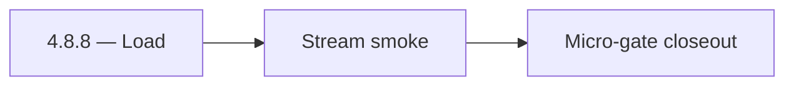

# 4.8.8 — Load

- **Era:** `4.x` Extension/SN maturity — hub [`versions.md`](../versions.md) · minors start at [`4.0 — Harbor`](4.0%20%E2%80%94%20Harbor.md)
- **Minor:** [4.8 — Lens](./4.8 — Lens.md)
- **Codename:** Load
- **Status:** planned

## Focus
Stream smoke

## Flowchart

## Micro-gate

| Track | Gate question | Answer / Evidence (fill at patch closeout) |
| --- | --- | --- |
| **Contract** | Extension/SN REST, GraphQL modules, CSP — `docs/backend/apis/` + endpoint matrices updated? | Document at patch closeout. |
| **Service** | SN scrape/save, Connectra upsert, jobs DAG, session refresh — smoke + idempotency? | Document smoke paths. |
| **Surface** | Extension popup, dashboard SN/campaign panels, operator flows changed? | Document UX delta or N/A. |
| **Frontend** | Which extension MV3 + dashboard routes/hooks for this patch? | `messages.contacts[]` consumers, optional AI panel, CSP. Document at closeout. |
| **Data** | Provenance fields, audience tables, `messages.contacts[]` — migrations + lineage? | Document lineage or N/A. |
| **Ops** | `logs.api` events, S3 evidence, runbooks, rate/retry — delta recorded? | Document ops delta or N/A. |

## Tasks
### Contract

- 📌 Planned: Confirm **no new contact.ai public endpoints** required for **4.8** (task pack).  
- 📌 Planned: Validate **`ContactInMessage`** vs SN profile fields: `uuid`, `firstName`, `lastName`, `title`, `company`, `email`, `city`, `state`, `country`.  
- 📌 Planned: Document optional **`source: sales_navigator`** (or equivalent) on JSONB contact entries.  
- 📌 Planned: **CSP:** allow `LAMBDA_AI_API_URL` in extension `connect-src`.

### Service

- 📌 Planned: Round-trip tests: SN object → **`messages.contacts[]`** → read → field equality.  
- 📌 Planned: Gateway/stream path accepts extension-originated context payload safely.  
- 📌 Planned: Optional panel: gate with **`ENABLE_AI_CHAT`** (or product flag).

### Surface

- 📌 Planned: Optional: “**Open in AI Chat**” from SN flyout — task pack UX.  
- 📌 Planned: Canonical UX remains **`/app/ai-chat`**; extension is additive.

### Data

- 📌 Planned: **Privacy:** only include SN fields explicitly needed in user-authored or system prompts — task pack.  
- 📌 Planned: Lineage: update **`contact_ai_data_lineage.md`** for SN in JSONB — task pack.

### Ops

- 📌 Planned: CSP change regression (extension load, AI call failure modes).  
- 📌 Planned: Telemetry: optional panel usage vs errors (no PII in events).

## Service task slices
> Merged from era `4.x` extension/SN task packs (P0→`.0`–`.2`, P1→`.3`–`.6`, Ops→`.7`–`.9`).

### contact.ai
- CSP review for extension: add `LAMBDA_AI_API_URL` to allowed `connect-src` origins.
- Test extension flow (optional): SN contact → extension popup → AI chat context → message sent → response received.
- No new Lambda timeout or memory changes expected in `4.x`.

### Appointment360 (gateway)
- Add SN + extension mutation tests in Postman collection
- Write E2E test: extension captures LinkedIn profile → appears in /contacts table
- Add X-Extension-Token header validation middleware or GraphQL guard

### emailapis / emailapigo
- Add release evidence for burst latency, cache hit rate, and provider error share by source.
- Record rollback and incident runbook notes for post-harvest degradation.
- Verify no duplicate paid verification on replayed extension batches.

### Salesnavigator
- P95 latency target: `save-profiles` for 25 profiles < 3s; for 100 profiles < 5s
- CloudWatch alarm: `save-profiles` Lambda timeout rate > 1%
- Lambda timeout tuning: current 60s sufficient for 1000 profiles; confirm under load
- Test: 1000-profile batch end-to-end in staging
- Deploy via SAM to staging + production
- Extension CSP check: confirm Lambda API domain is allowed in extension manifest
- [docs/frontend/salesnavigator-ui-bindings.md](../frontend/salesnavigator-ui-bindings.md)
- [docs/backend/database/salesnavigator_data_lineage.md](../backend/database/salesnavigator_data_lineage.md)
- [docs/backend/endpoints/salesnavigator_endpoint_era_matrix.json](../backend/endpoints/salesnavigator_endpoint_era_matrix.json)
- `docs/codebases/salesnavigator-codebase-analysis.md`
- `docs/backend/apis/SALESNAVIGATOR_ERA_TASK_PACKS.md`
- `docs/frontend/salesnavigator-ui-bindings.md`
- `docs/backend/database/salesnavigator_data_lineage.md`

## Evidence gate
Patch closeout includes contract diff, smoke output, data lineage delta, and ops note
