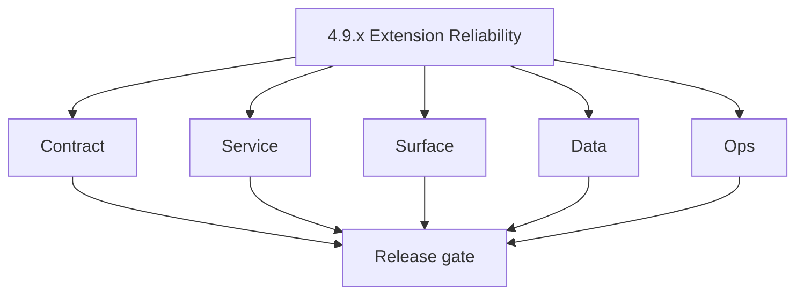

# Version 4.9 — Extension Reliability

- **Status:** ✅ Completed
- **Codename:** Extension Reliability  
- **Era:** 4.x (Extension and Sales Navigator maturity)  
- **Roadmap:** Extension depth minor (patch ladder in this file + [`versions.md`](../versions.md); promote rows when scheduled)  
- **Summary:** **Hardening** under flaky networks and hostile conditions: **retry + exponential backoff + jitter** → **adaptive timeout** → **batching policy** → **rate limits** → **CORS** tightening; folds in cross-era fixes from codebase analyses.  
- **Patch closure:** Every codenamed patch file includes **Micro-gate** + **Service task slices**. Era hub: [`versions.md`](../versions.md).

## Scope

- **Target:** `4.9.x` patches.  
- **In scope:** Client HTTP layer, Lambda concurrency hints, Connectra quotas, extension release checklist.  
- **Out of scope:** New product features (**4.5–4.8**); **4.10** exit gate paperwork.  
- **Owners:** Extension + Platform SRE.

## Flowchart

### Runtime focus (unique to this minor)

## Task tracks

### Contract

- ✅ Completed: 📌 Planned: Document max retries, idempotency expectations — **Service task slices** in `4.9.P` patches (ex-`connectra-extension-sn-task-pack.md`, `jobs-extension-sn-task-pack.md`).

### Service

- ✅ Completed: 📌 Planned: Server-side 429 hints honored; circuit breaker in extension.

### Surface

- ✅ Completed: 📌 Planned: User messaging: “temporarily unavailable” vs “fatal”.

### Data

- ✅ Completed: 📌 Planned: No corruption of partial batch checkpoints.

### Ops

- ✅ Completed: 📌 Planned: SLO: extension error budget; burn rate alerts.

## Task Breakdown

| Slice | Outcome |
| --- | --- |
| Extension | Resilient transport |
| Connectra | Stable under retry |

## Immediate next execution queue

- 📌 Planned: Netflix-style chaos: latency injection on save API.  
- 📌 Planned: Verify no retry amplifier on 5xx storms.

## Cross-service ownership

| Service | Focus |
| --- | --- |
| Extension | Client policy |
| Connectra / API | Server limits |

## References

- [`docs/codebases/extension-codebase-analysis.md`](../codebases/extension-codebase-analysis.md)

## Backend API and Endpoint Scope

- Rate-limit headers; optional Retry-After.

## Database and Data Lineage Scope

- Checkpoint fields for jobs if used for resume.

## Frontend UX Surface Scope

- Extension error copy + cooldown UI.

## UI Elements Checklist

- 📌 Planned: Debounced retry  
- 📌 Planned: Cooldown timer display

## Flow / Graph Delta for This Minor

- **Delta:** **Transport and policy** layer explicit in runtime graph.

## Audit and Compliance Notes

- Abuse controls must not weaken tenant isolation.

## Patch ladder (`4.9.0` – `4.9.9`)

### Micro-gate reference (apply at every `4.N.P`)

| Track | Gate question (must answer Yes or document waiver) |
| --- | --- |
| **Contract** | Extension/SN REST, GraphQL modules, CSP — `docs/backend/apis/` + endpoint matrices updated? |
| **Service** | SN scrape/save, Connectra upsert, jobs DAG, session refresh — smoke + idempotency documented? |
| **Surface** | Extension popup, dashboard SN/campaign panels, operator flows changed? |
| **Frontend** | Extension MV3 + dashboard routes/hooks (see minor scope / `extension-auth.md`, `extension-telemetry.md`)? |
| **Data** | Provenance, audience tables, `messages.contacts[]` — migrations + lineage docs? |
| **Ops** | `logs.api` events, S3 evidence, runbooks, rate/retry — delta recorded? |

**Patch intent bands:** Codenames per minor — see **Patch ladder** table in this file (`.0` charter … `.9` seal/handoff).

Theme: **Shield** — codenames in per-patch `4.9.P — *.md` files.

| Patch | Codename | Focus |
| --- | --- | --- |
| `4.9.0` | Retry | Charter |
| `4.9.1` | Backoff | Curve tune |
| `4.9.2` | Timeout | Adaptive |
| `4.9.3` | Batch | Size policy |
| `4.9.4` | CORS | Allowlist |
| `4.9.5` | Rate | Client cap |
| `4.9.6` | Clean | Reset bad state |
| `4.9.7` | Harden | Edge cases |
| `4.9.8` | Certify | Load proof |
| `4.9.9` | Gate | Freeze → **`4.10`** |

## Release Gate and Evidence

- 📌 Planned: Chaos test report  
- 📌 Planned: Error budget policy documented  
- 📌 Planned: No duplicate writes under stress

## Patches

| Patch | Codename | Doc |
| --- | --- | --- |
| `4.9.0` | Retry | [`4.9.0` — Retry](4.9.0 — Retry.md) |
| `4.9.1` | Backoff | [`4.9.1` — Backoff](4.9.1 — Backoff.md) |
| `4.9.2` | Timeout | [`4.9.2` — Timeout](4.9.2 — Timeout.md) |
| `4.9.3` | Batch | [`4.9.3` — Batch](4.9.3 — Batch.md) |
| `4.9.4` | CORS | [`4.9.4` — CORS](4.9.4 — CORS.md) |
| `4.9.5` | Rate | [`4.9.5` — Rate](4.9.5 — Rate.md) |
| `4.9.6` | Clean | [`4.9.6` — Clean](4.9.6 — Clean.md) |
| `4.9.7` | Harden | [`4.9.7` — Harden](4.9.7 — Harden.md) |
| `4.9.8` | Certify | [`4.9.8` — Certify](4.9.8 — Certify.md) |
| `4.9.9` | Gate | [`4.9.9` — Gate](4.9.9 — Gate.md) |
